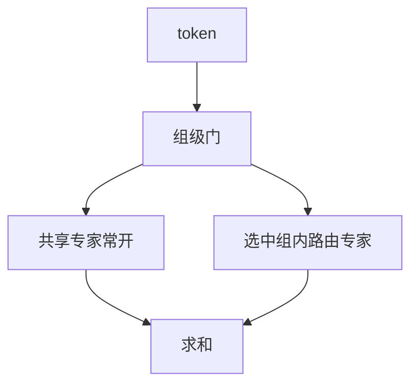

# 层次 MoE

先选一组或一台设备上的专家簇，再在簇内选个体；路由拆成树，通信与特化都沿树发生。

<footer>—— 层次混合专家的经典形式见 Eigen et al., 2013；当代稀疏 LLM 中的共享加路由专家见 Dai et al., DeepSeekMoE, 2024</footer>

[上一课](/llm/peer-million-experts)在平坦表上近邻检索。[节点受限路由](/llm/node-limited-routing) 已经是一棵浅树：先设备后专家。本课把树写正式：多层门，每层只在上一层选中的子集里打分。DeepSeekMoE 的共享专家 + 细粒度路由专家是一种两层（共享为常开组）。后课通信比把树的扇出定量化。

## 问题

平坦 top-$k$ 在 $N$ 大时门贵、通信贵、特化轴单一。PEER 用向量检索回避 $\Theta(N)$ 门，但近似索引难训。缺口是**显式层次**：第一层用便宜的门选 $G$ 组，$G$ 小；第二层在组内 $N/G$ 个专家里再选。组可以对应设备、领域、或共享/非共享。

Eigen 等人较早写出层次 MoE。当代 LLM 不一定引用该名，但共享专家（每个 token 必算）加路由专家（稀疏选）就是两层：一层恒等选共享组，一层稀疏选。课序把它们收成同一设计。

层次不是把 FFN 叠深。树的每一层都是路由，计算仍在叶子专家。中间节点通常没有 MLP，只有门。

## 方法

两层例：token 先对 $G$ 个组打分，取 top-1 或 top-2 组，再在组内 top-$k$。门参数是 $d\times G$ 加每组 $d\times(N/G)$，和为 $dN/G\cdot G + dG=dN+dG$，与平坦同阶，但实现上第一次 All-to-All 只在组代表之间。共享专家：$G_{\mathrm{shared}}$ 对所有 token 常开，相当于树根上的必经叶子，保证公共计算（如高频功能），稀疏枝负责长尾。

训练要对每层门分别均衡，否则第一层崩成永远选一组，层次名存实亡。无辅助损失偏置应对组级与专家级各设一套水位。

### 与 PEER、哈希

哈希是固定树。PEER 是度量树或 IVF。层次 MoE 是学习的浅树。三者都能把 $N$ 做大；可学习浅树在几十到数千专家上最可控，百万级再考虑检索。

## 机制

第一层决定粗特化（代码/自然语言、设备域），第二层决定细特化。序列级均衡若只加在叶子，第一层仍可把整段序列送进同一组——组级也要看直方图。共享专家降低对稀疏枝的依赖，使 $k$ 可以更小而不崩质量，这是细粒度 MoE 能把单专家削窄的前提。

通信：组对齐设备时，第一层几乎是节点受限；不对齐时层次不自动省网。设计树时拓扑优先于语义故事。

共享专家吃掉固定 FLOPs 配额。报稀疏度应写「共享加路由」的激活参数，而不是只写路由 $k/N$。

## 边界

层数多于两级，门的优化与实现复杂度上升很快，LLM 主干少见三层以上。第一层若 $G$ 太大，退回平坦。下一课把这些选择收进通信-计算比，不再引入新的路由哲学。剪枝应先剪叶子再考虑删组，删组等于砍掉一棵子树。

## 小结

- 层次 MoE 用浅树把路由拆成组选择与组内选择；共享专家是常开叶子。
- 每层都要均衡，否则塌成单组。
- 组对齐设备时才自动省通信；语义分组不保证网络收益。
- 报激活参数须包含共享枝。
- 出处：Eigen et al., 2013；Dai et al., 2024。
