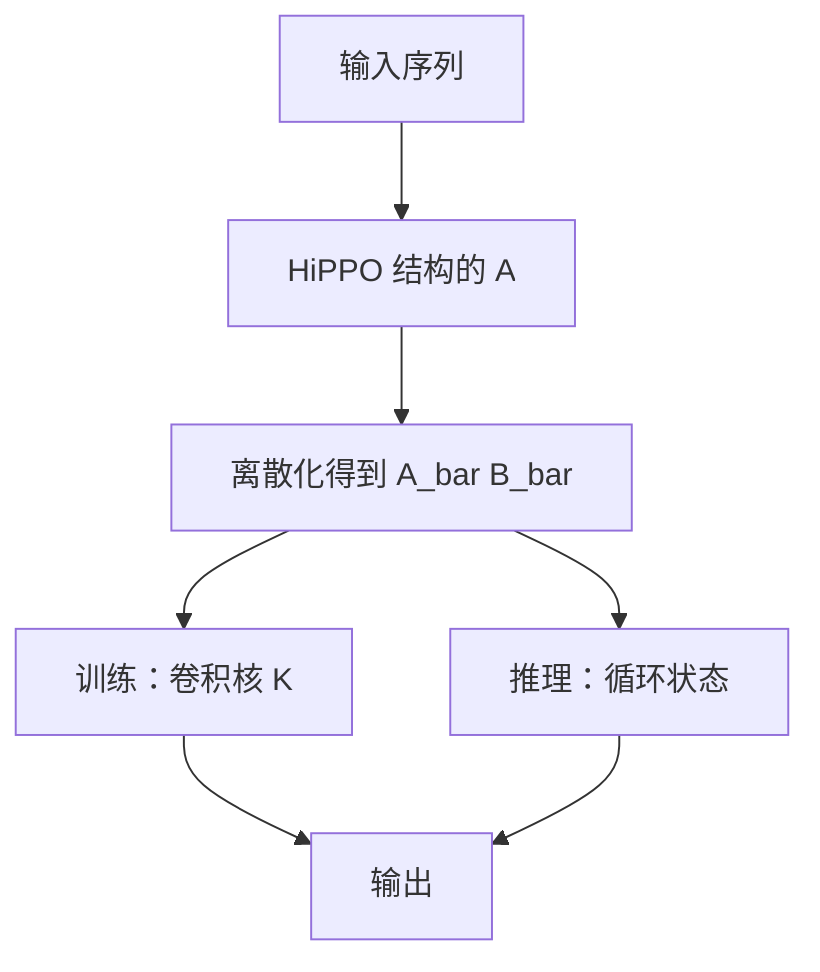

# HiPPO 与 S4

把历史投影到一组正交多项式系数上，再用结构化的状态矩阵让这条投影可以在线更新。

<footer>—— Gu et al., HiPPO, NeurIPS 2020；Gu, Goel &amp; Ré, Efficiently Modeling Long Sequences with Structured State Spaces, ICLR 2022</footer>

[上一课](/llm/albert-param-sharing)仍在 Transformer 块里共享权重。主干的 [Mamba](/llm/mamba) 已经用过选择性状态空间，但补层默认读者未必把 **HiPPO 先验** 和 **S4 的结构化 $A$** 当成可引用对象。本课把线性时不变 SSM 收成后课扫描、对偶、门控线性注意力都要指的骨架：状态 $h_t=Ah_{t-1}+Bx_t$，输出 $y_t=Ch_t$。不重写 Mamba 的选择机制。

## 问题

注意力把过去写成可变长 KV 表。[线性注意力](/llm/linear-attention) 把过去收成 $d_\phi\times d_v$ 的矩阵，没有说明这矩阵该有什么动力学。普通 RNN 的 $A$ 一学就容易谱半径失控：要么忘光，要么爆炸。缺口是：**为长程记忆指定一类 $A$**，使连续时间里对历史的最优投影，在离散更新后仍然可算、可训。

HiPPO 回答「记什么」：在线把到目前为止的信号投影到多项式基（Legendre 等）上，得到一组系数当状态。S4 回答「怎么算」：把对应的状态矩阵做成可对角化、可卷积的结构，训练时当长卷积，推理时当循环。

本课的 SSM 是时不变的：$A,B,C$ 不随 $x_t$ 变。选择发生在下一课。先把时不变骨架钉死，否则选择性会被写成又一种注意力。

## 方法

连续时间

$$
h'(t)=Ah(t)+Bx(t),\qquad y(t)=Ch(t),
$$

离散化时间步 $\Delta$，得到 $h_t=\overline{A}h_{t-1}+\overline{B}x_t$。HiPPO 给出特定的 $A$（例如 Scaled Legendre），其状态分量是历史在正交多项式上的系数，对多项式信号在某种测度下最优。S4 把 $A$ 参数化成对角加低秩等结构，用 Cauchy 核快速算卷积核 $K=\overline{C}\,\overline{A}^{k}\overline{B}$，整段 $y=K*x$ 可并行。

初始化须靠近 HiPPO，而不是随机高斯 $A$：随机 $A$ 很少能稳定地跨千步传递。这是本课与「随便堆一个线性层当 RNN」的差别。

### 卷积与循环对偶

同一线性时不变系统，训练用卷积（对长度并行），推理用循环（常数状态）。后课的分块并行、状态空间对偶，都是在这条对偶上换算法，不改动力学族。

## 机制

多项式投影解释了为何固定大小状态能近似长历史：不是记住每个 token，而是记住历史的光滑摘要。阶数（状态维）越高，能拟合的历史越不光滑。语言比音频更不光滑，所以纯 S4 做 LM 会缺选择——这正是 Mamba 课已经指出、下一课要在扫描里落地的缺口。

对角化让幂 $\overline{A}^{k}$ 变成逐分量的指数衰减，不同维度不同时间常数，对应多尺度记忆。低秩扰动保留 HiPPO 的耦合，避免完全解耦后表达力过弱。

$\Delta$ 是时间尺度。对离散 token，$\Delta$ 控制「这一格要不要多写入」。时不变时所有 token 共用 $\Delta$，这是选择性扫描要拆开的点。

## 边界

S4 适合均匀采样、长程光滑依赖（基因组、波形）。语言的内容稀疏记忆不是 HiPPO 的设定。不要用本课替代注意力的精确检索；后课线性召回瓶颈会回头量化这件事。实现上未结构化的稠密 $A$ 无法走卷积核技巧，复杂度退回 $\Theta(n N^2)$，$N$ 为状态维。课序默认 S4 式结构，而不是稠密线性 RNN。

## 小结

- HiPPO 指定把历史投影到多项式系数；S4 把对应 $A$ 结构化，使卷积训练与循环推理对偶。
- 时不变 SSM 是后课扫描与对偶的骨架；选择尚未引入。
- 初始化应靠近 HiPPO，随机 $A$ 几乎不能长程传递。
- 语言不光滑，纯 S4 不是 LM 的终点。
- 出处：Gu et al., NeurIPS 2020；Gu, Goel & Ré, ICLR 2022。
