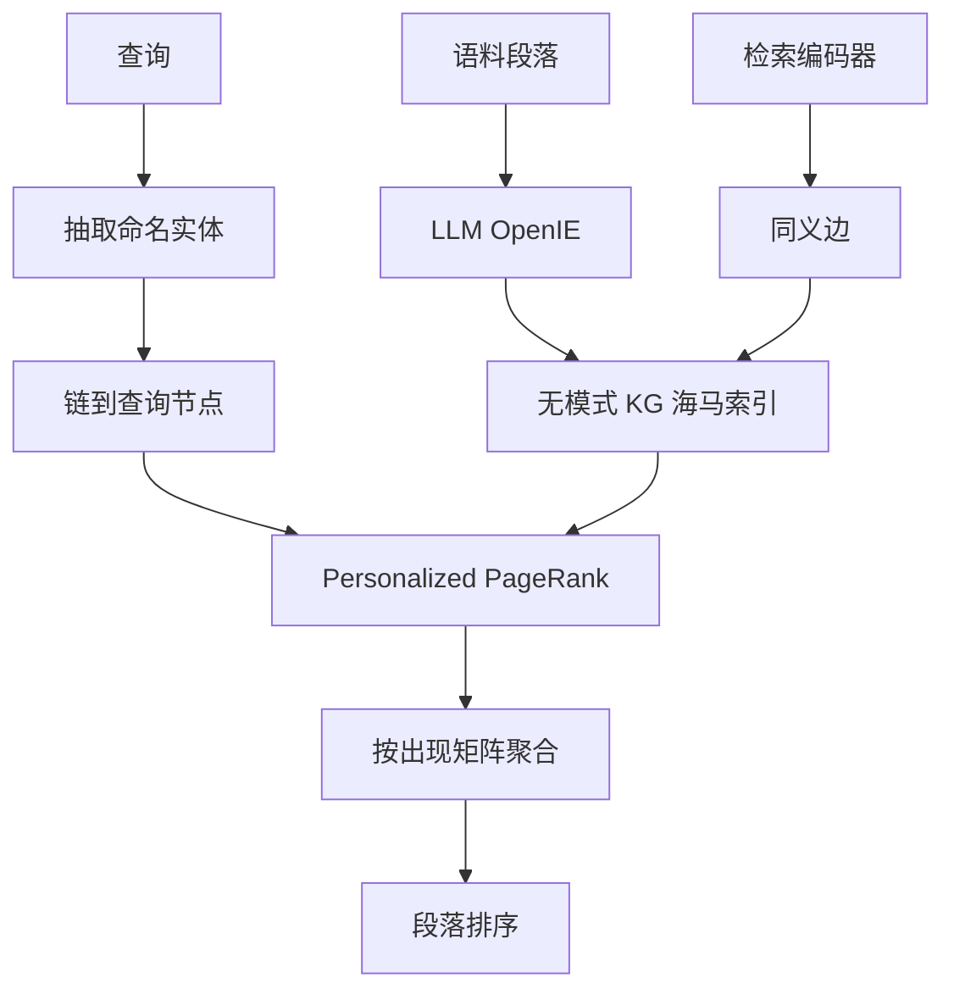

# HippoRAG

    
我们用大模型、知识图谱与 Personalized PageRank 协同，去模仿新皮层与海马在人类长期记忆里的分工。

    <footer>—— Gutiérrez et al., HippoRAG: Neurobiologically Inspired Long-Term Memory for Large Language Models, NeurIPS 2024</footer>

检索增强把新知识接到冻结的语言模型上，但默认做法是把每段文字单独编码。跨段落才能拼起来的问题——文献综述、案情比对、多跳问答——于是变成多轮检索加生成。Gutiérrez、Shu、Gu、Yasunaga 与 Su 在 NeurIPS 2024 提出 HippoRAG：离线用大模型把语料抽成无模式知识图谱，当作人工海马索引；在线用查询实体做种子，跑 Personalized PageRank，一次检索完成多跳联想。代码与数据在 OSU-NLP-Group/HippoRAG。它不是把海马电路逐层仿真，而是把「模式分离编码、模式补全检索」收成可实现的图算法。

## 问题

标准 RAG 把段落当成彼此独立的向量。问「哪位斯坦福教授做阿尔茨海默研究」，若没有同时写到两个属性的段落，稠密检索很难把 Thomas 教授抬上来。迭代检索如 IRCoT 用生成当桥梁，能跟路径，但每跳都要调模型，贵而且慢；路径不存在、需要从两端同时汇聚的 *path-finding* 多跳，迭代也够不着。

哺乳动物长期记忆的一条经典解释是 Teyler 与 Discenna 的海马索引理论：新皮层加工并存放记忆内容，海马保存指向这些内容的互联索引。编码时做模式分离，让不同经历的痕迹尽量不混；提取时用部分线索做模式补全，把相关邻域一起激活。HippoRAG 要借的，就是这种「改索引而不改皮层表征」的增量整合。

### 跨段落整合不是多跳问答的子集

多跳 QA 常假设一条可跟的证据链。知识整合更苛刻：两条属性可能分别落在上千篇互不相交的传记里，正确实体是它们在图上的交汇点。向量空间里两段各自相似，交汇却不自动发生。需要一种结构，把概念当成节点、把共现与同义当成边，让查询种子的激活沿边扩散。

HippoRAG 评测主表是 MuSiQue、2WikiMultiHopQA，并附 HotpotQA。HotpotQA 被原文与 MuSiQue 作者都指出含较多捷径，知识整合压力更弱。不要用 HotpotQA 上的持平去否定 2Wiki 上二十个点的差距，也不要把路径跟随例子写成路径发现的证明。

## 方法

离线索引对应记忆编码。指令微调大模型（默认 GPT-3.5-turbo-1106，温度 0）对每段做两步 OpenIE：先抽命名实体，再连同实体一起抽三元组。节点是名词短语，边是关系。图谱无固定本体。随后用检索编码器（Contriever 或 ColBERTv2）在节点嵌入上加同义边：余弦相似度超过阈值 $\tau$ 的实体对相连。$\tau$ 在 MuSiQue 训练集一百条上调到 $0.8$。另存矩阵 $\mathbf{P}$，记录每个名词短语在各段落出现的次数，供在线把节点概率聚合成段落分数。

在线检索对应记忆提取。同一套大模型从查询抽出命名实体，编码器把它们链到图上最近的查询节点 $R_q$。Personalized PageRank 以 $R_q$ 为重启源、阻尼因子 $0.5$，把概率质量推到联合邻域。节点概率再乘 $\mathbf{P}$ 得到段落排序。节点特异性定义为 $s_i=|P_i|^{-1}$，即该节点出现过的段落数的倒数；在 PPR 之前乘到查询节点概率上，相当于只用局部计数的 IDF。

### OpenIE 图谱与同义边各管一件事

OpenIE 提供可解释的离散联想：教授—任职—斯坦福、教授—研究—阿尔茨海默，不必等它们写进同一段。同义边补的是表面形式：Alzheimer's 与阿尔茨海默病、机构简称与全称。消融里去掉同义边，2Wiki 的 R@5 从 $89.1$ 落到 $85.6$；换成封闭抽取模型 REBEL，三元组大约少一半，平均 R@5 从 $72.9$ 掉到 $58.4$。Llama-3.1-70B-Instruct 做抽取在多数集上可与 GPT-3.5 打平，说明索引质量跟抽取器的概念覆盖有关，不是某一家 API 的魔术。

## 机制

PPR 是单步多跳的计算内核。随机游走以概率 $0.5$ 跳回查询节点，以 $0.5$ 沿边走，稳态把质量集中在种子的交叠邻域。只取查询节点、或把少量质量匀给一跳邻居，都明显弱于 PPR：MuSiQue 上仅用 $R_q$ 的 R@5 是 $41.0$，PPR 是 $51.9$。图搜索发生在索引阶段已经建好的边上，在线不必再让大模型逐步发明下一跳查询。

单步检索相对 ColBERTv2，MuSiQue 的 R@2 / R@5 约 $40.9/51.9$ 对 $37.9/49.2$，2Wiki 约 $70.7/89.1$ 对 $59.2/68.2$，HotpotQA 则略落后。全部支撑段落都召回的 all-recall 差距更大：2Wiki 的 AR@5 从 $37.1$ 升到 $75.7$。与 IRCoT 结合后三套数据都再涨，说明图联想与迭代检索互补。同一套阅读器下，单步 HippoRAG 的问答 F1 在 2Wiki 上从 ColBERTv2 的 $43.3$ 到 $59.5$；在线检索相对 IRCoT 便宜约 $10$–$30$ 倍、快约 $6$–$13$ 倍。

「神经生物学启发」对应的是功能分工，不是生物保真。节点特异性被写成比全局 IDF 更像局部突触计数；认知科学里也有词回忆与 PageRank 相关的观察。这些类比帮助设计选择，不能当成海马 CA3 已被实现的证据。

### 概念—上下文权衡

图谱偏向实体与短语，段落里的叙事上下文会被压扁。HotpotQA 这类可走捷径的题目，纯向量有时更省事。原文附录用集成缓解：图谱分数与稠密检索分数混合。工程上应把 HippoRAG 当多跳与路径发现的召回器，而不是替换所有关键词检索。

## 边界与工程取舍

索引成本在离线：每段至少两次大模型调用，MuSiQue 千问语料抽出约九万节点、十万级三元组，同义边往往比关系边更多。语料一变就要增量抽三元组并入图，原文没有给出与 [LightRAG](/llm/light-rag) 同级的增量合并算法。抽取噪声会变成错误边；PPR 会放大高频枢纽。命名实体稀疏的语料，图收益下降。

超参在一百条 MuSiQue 上调，$\tau$ 与阻尼在原文观察里不极端敏感，换领域仍应重标。阅读器与抽取器可以不是同一个模型；评测里的 QA 增益来自检索，不是阅读器换成更大的聊天模型。HippoRAG 2 后来把段落节点与识别记忆过滤加回来，那是另一篇，不要倒填进 2024 年这篇。

出处编号：Gutiérrez, Shu, Gu, Yasunaga, Su，*HippoRAG: Neurobiologically Inspired Long-Term Memory for Large Language Models*，NeurIPS 2024（arXiv:2405.14831）。海马索引理论引用 Teyler & Discenna。IRCoT 是对照的迭代检索，不是 HippoRAG 的子模块。

## 小结

- HippoRAG 用 OpenIE 图谱当海马索引，用 Personalized PageRank 做一次检索里的多跳联想。
- 同义边与节点特异性分别补表面形式与局部稀有度；PPR 不能换成「只要查询节点」或「一跳邻居」。
- 单步在 MuSiQue 与 2Wiki 上超过稠密 RAG 与 RAPTOR；相对 IRCoT 在线更便宜更快，二者还可叠加。
- 收益集中在需要跨段落交汇的题目；捷径多的 HotpotQA 上概念—上下文权衡更明显。
- 离线抽取是主成本；图质量绑定 OpenIE 覆盖，REBEL 一类封闭抽取会明显掉点。
- 出处：Gutiérrez et al.，*HippoRAG*，NeurIPS 2024（arXiv:2405.14831）。
