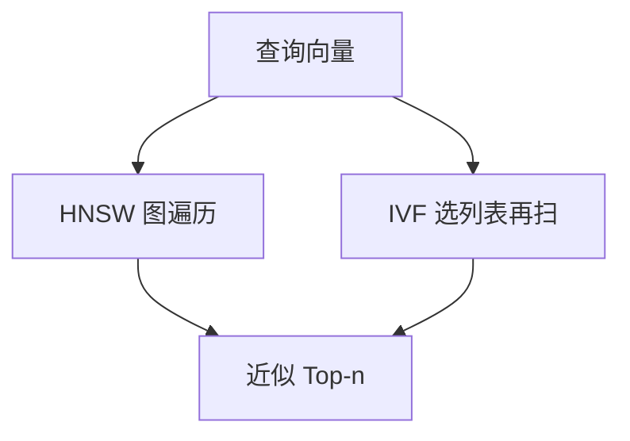

# HNSW / IVF

精确近邻随库规模线性扫。近似近邻用图或倒排粗量化换召回–延迟曲线。曲线是协议，不是「开了 HNSW 就无损」。

<footer>—— Malkov &amp; Yashunin HNSW；Jégou 等 IVF 粗量化倒排</footer>

[上一课](/llm/rag-context-compression)减少进入阅读器的 token。检索库本身仍可能是千万级向量。本课写 ANN 的两条默认结构：HNSW（图）与 IVF（倒排文件）。缺口是召回率对 $k$、efSearch、nprobe 的依赖。后课 PQ 在向量内部再压缩，常与 IVF 联用。

## 问题

精确 kNN 扫全库，延迟不可接受。HNSW 建多层可导航小世界图，搜索沿边贪心 + 候选集。IVF 先把空间分成粗心，查询只扫近的若干列表。二者都是近似：可能丢掉真正的邻居。RAG 里丢掉的若是唯一支撑块，忠实度直接掉。必须在**自己的查询分布**上画 Recall–延迟曲线，不能抄基准数字。

过滤（权限、租户）与图遍历交互：先过滤后搜或边搜边滤，实现错了会漏召回或漏出无权限文档。

建索引的超参（M、efConstruction、粗心个数）改的是图/列表质量，搜时的 efSearch / nprobe 改的是预算。两套都要进模型卡式的索引卡。

## 方法

选结构：内存允许、要高召回 → HNSW；库极大、可接受较低召回或配合 PQ → IVF。调参：固定延迟预算扫 efSearch 或 nprobe，看 Recall@$k$。$k$ 应大于最终送给阅读器的块数，给融合与压缩留候选。增量插入：HNSW 可动态加边，IVF 列表 unbalanced 时要重建。

## 机制

HNSW 的高层边是长距离高速公路，底层是精细邻居。efSearch 增大等于允许更宽的候选，逼近精确。IVF 的误差来自查询落在错误粗心附近——边界点会被切错列表，nprobe 增大即多探几个心。两者都把「真实近邻被剪掉」的概率换成延迟。这个概率在难查询（近邻很近、易混）上更高，平均召回会掩盖切片。

## 边界

ANN 不修复坏嵌入。空间本身塌了，图再好也搜不到。下一课 PQ：把向量量化进码本，内存再降一截，误差再加一层。

## 小结

- HNSW / IVF 用近似换延迟，必须报自己分布上的 Recall–延迟。
- 搜时预算与建时超参都要版本化。
- 权限过滤与遍历实现属于正确性，不只是性能。
- 出处：Malkov & Yashunin HNSW；Jégou 等 IVF。
