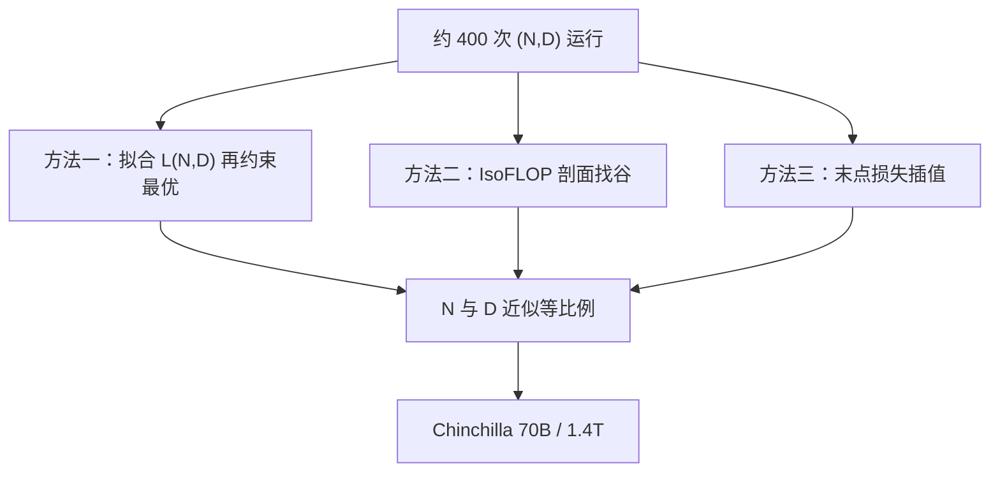

# Hoffmann 的 Chinchilla 论文

我们用三种独立方法估计计算最优的参数量与 token 数，它们指向同一区域：两者应近似同比例随 FLOPs 增长——这与先前偏大模型的分配相反。

<footer>—— Hoffmann et al., Training Compute-Optimal Large Language Models, 2022</footer>

DeepMind 的 Gopher（280B）按当时流行的 Kaplan 分割，用相对较少的 token 堆出很大的稠密模型。Jordan Hoffmann 等人在同一技术栈上问：若把等量训练 FLOPs 分给更小的模型、更多的 token，损失与下游会不会更好？答案是 Chinchilla：约 70B 参数、约 1.4T token，计算量与 Gopher 相当（约 $5.8\times 10^{23}$ FLOPs 量级），语言建模与 MMLU、BIG-bench 等下游全面领先。论文的贡献不只是这一头模型，而是**同一结论被三种估计方法独立指向**，以及为此训练的约四百个对照点。计算最优作为规划口诀、以及它与过训部署的差别，已在 [Chinchilla 计算最优](/llm/chinchilla) 里写；本篇回到原文：实验设计、三种方法各自做什么、70B 对照表，以及他们实际拟合出的指数。

## 问题

Kaplan 给出的计算最优是 $N$ 随 $C$ 涨得比 $D$ 快（约 $0.73$ / $0.27$）。若该分割来自大模型未在相称的 token 上走完余弦、或来自把未收敛点塞进损失面，那么 Gopher 这类「同计算下尽量大」的模型会系统欠训。Hoffmann 等人要在控制优化配方的前提下重新测等计算面的谷底，并且不信任单一拟合：若参数化损失面、等 FLOP 剖面、以及训练曲线末点插值三种做法落到同一 $(N,D)$ 区域，结论才站得住。

他们仍承认 $C \approx 6ND$ 的稠密会计。问题不是「要不要多看数据」，而是固定 $C$ 时 $N$ 与 $D$ 的交换率。数据用 MassiveText 一类 Gopher 同源语料，避免「换了数据才变强」的混淆。学习率余弦的寿命必须与预定 $D$ 对齐——这是原文明写的实验卫生，后来被用来解释 Kaplan 为何偏大。

### 四百次运行是为了画面，不是为了刷一个 70B

公开叙事容易变成「Chinchilla 70B 打赢 Gopher 280B」。论文的方法学重心是：在许多 $(N,D)$ 上把最终损失当成可插值的曲面，再在 $ND$ 乘积为常数的曲线上找最低点。70B 是把该最低点附近的配置训满、并做下游评测的旗舰，用来证明谷底不只在语言建模损失上存在。没有那四百个点，70B 只是又一个大模型故事。三种方法都在「稠密 Transformer + 他们的 AdamW 配方 + 当时的网络文本」上成立。把拟合指数抄到 MoE、重复数据或完全不同的 tokenizer 上，等于改了 $L(N,D)$ 的定义。原文没有声称 20 token/参数是物理常数。

## 方法

**方法一：参数化损失面。** 将最终损失拟合成可分形式

$$
L(N,D)=E+\frac{A}{N^{\alpha}}+\frac{B}{D^{\beta}},
$$

在 $C \propto ND$ 约束下对 $N$ 求最优，得到 $N_{\mathrm{opt}}\propto C^{a}$、$D_{\mathrm{opt}}\propto C^{1-a}$。他们的拟合给出 $a$ 接近 $1/2$（文中一组常用读数约为 $N \propto C^{0.50}$、$D \propto C^{0.50}$，与 Kaplan 的 $0.73$/$0.27$ 对照）。$E$ 是不可约损失代理。这一方法吃全部运行的最后损失，对失败点敏感，但能外推到未直接训练的 $C$。

**方法二：IsoFLOP 剖面。** 固定若干离散计算预算，在每个预算上扫不同的 $N$（因而 $D=C/(6N)$ 跟着变），直接读出该预算下损失最低的 $N$。不依赖 $L$ 的参数化形状。剖面的谷随 $C$ 移动的方式，用来交叉验证方法一的指数。原文用多条等 FLOP 曲线表明谷底并不落在「尽量最大的 $N$」上。

**方法三：训练曲线末点。** 用各次运行的最后损失对 FLOPs 做插值，估计给定 $C$ 时最好的 $(N,D)$，避免完整参数化。三种估计落在同一区域，构成论文的核心稳健性声明。

旗舰对照：Chinchilla 70B × 1.4T token versus Gopher 280B × 约 300B token。下游：MMLU、BIG-bench、阅读理解与常识等，Chinchilla 系统性更高；作者把差距归因于计算分配而不是新架构——架构与 Gopher 同族。经验规则被读成约 **20 token 每参数**，对应这次拟合在稠密解码器上的读数。

### 与 Gopher 同栈是为了分离「分配」变量

若 Chinchilla 换了优化器、换了数据清洗、换了深度–宽度比，70B 的胜利无法归因于 $D$ 更大。原文刻意钉在 Gopher 配方上，只改 $N$ 与训练 token 数（以及与 $D$ 对齐的日程终点）。这是因果设计，不是缺少创新。读论文时把「没有新结构」当成缺点，会看丢它要鉴定的变量。

## 机制

三项式把容量不足与数据不足写成可交换的降损通道。$\alpha$ 与 $\beta$ 接近时，拉格朗日约束下最优落在 $N$ 与 $D$ 同阶。Kaplan 的偏大 $N$ 相当于把数据项的指数估低、或把未充分退火的大模型损失当成充分训练损失。机制上不必引入新的网络理论：测量协议一改，等计算面的谷就向更大的 $D$ 移动。Chinchilla 是把测量做干净。

不可约项 $E$ 解释为何无限加 $N$ 或 $D$ 不能把损失送到零。靠近 $E$ 时，同样比例的扩展换来的绝对降幅变小。高质量数据与去重改的是 $E$ 与系数，见后续的 [数据约束扩展](/llm/data-constrained-scaling)，不在 2022 年这篇的主实验里。

原文比较的是训练计算最优，评测的是验证损失与学术下游。它没有优化推理成本。Llama 之后把 $D/N$ 推过 20，是在等计算面之外选择更小的 $N$，见 [过度训练](/llm/overtraining-for-inference)。那不推翻三种方法指向的谷底，只是换了目标函数。

### 20 从哪里读出来

在 $a\approx 1/2$ 且落到他们扫描的 $C$ 范围内，最优 $D/N$ 大约是二十这一量级。它随拟合细节与 $C$ 的区间会动，所以应写成「约 20」，并记住这是稠密、单次过数据假设下的数。IsoFLOP 谷给出的是图形上的 $N_{\mathrm{opt}}(C)$，换成 $D/N$ 才是口诀。口诀便于排期，拟合式便于外推；论文两种都给了。

## 边界与工程取舍

数据墙：若独特 token 少于 $D_{\mathrm{opt}}$，谷底落在不可达处，必须重复或改 $N$，原文的等比例不再可执行。评测污染、tokenizer、序列长度都会移动 $L$。Gopher 栈的 AdamW、batch 与并行策略是实验的一部分；换 [Sophia](/llm/sophia) 或 μP 不会自动保持同一谷底，但「应在等计算面上比较」这一方法仍适用。

三种方法对早期停、发散点敏感。复现应报告扫了哪些 $N$、IsoFLOP 上的最低损失，而不是只复述 70B 赢了。下游领先不能细拆成「全是更多 token」还是「70B 恰好好优化」——对照设计已经尽量排除架构，但仍剩优化动态与有限的随机种子。

不要用本篇替代 [Kaplan 2020 原文](/llm/kaplan-2020) 的阅读。Hoffmann 修正的是计算分配指数，不是「损失随 $N,D,C$ 幂律下降」这一观察。两篇合在一起才是预训练规划语言的来源。

## 小结

- Chinchilla 论文的贡献是：在 Gopher 同栈上用三种独立估计表明，计算最优处 $N$ 与 $D$ 近似等比例随 $C$ 增长。
- 方法一拟合三项式并求约束最优；方法二画 IsoFLOP 剖面；方法三做末点插值；约四百次运行支撑损失面。
- 旗舰 70B / 1.4T 与 280B / 0.3T 的 Gopher 同计算对照，下游与损失均支持更多 token 的一方。
- 约 20 token/参数是该拟合的读数；余弦寿命必须与 $D$ 对齐，否则会重现偏大模型。
- 原文不管推理最优、不管数据重复、不管 MoE。
- 出处：Hoffmann et al., *Training Compute-Optimal Large Language Models*，2022（arXiv:2203.15556）。规划口诀的展开见 [Chinchilla 计算最优](/llm/chinchilla)。
