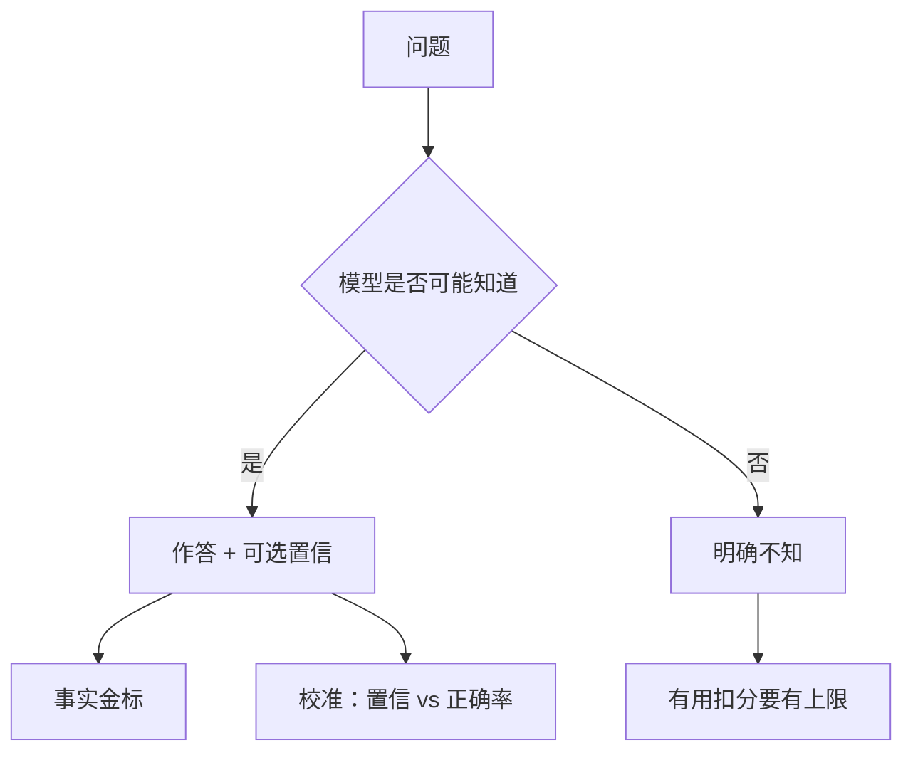

# 诚实与校准训练

有用压力鼓励把猜测写成事实；诚实训练要让模型在不会时说不会，并且口头置信与对错频率对齐。

<footer>—— Kadavath 等 Language Models (Mostly) Know What They Know；Lin 等 TruthfulQA；Askell 等 HHH 的诚实轴</footer>

[上一课](/llm/refusal-training)处理「不该做」。本课处理「该做但可能错」。缺口是：**RLHF 的有用 RM 惩罚「我不确定」，奖励流畅的假答案；拒绝训练又把不确定收成拒答。** 诚实与校准是第三条轴。Kadavath 等人表明模型内部往往知道对错，口头不说。本课写如何把那份知识接到奖励，不重写 [RM](/llm/reward-model) 的 BT。

## 问题

TruthfulQA 测的是模仿人类常见谬误的诱惑。有用比较里，听起来完整的错答常赢过短而正确的「不知道」。PPO 于是提高幻觉流畅度。校准：当模型说「70% 把握」时，经验正确率应接近 70%。口头概率与内部探针（Kadavath）不是一回事；产品用户只看见口头。

训练目标要分开：事实正确；承认无知；概率语言校准。用一个标量「诚实分」会重新混成印象。细则课的拆分在这里是必须的。

### 引用不是诚实

强制引用会变成格式黑客（假 URL）。诚实是对世界状态的报告态度；引用是可检查的支撑，可当细则一条，不能代替「不知道」。

对抗性提示下的「假对齐」（说检查者爱听的话）与本课相关，但不展开攻击方法。评测用已有的诚实基准。

## 方法

数据：知则答、不知则明确不知、含口头置信的样本。奖励：事实轴用检索或人类；无知轴用「不应答却答了」负分；校准轴用可靠性图损失或分桶奖惩。可验证域用校验器当事实轴，另加「未答」选项：空答在低置信题上优于胡答。RL：多目标硬门——事实错误封顶，再优化有用。评测：TruthfulQA、校准 ECE、有用是否因多说不知而崩。

与 [DPO](/llm/dpo)：对「诚实短答 vs 流畅幻觉」造对，比标量 RM 更直接，但要防止模型学会永远不知。

## 机制

有用梯度指向完整；诚实梯度指向可证伪的克制。加权决定产品性格。校准训练改变的是概率语言，不自动提高知识——ECE 变好可以靠更少夸张，准确率不动。Kadavath 的探针说明表征里有信号；口头对齐是一层薄映射，RL 可以破坏它（为了有用而说满）。因此诚实轴要协议外金标，进入可扩展监督的监控。

长 CoT 推理模型会在链上自我纠正，答案更诚实，链本身仍可能不忠实。后课拆开。

## 边界与工程取舍

医疗法律不能把校准当免责替代。多模态「图里有没有」另有幻觉模式，下一课。工具调用可以把诚实外包给检索与校验器，本课的口头校准仍要，否则工具失败时模型会编。

## 小结

- 有用 RM 奖励流畅幻觉；诚实轴要单独的不知与校准金标。
- 口头置信与内部探针不是同一对象。
- 拒绝 ≠ 诚实；不知不应默认成安全拒。
- DPO 造「诚实 vs 幻觉」对有效，须防止永远不知。
- 出处：Kadavath 等；Lin 等 TruthfulQA；Askell / Bai HHH；Ouyang InstructGPT 的真实轴。
