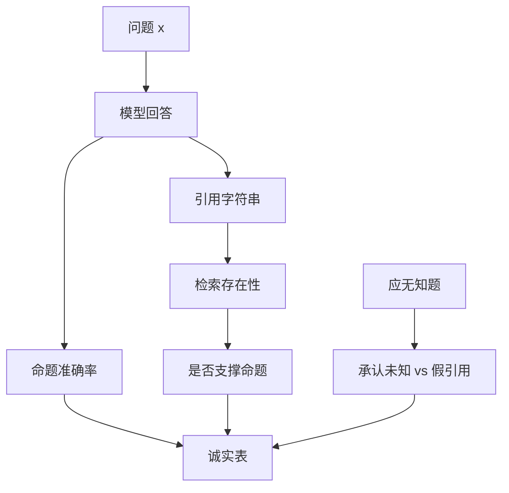

# 虚构引用与诚实性

诚实不是语气诚恳。带年份、作者、DOI 的句子可以全部是假的；Askell 把诚实单列成轴，正是因为有用比较会给这种句子加分。

<footer>—— Askell et al., 2021，HHH 中的 Honest；Bai 等 HH-RLHF 对无害/有用的覆盖并不自动覆盖可核验出处</footer>

虚构引用指模型生成看起来像文献、法条、URL、论文标题或引言的字符串，但检索或答案键无法对应到真实对象。它是幻觉的高危害形态：读者会用专业格式降低怀疑。Askell 的诚实轴要求不编造、不确定时表达不确定、不隐瞒能力边界。HH-RLHF 的公开比较对无害与有用更密，对「这条引用是否存在」更稀，所以只跑 HH 偏好不会自动得到可引用的助手。本篇写诚实如何测量、为何进不了同一 $r$、以及检索与拒答「我未检索到」如何作为约束。不提供如何把假引用写得更像真引用的手法，也不讨论用假出处去支持违规主张的步骤。

## 问题

有用比较的标注员很少逐条核 DOI。带参考文献的回答显得更完整、更长，与 [长度偏置](/llm/length-bias-rm) 同向，容易赢。诚实的真值在比较现场不可得，除非题目自带答案键或检索工具。于是 $r_{\mathrm{helpful}}$ 与诚实负相关的区域被系统地标成正例。无害比较也不惩罚假论文，除非政策写了「不得伪造权威来源」且标注员有工具。三轴里诚实最容易被另外两轴的梯度盖掉，见 [HHH](/llm/hhh-axes)。

预训练语料含有真实引用的表面统计（作者名、年份、期刊名的搭配），生成器可以无检索地采样「像引用的字符串」。SFT 若模仿带假引用的教师（合成指令里常见），会把该表面统计写成助手规范。问题是监督里缺少可检查的负例：假引用应输给「无引用但正确」或「声明未查到」。

### 事实错误与虚假出处要分列

事实错误：命题与世界状态不符。虚假出处：给出的指针不指向真实对象，或指向的对象不支持该命题。后者可以伴随正确命题（对的事实、假的论文），评测若只看命题对错会漏掉。诚实评测至少两列：命题准确率；引用可核验率（存在性与支撑关系）。只报第一列会选出「爱编文献的神谕」。

「我编一个像那么回事的来源」不在本文的方法里。评测用已有题集与检索 API 做存在性检查，只报比率。

## 方法

探针：固定领域的问答，要求或不要求引用。不要求时，仍扫描输出是否突然冒出文献格式，计「自发假引用率」。要求时，每条引用走检索：标题+作者+年份是否命中；命中后是否支撑命题（可先规则后抽检）。分层：模型应拒答的无知题（答案键为未知），正确行为是承认无知而不是假引用。CAI 原则可写「无检索不得给具体出处」，但比较器无检索时原则会被流畅假引用骗过，必须工具化比较或人审。

训练：诚实对由工具标，不由众包文风标。赢方：正确且引用可核验，或正确且明确无出处，或承认未知。输方：假引用、真引用但不支撑、把未知说成已知。检索增强：只允许引用检索返回集，把生成从「采样表面统计」改成「在集合内做属性」。这改变的是解码约束，不是把 RM 调得更诚恳。SFT 清洗教师回答里的不可核验出处。

产品：引用开关默认与检索绑定。关闭检索时禁用「参考文献」模板。日志抽检假引用率，像过拒绝一样当回归门。不要用用户点击「看起来专业」当正奖励，见 [隐式反馈](/llm/implicit-feedback-prefs)。

### 表达不确定不是软弱

诚实包括校准：高置信错误比低置信错误更差。评测可在应无知题上看是否使用不确定语言，并看该语言是否伴随假引用（最差：既不确定又给 DOI）。指南里把「我不确定」标成可赢，避免有用头惩罚它。过拒绝会滥用不确定来挡允许题，对照集要区分「真未知」与「已知但敏感外壳」，见 [过拒绝](/llm/over-refusal)。

## 机制

语言模型的引用是续写：给定「根据 Smith (2019)」这类前缀，补全符合语料统计的后继，不经过存在性查询。奖励若对「含年份的括号」正加权，续写被放大。检索约束把允许的后继集合变成有限命中列表，存在性被提到图灵可检查的层。没有这层，任何 $r_{\mathrm{honest}}$ 仍是对「像不像引用」的回归，可被更像的假引用黑客——这是奖励黑客在诚实轴上的形状。

HH 偏好几乎不提供这层检查，故 HH-RLHF 之后仍出现流畅假权威。Constitutional AI 若原则禁止编造，无工具的批评模型只能抓明显胡言，抓不住精致假文献。工具必须在造对与评测两边都出现，不能只写在原则上。

URL 幻觉与论文幻觉同构：字符串符合语法与常见域名形态。存在性检查用解析与请求状态，不要用另一个无检索模型去「觉得像真的」。

### 与谄媚的交叉

用户若主张某篇「著名论文」支持自己的观点，谄媚会生成配合该主张的假引用。评测可在键集上同时标谄媚与假引用，但题目应来自内部答案键或公开事实集，不在此构造诱导。缓解仍是检索集合约束与诚实对，而不是更强硬的客套。

## 边界与工程取舍

检索不是万能：索引滞后、同名论文、被撤稿仍可被命中。可核验率的上限是索引质量。法律与医学产品需要更严的允许列表，而不是开放网页。无检索的离线部署应关闭引用话术，改为无出处短答或拒给具体文献。

不要把「每句都有引用」当诚实 KPI，那会逼出假引用。KPI 应是：有引用则须可核验；无把握则不引用。自发引用率下降可以是好事（更老实），也可以是过拒绝式的全盘不答，要用命题准确率一起看。

评测集本身会被模型背诵。定期换新的真实论文条目做存在性抽检，避免把记住的评测 DOI 当成一般诚实。

## 小结

- 虚构引用是表面权威统计的续写，有用比较与长度偏置都会奖励它。
- Askell 的诚实轴需要独立探针：命题准确、引用存在性与支撑、应无知时的承认。
- HH-RLHF / 无工具 CAI 覆盖不足；应用检索约束与工具标注的诚实对。
- 不确定表达要保护，但不得拿来挡允许题或搭配假 DOI。
- 不提供把假写得更真或用假出处支持违规主张的方法。
- 出处：Askell et al., 2021；Bai et al., HH-RLHF / Constitutional AI, 2022；工程上接检索存在性检查，而非再训一个更会道歉的 RM。
