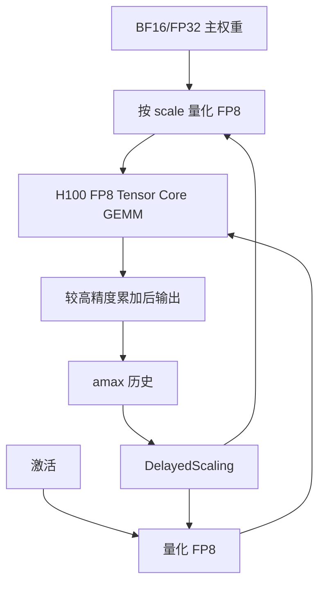

# H100 Transformer Engine

Hopper 把 FP8 矩阵乘做成 Tensor Core 的一等精度；Transformer Engine 则把缩放因子、混合格式与融合层收成可在框架里打开的配方，而不是一次 `tensor.to(fp8)`。

<footer>—— NVIDIA Hopper 产品材料与 Transformer Engine 文档中的 FP8 Delayed Scaling / HYBRID 格式</footer>

H100 相对 A100 的软件可见变化里，对 LLM 训练最硬的一块是 **第四代 Tensor Core 的 FP8** 加上第一代 **Transformer Engine (TE)**。混合精度的数学——主权重、损失缩放、amax——见 [BF16 / FP8 训练](/llm/pretrain-mixed-precision)。本篇只写 Hopper 这一代 TE 作为**库与硬件合同**：它吃什么格式、延迟缩放为什么存在、线性层如何替换，以及没有 TE 路径时 H100 为什么仍停在 BF16 的屋顶线上。不把 Blackwell 的 NVFP4 / MXFP8 提前写成 H100 特性。

## 问题

产品表上的稀疏 FP8 峰值大约是稀疏 FP16 的两倍量级（H100 SXM 公开表：稀疏 FP16 约 1,979 TFLOPS，稀疏 FP8 约 3,958 TFLOPS）。HBM3 约 3.35 TB/s，相对 A100 的约 2.0 TB/s 并没有按峰值同样倍数涨。若计算仍用 BF16、只把权重以 FP8 存放，得到的是容量，不是 $P$。若用假量化在 CUDA 核心上模拟 FP8，得到的是正确性实验，不是 Hopper 的 MMA。

FP8 的动态范围极窄。E4M3 尾数多、范围小，适合前向；E5M2 范围大、尾数少，适合梯度。没有每张量（或分块）的缩放，大多数激活与梯度根本进不了格子。需要一个把「统计 amax → 选 scale → 量化 → FP8 GEMM → 反量化语义」绑在层上的运行时，并且尽量不在每步先做第二次全张量扫描。这就是 TE 在 Hopper 上要卖的东西。

### 硬件边界：SM90 与 FP8 MMA

TE 文档写明 FP8 延迟缩放路径需要 SM89（Ada）或更新；数据中心训练的主对象是 SM90 的 H100 / H200。没有 FP8 Tensor Core 的 GPU 上，TE 可以回退或拒绝，但没有吞吐意义。格式由库与硬件共同约定：输入 FP8、累加通常在更高精度（实现上常见 FP32 累加器），缩放因子作为 GEMM 元数据乘回去。漏乘一个 scale，等于给该层乘了一个随机学习率。

H100 还有 FP8 以外的 Hopper 特性（TMA、WGMMA、线程块集群）。它们加速的是搬运与 MMA 发射，TE 加速的是精度协议。融合核可以把两者叠在同一条线性层里，但排障时要分开问：Nsight 里 Tensor Pipe 是否非零，以及 amax 历史是否在更新。

## 方法

典型用法是：用 `te.Linear`、`te.LayerNorm`、`te.TransformerLayer` 一类模块替换框架线性层，或让 Megatron / NeMo 在配置里打开 TE；构造 `DelayedScaling` 配方；在 `fp8_autocast` 上下文中前向反传。默认 **HYBRID** 格式：前向 E4M3，反传梯度 E5M2。也可指定全程 E4M3，范围更紧、尾数略好。`DelayedScaling` 的默认思路是：本步用历史 amax 窗口估计 scale，本步观察到的 amax 写入历史，供后续步使用。窗口长度、用窗口内 `max` 还是 `most_recent`，都是配方参数。相对 Current Scaling，延迟缩放把「先扫一遍 amax 再量化」合成一次读，换来的是 scale 陈旧。

### 分布式下的 amax 归约

张量若被数据并行、序列并行或上下文并行切开，各 rank 上的局部 amax 不是全局 amax。TE 文档要求在张量被切分的进程组上做 amax reduction（配方里的 `reduce_amax`，autocast 里的 `amax_reduction_group`），并建议包含所有持有该张量分片的 GPU。不做归约，每张卡各用各的 scale，拼接后的数值协议破裂：可以训练、可以降损失，有效学习率已经不是配置文件里的数。流水线各阶段的 FP8 元数据要随检查点一起存；只存 FP8 权重、不存 scale 与 amax 历史，无法按原配方续训。

TE 还提供融合：GEMM 后接 GELU / 偏置、LayerNorm 线性等，减少 FP8 进出 HBM 的往返。Hopper 上这些融合才有资格同时吃 TMA 与 WGMMA。用户手写三颗独立 kernel，中间用 BF16 写回，等于把 TE 降成「偶尔发一次 FP8 MMA」。推理侧 TE 也可参与 FP8，但校准、静态 scale 与训练的延迟窗口不是同一配方——不要用推理校准集去「验证」预训练 FP8。

## 机制

延迟缩放能成立，是因为大 batch 预训练的 amax 在相邻步之间往往平滑。scale 慢一拍，大多数值仍落在可表示区；偶发尖峰则溢出，实现通常跳过该步或缩小 scale，与动态损失缩放是同一类控制回路。微调、极小 batch、损失尖峰更频繁时，陈旧 scale 更危险，文档与实践会改用 Current Scaling 或先 BF16 热身再开 FP8。这不是 Hopper 硬件缺陷，是统计假设破了。

屋顶线上，FP8 把同一 HBM 流量对应的算术强度抬高，拐点右移：本该带宽受限的层有机会靠近计算墙。Decode 小 $M$ 的 GEMM 除外——tile 填不满 Tensor Core，精度再窄也接近带宽墙。所以 H100 上「开 TE」对预训练大微批、prefill 更敏感，对单请求 decode 不是同一故事。稀疏 2:4 峰值另算：权重必须满足模式且走稀疏 MMA，稠密 FP8 不会因为表头印了 sparse 就翻倍。

HYBRID 不是「前向 FP8、反传 BF16」的口语简化。反传里进入 Tensor Core 的梯度张量走 E5M2；softmax、归一化、损失仍应在较宽格式。TE 管的是参与 GEMM 的那些张量，不是整网所有 op。

### 与框架、ZeRO、流水线的交接

TE 层内部持有 FP8 权重副本或每步从主权重转换。ZeRO / FSDP All-Gather 的对象必须与 TE 的存储约定一致：Gather 来的是 BF16 主副本再量化，还是已经 FP8 的片，决定通信体积与 scale 归属。跨阶段流水时，amax 窗口在 microbatch 之间的更新顺序要固定，否则数值随流水深度漂。这些是集成问题，H100 白皮书不会写。验收应包含：Tensor Pipe 占用、溢出 / 跳步计数、与 BF16 基线的损失曲线，而不是只看 MFU。

## 边界与工程取舍

不要在 A100 上用「H100 TE 配方」期待 FP8 MMA。不要把产品表稀疏 FP8 除以墙钟当利用率。不要在 amax 不归约的张量并行里开 FP8 还对拍多卡损失。H100 NVL（PCIe 双槽）与 SXM 的 NVLink 规格不同，通信隐藏预取的能力不同，但 FP8 MMA 合同相同——不要把形态差异写成 TE 不支持。

H200 同属 Hopper 一代，HBM 更大，TE 配方可沿用；那是容量与带宽步进，不是第二代 Transformer Engine。第二代、FP4、微缩放是 Blackwell 叙事，见 [Blackwell 对推理的含义](/llm/blackwell-infer)。库版本必须与 CUDA / cuDNN 对齐；静默回退到 BF16 GEMM 是最常见的「开了 TE 却没加速」。

出处：NVIDIA Transformer Engine 用户指南（FP8 Delayed Scaling、`Format.HYBRID`、设备要求 SM89+）；H100 产品页中的 FP8 Tensor Core 与 HBM3 / NVLink 公开规格。加速比随模型与是否稀疏而变，不在本篇写成定律。

## 小结

- H100 的第一代 Transformer Engine 把 FP8 GEMM、混合 E4M3/E5M2 与延迟缩放收成层级 API。
- 吞吐来自第四代 Tensor Core 的 FP8 MMA，不是来自存储 dtype 改名。
- DelayedScaling 用历史 amax 避免每步双倍读；分布式必须按分片组归约 amax。
- 融合与 Hopper 异步拷贝叠用才接近表头；小 $M$ decode 仍可能带宽受限。
- 不要把 Blackwell 的 NVFP4 写成 H100 能力；不要把稀疏峰值当稠密工作负载。
- 出处：NVIDIA TE 文档与 Hopper / H100 公开产品规格；数值协议对照 [混合精度训练](/llm/pretrain-mixed-precision)。
