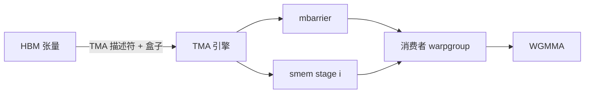

# TMA 与 Hopper 异步拷贝

    
Hopper 把全局内存与共享内存之间的批量张量搬移做成专用引擎：线程写描述符、发一条异步拷贝，自己去忙 MMA；完成与否由 mbarrier 通知，而不是靠 warp 里逐地址的 load。

    <footer>—— NVIDIA Hopper 架构白皮书与 CUDA 编程指南中的 Tensor Memory Accelerator / `cp.async.bulk`</footer>

Ampere 已经提供 `cp.async`：线程把全局地址搬进共享内存，拷贝与随后的 `mma.sync` 可以重叠。Hopper（H100 一类）再进一步，引入 Tensor Memory Accelerator（TMA）：用张量映射描述符表达多维布局、盒子大小与边界填充，由拷贝引擎执行 `cp.async.bulk.tensor`，把地址生成从 SIMT 线程上卸下。LLM 核里的大块 $A$、$B$、注意力的 $K,V$ 瓦片，适合走这条路径；完全随机的 gather 仍然不是 TMA 的对象。

本篇写 Hopper 这一代的异步拷贝：从 `cp.async` 到 TMA、描述符、mbarrier、以及 cluster 上的 multicast。Rubin 对描述符的内联覆盖见 [TMA 与本地化访存](/llm/rubin-tma)，不在这里提前写成 H100 特性。

## 问题

GEMM 与分块注意力的访存模式是「一块连续或等步长的张量盒子」，不是「每线程一个无关指针」。用 SIMT 去算这些地址，占用发行槽、寄存器和指令缓存，只为了驱动本来就很规则的 HBM 请求。`cp.async` 减轻了「先 load 进寄存器再 store 到 smem」的往返，但地址算术仍在线程上，且粒度按线程的拷贝宽度走。当 tile 变大、布局变成 MMA 需要的 swizzle 时，线程协作拷贝本身成为瓶颈，也容易引入 [bank conflict](/llm/shared-memory-banks)。

TMA 要解决的是：让规则张量的 HBM↔smem 搬移以描述符为合同，线程只负责「发」和「等」，计算 warp 可以特化成纯 MMA，见 [warp specialization](/llm/warp-specialization)。问题的另一半是同步：异步拷贝完成前读 smem 是数据竞争。Hopper 用 `mbarrier` 把「这一盒子到齐」做成硬件可等待的对象，替代 CTA 级 `__syncthreads` 对整块 smem 一刀切。

### 描述符能表达什么

张量映射包括基址、各维尺寸与步幅、元素宽度、以及越界时的填充模式。拷贝指令给出本次盒子的坐标与目标 smem 地址。引擎按盒子走路，而不是按 1D `memcpy`。步幅、对齐、维数必须落在文档允许的子集；任意间接页表（分页 KV 的随机块列表）不能直接当成一个 TMA 盒子——要么先整理成连续/等步长块，要么对每块发一次 TMA，要么回退到普通 load。这是分页注意力核要保持块对齐的硬件原因之一。

TMA 不是 `cudaMemcpyAsync`。后者是主机或运行时发起的一维 DMA，走运行时通道；TMA 是设备核内指令，源和目的是全局张量与共享内存（以及文档写明的部分全局到全局路径）。把二者混名，会在「谁来发、何时完成」上规划错。

## 方法

核的结构从「全体线程算地址」改为：

1. 主机或核初始化 `CUtensorMap`（或对应 PTX 描述符），指定全局张量布局。
2. 生产者 warp 对每个 pipeline stage 发 TMA load，把盒子写入该 stage 的 smem 槽，并 `mbarrier.arrive` 与拷贝完成挂钩。
3. 消费者在对应 barrier 上 wait，然后按约定的 swizzle 布局做 [WGMMA](/llm/wgmma) 或 `ldmatrix`。
4. 沿 $K$ 推进 stage，形成 [软件流水](/llm/sw-pipeline-buffer)。

Thread block cluster 上，TMA 支持 multicast：一次发行把同一盒子写入集群内多个 CTA 的共享内存。权重复用跨 CTA 时，这能减 HBM 流量，代价是集群调度与分布式 smem 的约束。CUTLASS sm90 集体主循环把上述步骤收成模板；手写时必须自己管理 barrier 相位，错一个 stage 就是静默错数。

### 与 Ampere `cp.async` 如何选

`sm_80` 没有 TMA 指令。A100 核应继续用 `cp.async` + `cp.async.commit_group` / `wait_group`，或让 CUTLASS 选 sm80 集体。H100 上并非所有拷贝都该走 TMA：小而零碎、或完全间接的访问，描述符开销和盒子约束可能更差。经验是：大、规则、多维、要与 WGMMA 重叠的 tile 用 TMA；尾块、标量、不规则 gather 用普通异步拷贝或 load。同一核里两种路径并存是正常的，不要为「纯 TMA」而把尾块 pad 到浪费一个 stage。

Store 方向（smem→HBM）同样有 TMA store，用于 epilogue 写出大块 $C$。小向量 epilogue 仍常走寄存器直写全局，以避免为几行输出建描述符。

## 机制

TMA 是独立于 SIMT 的拷贝引擎：描述符驻留后，指令引用它并给出本次坐标。HBM 控制器看到的是规整的批量请求，更容易打到峰值附近的事务尺寸。线程侧的收益是发行条数下降、地址寄存器释放给 MMA。完成语义靠 barrier：拷贝引擎在盒子完成后对指定 mbarrier 做 arrive，消费者 wait 的是「数据可见」，不是「指令退休」。这与 CPU 上的 DMA 完成中断同类，只是完成队列在 SM 内。

Multicast 的机制是一次 HBM 读、多次 smem 写（在集群可达的 CTA 上）。它不创造新带宽，只把已经读出的字节复制到多个近端。若多个 CTA 本就会打同一权重 tile，multicast 减少重复读；若各 CTA 要的盒子不同，强行 multicast 没有意义。白皮书把 cluster 与 TMA 写在一起，是因为没有集群，multicast 的目的地集合不存在。

达成带宽仍受行命中、bank、以及计算是否及时消费限制。TMA 把请求变规整，不能把产品表上的 HBM TB/s 保证给任意核。Nsight 应同时看 DRAM throughput 与 TMA/copy 相关计数器，而不是只看核名里有没有 `tma`。

### 异步与正确性

TMA 发行后生产者可以立刻去发下一条，不必等。消费者必须 wait 对应 barrier，且对同一块 smem 的复用要遵守 pipeline 的相位：写 stage $i$ 不得覆盖消费者仍在读的 stage。Fence 与 barrier 的配对以 PTX 文档为准；少一次 `arrive` 会表现为随机损坏，多一次可能死锁。调试应先把 stage 降到 2，用固定输入对照 cuBLAS，再加深流水。

## 边界与工程取舍

不要在 Ampere 及更早假设有 TMA。不要把主机 `cudaMemcpy` 叫做 TMA。不要为未公开的引擎队列深度、描述符缓存大小编造数字。跨 GPU 的搬移不是 H100 TMA 的主合同；NVLink 上的远程拷贝有另外的编程模型，柜外仍是 GPUDirect / RDMA。混合精度下，描述符的元素宽度必须与 MMA 输入一致，否则「搬得很快、乘的是错的字节」。

分页 KV、MoE 专家槽若形状相同、基址不同，Hopper 上往往是每块更新坐标或换描述符基址；Rubin 公开的指令内联覆盖是后代增强，见专门一篇。框架若仍用旧的全局 load 核，换 H100 不会自动走 TMA，需要 CUTLASS / cuDNN / 注意力核版本跟上。

出处：Hopper 架构白皮书；CUDA C++ Programming Guide 的异步拷贝、TMA、`cp.async.bulk`、mbarrier；PTX ISA 中对应指令。CUTLASS sm90 示例是合法落地，不是另一套硬件语义。

## 小结

- Hopper TMA 用描述符做全局张量与共享内存之间的批量异步拷贝，把地址生成从 warp 上卸下。
- 完成靠 mbarrier，与 WGMMA 和软件流水组成重叠；替代不了不规则 gather。
- Cluster multicast 一次读、多 CTA 写 smem，服务权重复用，不创造新的 HBM 峰值。
- A100 走 `cp.async`；H100 上大规则 tile 才优先 TMA。
- 描述符宽度、对齐、盒子必须与 MMA 布局一致。
- 出处：Hopper 白皮书与 CUDA TMA / `cp.async.bulk` 文档。
