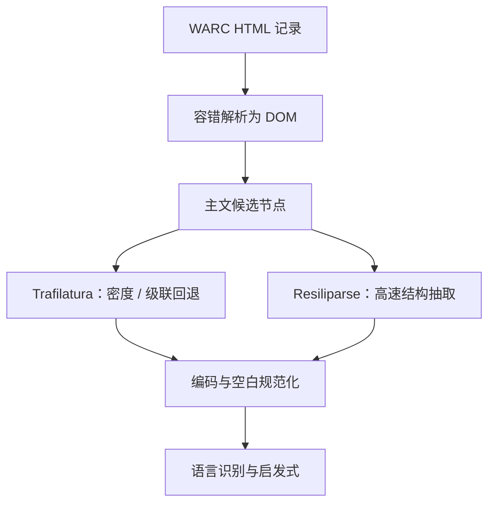

# trafilatura / resiliparse 抽取

    
同一条 WARC 记录，换一个正文抽取器，得到的可训练字符可以差出一个数量级；后续所有过滤都只是在这个字符串上工作。

    <footer>—— Penedo et al., FineWeb；抽取器对照 Barbaresi Trafilatura 与 Bevendorff et al. Resiliparse</footer>

网页预训练并不从「文档」开始，而从 HTML 字节开始。Common Crawl 的 WARC 里混着导航、脚本、评论框、cookie 横幅、页脚法律声明和真正的主文。把标签剥掉得到的不是文章，而是一堆按 DOM 顺序拼起来的碎片。正文抽取要做的，是在不理解语义的前提下，用结构、密度与模板信号把主文从样板里切开。Barbaresi 的 Trafilatura 与 Webis 的 Resiliparse 是当前公开管线里最常对打的两套实现：前者偏准、级联多种启发式；后者偏快、面向 WARC 全量扫描。Penedo 等人在 FineWeb 里把抽取器选择写成一等消融——不是实现细节，而是数据配方本身。

## 问题

HTML 没有「主文」标签。`<article>`、`<main>`、schema.org 的 `articleBody` 只在一部分站点出现；大量 CMS 把正文放在无语义的 `
` 里，侧栏与推荐模块用同样的标签。按 DOM 深度或文本长度取最长节点，会把评论区或转载列表当成正文；按标签黑名单删 `nav`/`footer`，又会误伤把目录写进 `<nav>` 的技术文档。抽取因此是一个不对称错误问题：多留样板，下游语言识别和质量分类器会被模板 n-gram 带跑；少留主文，百科与教程被剪成标题党。

速度是另一条硬约束。一次月度 Crawl 是数十亿 HTML。Python 纯解析器在这个量级上会变成流水线墙，必须能流式读 WARC、容忍残缺标记、并在单机内存预算内处理单页异常大的 DOM。Resiliparse 正是为这种「先能跑完」设计的；Trafilatura 则把多种抽取后端串成回退链，用精度换吞吐。二者不是同一目标函数上的两个超参，而是两种工程哲学。

### 正文不是 DOM 的默认投影

浏览器渲染顺序、无障碍树顺序和字节流顺序三者经常不一致。脚本插入的模块在静态 HTML 里可能是空的；AMP 与打印版 CSS 会隐藏整块 DOM。抽取器若只看静态树，会漏掉客户端渲染的主文，或把隐藏的 SEO 堆砌收进来。对预训练而言，隐藏文本尤其危险：搜索引擎优化农场会把关键词堆在 `display:none` 里，纯文本化之后它们变成「通顺」的重复短语。FineWeb 的消融说明：在同一批快照上，只换抽取器、其余启发式保持可比，下游分数就能分开。这纠正了「抽取只是去标签」的错觉。去标签是语法操作；抽取是在没有标注的情况下做页面分割。

编码与残缺标记会在更早的阶段污染字符。声明是 Latin-1、实际是 UTF-8 的页，抽取后出现替换字符；未闭合的表格把后续段落吞进一个单元格。Resiliparse 的容错解析器把「能吐出一棵树」放在第一位；Trafilatura 则在树上进行密度与链接比例打分。谁先失败，谁就决定了这页会不会变成空文档——空文档随后被长度启发式丢掉，看起来像过滤，其实是抽取召回不足。

## 方法

公开网页语料几乎都走同一骨架：WARC → 选择 HTML 记录 → 解析 DOM → 主文候选 → 去样板 → 规范化空白与编码。分歧在候选怎么打分。Trafilatura 结合正文密度、链接密度、标签类型，并在主路径失败时回退到 Readability、jusText 一类算法，宁可短也不脏。Resiliparse 提供从原始字节到 DOM 与主文抽取的 C++ 实现，强调在残缺 HTML 上的稳定吞吐，配置上可以更激进地保留节点。Penedo 等人比较后，FineWeb 主路径采用 Trafilatura，把抽取质量当成后续 Gopher 式规则与 MinHash 的上限。

工程上还应固定：是否保留标题与元描述、是否保留代码块与表格、是否把列表压成一行。代码与数学网页的公式若被当成「短节点」丢掉，后面的数学抽取篇再努力也补不回来。表格若只导出单元格文本而丢失行列关系，对模型来说就是一袋无序词。抽取配置必须按下游桶分流，而不是全球一个 `favor_precision=True`。

### 两条工程路线如何对打

精度路线假设：样板比缺失更伤训练。导航、分享按钮、「相关阅读」会在全库里形成高频模板，精确去重也难以消掉——它们每页略有不同。Trafilatura 的级联是为了在多种版式上维持「像一篇文章」。吞吐路线假设：抽不完等于没有数据，且部分样板可被后续去重与质量分类器补救。Resiliparse 让实验室能对全部快照做同构抽取，再在文本层做更重的过滤。FineWeb 的选择表明，至少在英语网页上，把预算花在更干净的主文上，比留下更多字符更划算。这不是对 Resiliparse 的否定：没有高速解析，消融本身做不成。

URL 过滤与抽取是耦合的。论坛分页、打印版、AMP 版是同一文章的多种 HTML。若抽取器对这三种版式输出几乎相同的主文，去重还能合并；若打印版丢掉评论、AMP 丢掉侧栏代码块，三者会变成「近重复但信息量不同」的簇，保留策略会悄悄决定你丢掉的是评论还是代码。

## 机制

抽取改变的是训练分布的支撑，而且发生在一切可学习过滤器之前。设页面为 DOM 树 $T$，抽取器 $e$ 输出字符串 $e(T)$。语言识别、KenLM 困惑度、质量分类器看到的都是 $e(T)$，不是 $T$。若 $e$ 系统性地丢掉公式节点，数学密度特征会偏低，该页在质量门上被判「不像维基」；若 $e$ 留下全站页脚，困惑度过滤器会把许多不同主文打成同一档「模板腔」。Wenzek 的 CCNet 用维基 KenLM 打分，前提是输入已经像自然语言；抽取失败时，困惑度衡量的是样板，而不是主文质量。

误差还会在去重阶段放大。MinHash 的 shingle 来自 $e(T)$。抽取器若在每页头部留下同一段导航，Jaccard 被共同前缀抬高，不相关页面被收成一簇；抽取器若不稳定，同一 URL 在两次快照里输出不同切分，精确哈希去重失效，近重复簇膨胀。Soldaini 的 Dolma 与 Penedo 的 FineWeb 都把抽取版本写进配方，原因是：换抽取器等于换数据集，而不是换预处理开关。

### 链接密度与模板腔

许多抽取器惩罚高链接密度的节点，因为导航和推荐模块几乎全是锚文本。惩罚过强，会删掉维基的「参见」、论文 HTML 的参考文献、以及本来该进知识的目录页。惩罚过弱，购物站点的「同类商品」会留下来，变成无主语的名词列表。没有与站点无关的最优阈值：新闻站与文档站的链接功能不同。实践上只能按域抽样人工看抽取前后的对齐，而不是只看抽取器自报的「正文长度」。

不要用「抽取后平均字符数」当质量指标。更脏的抽取器往往更长。应以人工抽检的样板残留率、以及固定过滤预算下的下游探针为准。FineWeb 把这条做成了可公开复现的比较，而不是实验室内部的口耳相传。

## 边界与工程取舍

抽取器无法从静态 HTML 恢复客户端渲染内容，也无法把扫描件 PDF 的图片公式变成 LaTeX——后者属于 PDF / OCR 路径。把一切网页都交给 Trafilatura，代码仓库镜像、API 文档和数学博客会系统性失血。应按 MIME 与站点类型分流：HTML 新闻走精度抽取；文档站保留 `<pre>` 与表格；论坛保留主帖、谨慎保留评论。

多语言是另一条裂缝。针对英语新闻调的密度阈值，对中文无空格文本、对日语混排、对阿拉伯语方向标记都不稳。语言识别若发生在抽取之后，空抽取会被标成「未知语言」丢掉；若发生在抽取之前，又只能用 URL 或短标题做 lid，误差同样大。CCNet 式管线把 lid 放在文本上，等于默认抽取已经成功。迁移到非拉丁脚本时，必须重做抽检，而不是只换 fastText 模型。

版本要冻结。Trafilatura 与 Resiliparse 的默认策略会随版本改变保留标题、评论与元数据的行为。数据卡片应写下抽取器名称、版本、关键开关，以及是否对同一 URL 的多快照做抽取对齐。只写「用了 Common Crawl」而不写抽取器，等于没报告训练集。

## 小结

- 正文抽取把 HTML 变成后续管线唯一看见的字符串，是网页配方的上限，不是去标签。
- Trafilatura 走精度与级联回退；Resiliparse 走容错解析与 WARC 吞吐；FineWeb 在英语上选择前者作为主路径。
- 抽取误差会污染语言识别、困惑度过滤、MinHash 簇与质量分类器，无法在下游「顺便修好」。
- 配置应按桶分流：代码块、表格、公式节点不能用新闻密度规则一刀切。
- 平均长度不是质量；应用样板残留与下游探针比较抽取器。
- 版本、开关与多语言抽检必须写进数据卡片，换抽取器即换数据集。
- 出处：Barbaresi，Trafilatura；Bevendorff et al.，Resiliparse / Webis；Penedo et al.，FineWeb 与 RefinedWeb；上游对照 Common Crawl WARC。
