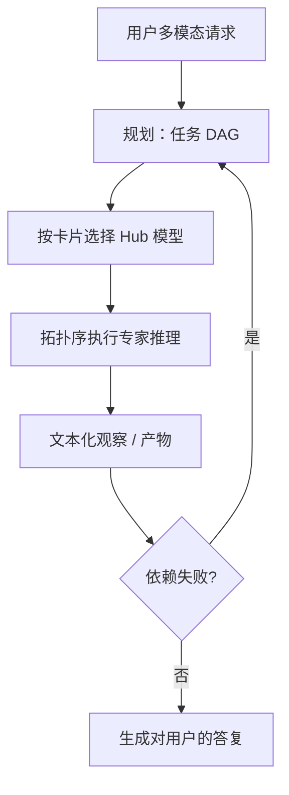

# HuggingGPT

    
对话模型不必自己看见像素或频谱：它先把用户请求拆成有依赖的任务图，再在 Hugging Face 上按描述挑选专家模型，跑完之后用自然语言把各段证据收成一句答复。

    <footer>—— Shen 等，HuggingGPT: Solving AI Tasks with ChatGPT and its Friends in Hugging Face，NeurIPS 2023</footer>

Yongliang Shen、Kaitao Song、Xu Tan、Dongsheng Li、Weiming Lu 与 Yueting Zhuang（浙江大学 / 微软亚洲研究院）的 HuggingGPT（arXiv:2303.17580，NeurIPS 2023）把 ChatGPT 当成**控制器**，把 Hugging Face Hub 上的视觉、语音、检测、翻译等检查点当成**专家**。四段流水线：任务规划、模型选择、任务执行、响应生成。它是先规划再执行的工作流，对照见 [规划 vs 反应式循环](/llm/plan-vs-react)；不是在用户桌面上驱动 GUI 点击，也不涉及越权调用。本篇写这四段如何把多模态请求收成 DAG，以及计划过期、模型卡片过时、执行失败时该停在哪一层。

## 问题

用户一句话里常常叠多种模态：「把这张图里的物体检测出来，再描述，再念给我听」。单一对话模型当时不能稳定地同时做检测、图像描述和 TTS；单一专家模型又读不懂这句复合意图。需要一个能读自然语言的调度器，把意图写成可执行的专家序列，并处理数据依赖（检测框要喂给描述，描述文本要喂给语音）。

另一半问题是专家太多。Hub 上同类任务有成打模型，选错尺寸或选错语言会在执行期才爆。调度器必须根据模型卡片的任务标签、描述、资源约束做选择，而不是把所有专家的权重读进 ChatGPT。

### 控制器不感知，专家不规划

ChatGPT 看见的是文本：用户请求、任务列表 JSON、模型 id、执行返回的文本化结果（caption、标签列表、ASR 转写）。像素与波形只在专家进程里。这个分工与 [function calling](/llm/function-calling) 同构——副作用在宿主——但工具表不是手写的五个函数，而是动态的 Hub 目录。HuggingGPT 演示的是**模型即工具**，工具名是 `facebook/detr-resnet-50` 这类仓库 id。

论文实验绑定当时的 ChatGPT 与公开 Hub 卡片。换更新的对话模型或私有模型库，规划质量会变，但四段结构仍可复用。不要把某次 demo 的成功率写成 Hub 全集的 SLA。

## 方法

**任务规划。** 提示 ChatGPT 解析用户请求，输出任务列表：任务类型（图像描述、目标检测、ASR、TTS、翻译等）、依赖 id、参数槽（输入是用户上传还是上一任务的输出）。表示是有序列表或带依赖的图，以便并行互不依赖的专家。

**模型选择。** 对每个任务，按类型过滤 Hub，把候选模型的卡片描述交给 ChatGPT（或规则 + 语言模型），选出一个 id。资源不够则降级到小模型。这一步是阅读理解，不是在权重空间搜。

**任务执行。** 宿主按拓扑序调用推理端点：下载或命中缓存的模型，传入文件或上游输出，得到结构化或文本结果。失败（OOM、超时、空框）写成观察，而不是假装成功。

**响应生成。** 再次调用 ChatGPT，把各专家的证据汇总成对用户的自然语言，注明用了哪些模型。用户看到的是故事，日志里应留下任务图与 id，便于审计。

评测包括单任务专家是否选对、复合请求能否串起来、以及与当时只靠 ChatGPT 自身能力的对照。定性案例覆盖「图→检测→描述→语音」一类流水线。定量受 Hub 变动与 API 配额影响，复现应对齐日期与候选池。

### 计划是数据结构，不是散文

规划段必须产出机器可执行的节点，而不是「我将先看看图片再想想」。参数槽应引用上游任务 id，而不是在规划时写死「用刚才那张图的第二个框」——执行期框集合可能为空。这与 ReWOO 把证据槽留空再填充是同一纪律，只是槽里装的是专家输出而不是搜索片段。

## 机制

复合请求的难度在意图分解与类型路由。ChatGPT 的贡献是把开放词汇的用户话映射到 Hub 的任务本体；专家的贡献是在各自模态上给出校准过的预测。没有第四段，用户只能面对一堆 JSON；没有第一段，专家调用没有依赖边，TTS 可能读到空字符串。模型选择相当于在长列表上做条件生成，卡片质量直接决定幻觉：卡片写「image-to-text」却实际是 OCR，控制器会选错。执行层必须把文件路径与 URL 限制在用户上传与本会话产物，防止计划节点被填成任意远程地址——这是工作流安全，不是模型能力。

与 ReAct 比：决策频率低，适合专家调用昂贵、依赖已知的 DAG；网页那种高熵观察更适合逐步反应。与 Gorilla 比：Gorilla 微调小模型写单次 API；HuggingGPT 用大控制器零样本调度多次专家，不更新权重。

重规划条件应写清楚：专家返回空、类型不匹配、用户追加约束。每步都重规划则退回 ReAct，还多付一次「写 DAG」的税。

### 产物传递要类型化

检测输出框、描述输出字符串、TTS 输出音频文件。下一节点的参数必须做类型检查，不能靠模型「看懂」上一段散文。工程上用显式工件表（artifact id → MIME），规划里只引用 id。这比让 ChatGPT 在响应段重新发明文件名更稳。

## 边界与工程取舍

HuggingGPT 的延迟是各专家墙钟之和加两次（或更多）对话模型调用，不适合交互式像素级编辑循环。Hub 上的模型许可、隐私（用户图是否发到第三方推理端点）、磁盘缓存策略都在论文演示之外，产品必须单独立项。控制器会编造不存在的仓库 id，执行前要相对本地允许列表校验，与 Gorilla 的表外幻觉是同一类病。不把这篇写成桌面 RPA 或浏览器自动化：专家是 ML 推理服务。更细的工具协议与并行调用评测见 BFCL；需要自监督学会「插一次计算器」见 Toolformer。

出处：Shen, Song, Tan, Li, Lu, Zhuang，*HuggingGPT: Solving AI Tasks with ChatGPT and its Friends in Hugging Face*，NeurIPS 2023，arXiv:2303.17580。控制流对照见规划 vs 反应式循环。

## 小结

- HuggingGPT 用对话模型规划任务图，用 Hub 专家执行感知与生成，最后再汇总答复。
- 四段：规划、选模型、执行、响应；依赖用工件 id 传递。
- 控制器不看原始像素；专家不负责拆用户意图。
- 出处：Shen et al.，NeurIPS 2023。
