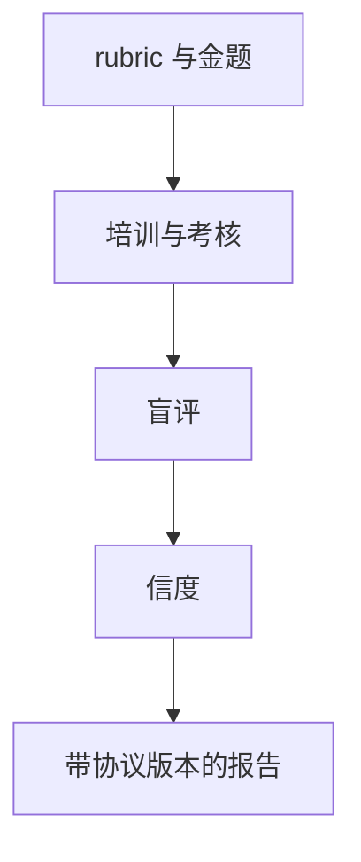

# 人类评测协议

人评的质量是招募、盲法、rubric 与疲劳管理的函数。没有协议的「人类更喜欢」不可复现。

<footer>—— 对照 HELM 的场景人评；众包金题与一致性淘汰的通用做法</footer>

[上一课](/llm/self-preference-bias)把同族法官判为系统误差。金标回到人，但人不是自动校准器。主干[人机分工](/llm/human-vs-auto-eval)已选何时用人；本课写**怎么用人**。缺口是协议。后课危险能力评测默认：开放口味的 Arena 不能替代受控实验室人评，更不能替代安全场景。

## 问题

众包便宜、偏技术英语、易被长度引诱，Arena 课已写。实验室 rubric 慢，但可分层抽样、可培训、可算评分员间信度。没有金题（已知对错的锚），无法发现乱点的工人；没有休息，后半场分数会漂。多语言必须用该语言母语者，机器翻译后再评会引入翻译模型偏见。

安全与危害场景还有知情与创伤风险：协议要规定不展示什么、如何上报，而不是把红队材料直接丢给众包。

评分员间信度低时，应先修 rubric 与培训，而不是加人数把噪声平均掉。平均解决的是方差，解决不了尺度误解。

## 方法

书面协议至少含：任务声明、盲法（隐藏模型名）、左右随机、分项定义与示例、金题比例、通过阈值、每人每日上限、争议仲裁。成对与逐点按前课选择。报告：样本数、工人数、信度、金题准确率、与自动指标的差异集。差异集比再报一个总分更有信息。

## 机制

人的判断是条件于最近见过的样本的。顺序效应、对比效应会让同一条回复在不同批次得不同分。盲法去掉品牌先验；金题锚定尺度；随机化减轻顺序。这些不是礼貌，是让「人类偏好」接近一个可命名的随机变量。

## 边界

人会系统性偏好谄媚与冗长，风格课的控制对人同样适用。下一课进入危险能力：人评仍需要，但场景、访问控制与不公开细节的纪律与口味评测不同。

## 小结

- 人评可复现性来自书面协议、盲法、金题与信度。
- 母语者与安全场景有额外约束，不能套 Arena。
- 报告差异集与协议版本，不只报「人更喜欢」。
- 出处：HELM 人评实践；众包质量控制通识。
