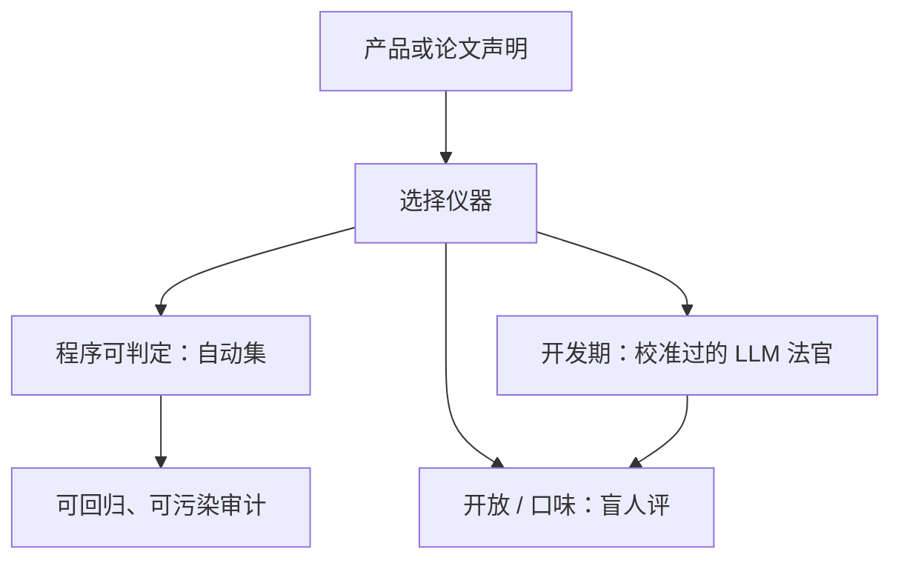

# 人工评测 vs 自动评测

自动基准给可比的标量；人给的是任务是否被完成的判断。两者测的不是同一个随机变量，不能用其中一个去「校准」另一个却不声明条件。

<footer>—— 对照 MMLU 一类静态卷面与 LMSYS Arena 的成对偏好</footer>

[上一课](/llm/lmsys-arena) 把 Arena 写成滑动的人类偏好 Elo。本课把镜头拉宽：何时必须用人，何时自动指标足够，以及用 LLM 当法官时你实际站在哪一边。缺口不是再讲 Bradley-Terry，而是 **评测设计里的角色分工**。后课智能体协议与种子方差都假定：你已经为每个声明选对了人 / 自动 / 混合，而不是默认「有分就算评过」。

## 问题

自动评测：固定题面、程序或标准答案、可回归。适合 [MMLU](/llm/mmlu)、[数学卷](/llm/math-bench)、[代码单测](/llm/code-bench)、[针测](/llm/niah)、[IFEval](/llm/ifeval)——即输出空间能被规则或测试吃掉的任务。人工评测：开放生成、多约束取舍、安全、产品口味。Arena 是人工的一种廉价众包形态；实验室 rubric 是另一种，更慢更可控。

错误发生在用自动分代替人去做开放任务（BLEU 式、或 LLM-as-judge 未经人校准），或用人去代替本可以单测的代码（贵、不可复现）。LLM 法官看起来自动、便宜，统计性质却像「一个未校准的标注员」：有位置偏见、长度偏见、自偏好。它既不是 Arena 的人，也不是 MATH 的校验器。

### 声明决定仪器

「数学能力涨了」应用可验证自动集，固定预算。[可验证奖励](/llm/verifiable-reward) 课的 $R$ 甚至可以直接当评测。 「更好用」应用盲成对人评或产品 A/B。 「遵循指令」可先 IFEval 再对人抽查失败模式。一张表里混三种声明却只放 Arena 分，是仪器用错。人评的方差来自题目抽样与评分员；自动评的方差来自解码种子与题面。后课专门拆种子。本课只要记住：人评的置信区间通常更宽，小样本名次无意义——Arena 课已强调对战次数。

## 方法

### 先写声明再选仪器

设计步骤：写出产品声明 → 选主仪器（自动 / 人 / 法官）→ 选防偏（盲、长度控制、题面冻结）→ 规定复测频率。自动集要版本化，防污染。人评要写 rubric：相关性、事实、危害、格式，分项打分比单一「更好」更可诊断，但更贵。成对比较降低校准负担，适合口味；绝对 Likert 适合追趋势，但漂移大。

LLM-as-judge：必须在同一批题目上用人评校准（相关、成对一致率），并报告位置交换实验。未校准的法官只能当开发期烟雾，不能当论文主表。法官模型若与被评模型同族，自偏好要当成一等系统误差。

## 机制

自动指标优化会进入训练环（RL 对校验器黑客、对 MMLU 的污染）。它测的是「对这个仪器好不好」，仪器一旦可被梯度碰到就贬值。人评更难直接进梯度（贵、慢），因此更抗投机，但样本少、题分布随招募漂。Arena 课已经写了自愿者偏技术英语。实验室人评可以分层抽样，代价是不规模。

混合协议：自动做全量筛，人做分层抽查。智能体轨迹尤其需要——全自动单测覆盖不到的「是否在胡用工具」，要人看录像或日志。这是下一课协议要标准化的对象。

不要用人去给 GSM8K 再打一遍分，除非在研究抽取器错误。人的时间应花在自动指标说「过了」但产品仍失败的区域，或自动指标说「挂了」但其实用户可接受的区域。差异集比再跑一张总分更有信息。

### 长度与风格混淆

自动长度无关的准确率仍可能与风格相关（格式分）。人评强烈爱长、爱列表。长度控制（截断再评、或强制短答）应同时出现在人评与 Arena。否则「人工评测显示更好」只是更长。这与推理 RL 长度预算是同一混淆在评测侧的镜像。

## 边界与工程取舍

安全评测不能只靠自动拒答率：过拒与漏拒都要人看上下文。代码可以几乎全自动，但「是否解决用户意图」仍要人。多语言人评招募比英语贵一个数量级，自动翻译再评会引入翻译模型偏见。声明若含中文产品，人评必须含中文标注员，不能用英文 Arena 代理。

成本上：自动评应每次提交都跑；人评按里程碑。把人评当 CI 会破产或导致评分员疲劳，分数漂得比模型还快。疲劳是人评特有的失效模式，协议里要有休息、金标题、淘汰不一致评分员。

本课不设立「人永远更正确」。人会系统性偏好谄媚与冗长。对事实任务，校准良好的自动集优于未训练的众包。仪器服从声明，不服从道德口号。

## 小结

- 自动评测服务可判定声明；人评服务开放与口味；LLM 法官必须经人校准。
- 先写声明再选仪器；禁止用 Arena 代理数学能力。
- 人的时间花在自动与产品的差异集上。
- 长度偏见在人评与 Arena 上都要控制。
- 人评有疲劳与抽样偏；自动评有污染与投机。
- 出处：静态基准传统；Chatbot Arena；LLM-as-judge 的校准文献。
