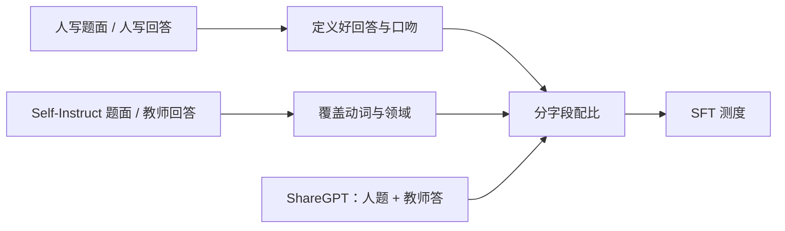

# 人写 vs 合成指令

人写示范定义「什么叫答得好」；合成指令定义「还能问出什么」。二者交换角色时，模型会学到便宜的覆盖，或学到昂贵但窄的口吻。

<footer>—— 对照 Zhou 等 LIMA 的精选人写、Wang 等 Self-Instruct 的自举、Ouyang 等 InstructGPT 的标注员示范，以及 OpenHermes 相对 ShareGPT 的公开混合物</footer>

指令微调总要在两种监督之间做配比：一种是人写的回答（标注员、作者、社区里被挑出来的好答案），一种是模型写的题面或回答（Self-Instruct、教师模型蒸馏、OpenHermes 里大量 GPT-4 轨迹）。争论常被简化成「合成能不能替代人」。经验上两者解决的不是同一个缺口。LIMA 表明，大约一千条精心挑选的人写示范，就足以让强基座在开放生成上像个助手；Self-Instruct 表明，从少量种子出发可以生成数万条题面，把指令遵循从「只会种子任务」扩到更宽的动词与领域。InstructGPT 则坚持关键示范由人按指南写，而不是把生成器的输出直接当金标准。ShareGPT 夹在中间：题面是人写的，回答是当时闭源助手合成的。本篇把「谁写题面、谁写回答」拆开，看风格、覆盖、失败模式，而不把某一种写成唯一正确配方。

## 问题

人写的瓶颈是覆盖。标注员不可能穷尽用户会问的动词、领域与多轮追问；写得越像产品政策，越不像真实用户的病句与省略。合成的瓶颈是定义。生成器只能在自己已经会的分布附近采样，题面多样性看起来很大，有效任务族可能很少；回答会复制教师的套话、谄媚、以及事实错误。若用合成回答当唯一监督，学生的上限贴近教师，并且把教师的失败当成应当模仿的行为。

还有第三种错位：题面人写、回答合成（ShareGPT、多数蒸馏），或题面合成、回答人写（少见，成本更高）。产品评测往往是真人题面。用纯合成题面训练，等于在另一套题型上学遵循，真人评测时的「听不懂口语」不一定是能力问题，是题面域偏移。反过来，只用真人题面、回答却全是教师长思维链，学生会在「几点了」上也输出长推理。

### LIMA 的「少而精」与 Self-Instruct 的「自举」不是互斥答案

LIMA 的主张是对齐主要改风格，前提是基座已经具备能力、示范覆盖足够的风格轴（问答、教程、建议、少部分多轮），并且每条质量高。它没有主张「合成无用」，也没有主张「一万条脏数据更好」。Self-Instruct 的主张是：给定种子任务，语言模型可以生成新指令、再生成实例，经启发式过滤后用于微调，从而在没有大规模标注的情况下提升遵循。它没有主张生成的回答在事实与安全上可替代指南。把两篇论文打成「质量派 vs 数量派」会丢掉前提：LIMA 的一千条是人挑的；Self-Instruct 的数万条是机器扩的，质量靠过滤而不是靠作者逐条改。

OpenHermes 更接近 Self-Instruct 路线的工业放大：多源合成汇编，条数很大。ShareGPT 更接近「真人题面 + 教师回答」。用二者做消融时，变的不只是人写比例，还有多轮深度与教师身份。不要只报告「合成占比 80%」而不写教师是谁。

## 方法

按字段决定谁生成。题面侧：真人来源（产品日志、标注员按场景写的提示、ShareGPT 的用户轮、LIMA 的社区题）负责口语、省略、多约束混杂；合成题面（Self-Instruct 及其后裔）负责动词与领域网格——把「翻译 / 改写 / 分类 / 抽取」乘到种子里没有的主题上。回答侧：政策敏感、安全拒答、品牌口吻、以及评测会逐句看的金标准，优先人写或人改；过程性、格式性、已有把握的代码与改写，可用强教师生成再过滤。InstructGPT 把示范阶段放在人，把大规模比较留给后面的奖励模型，等于承认「什么叫好」先由人定义，再在比较里放大。

过滤合成回答时，不要只用「像不像人话」。应查：是否只换了种子题面的槽位（Self-Instruct 原文就过滤过近重复）；是否句式模板化（同一开场白占比）；代码能否解析；是否在简单题上强制冗长推理；是否复读教师免责声明。人写回答的过滤相反：查指南符合度与事实，而不是用流畅度模型打高分就留下——流畅度会偏向职业标注腔，把社区里有用的短答案删掉，与 LIMA 的多样性目标相冲突。

配比要分字段报告：人写题面比例、人写回答比例，而不是一个「人工数据%」。一个常见的可运行起点是：金标人写回答占小比例但每 epoch 都能见到（上采样），合成填满覆盖；ShareGPT 类「人题+教师答」单独一桶，以便发现谄媚时下调，而不误伤 LIMA 式精选。OpenHermes 当作合成汇编桶，内部再按子源降权，避免单一教师的思维链格式吞掉混合物。

### 风格坍缩是合成监督的默认引力

教师模型在温度较低、又经过自身对齐时，回答的词汇熵偏低：列表、加粗、先道歉再拒绝。学生在交叉熵下会把高频表面形式当成任务。人写示范若足够多样，可以拉开熵：短答、表格、代码-only、偶尔不完美但正确的句子。LIMA 刻意选风格轴，就是在对抗坍缩。Self-Instruct 若只用同一个生成器、同一套提示词产题又产答，坍缩会同时发生在题面和回答上，微调后的模型对「不像生成器的题面」变差。缓解是：多温度、多种子、多教师，或题面用一种模型、回答用另一种，再加近重复过滤。

## 机制

把题面随机变量记为 $x$，回答为 $y$。人写测度 $p_h(x,y)$ 的 $y$ 条件于人的标准，方差大、噪声类型是笔误与不一致。合成测度 $p_s(x,y)$ 的 $y$ 条件于教师 $\pi_{\mathrm{T}}$，方差小、噪声类型是系统偏差。SFT 优化的是混合 $\lambda p_h+(1-\lambda)p_s$ 上的交叉熵。$\lambda$ 大时，学生贴近人的条件，但 $x$ 的支撑可能不够，泛化靠基座预训练。$\lambda$ 小时，$x$ 的支撑可以人为铺开，但 $p_\theta(y\mid x)$ 被拉向 $\pi_{\mathrm{T}}$。ShareGPT 是 $p_{\mathrm{user}}(x)\,p_{\mathrm{T}}(y\mid x)$，对人题的覆盖好，对「人认为好的 $y$」覆盖差——这正是为何 InstructGPT 还要后面的比较数据与 RLHF，而不能停在模仿教师。

Self-Instruct 的题面生成是在种子邻域做扩张：有效覆盖取决于过滤后还剩多少任务族，不取决于条数。LIMA 的机制是高 $\lambda$、极小样本量、人为保证 $x$ 的风格覆盖；它依赖基座已经在预训练里见过那些领域的知识。弱小基座上复制 LIMA，会表现为「口吻像助手、内容空」，那不是人写失败，是能力前提不成立。

蒸馏常被说成合成指令。若教师与学生同族、题面又来自教师自己爱答的分布，学生会快速模仿表面形式，指令遵循的指标上升，换一个真人口语集就掉。应用独立的人写题面做持有评测，不要用教师生成的测试指令宣布胜利。

### 成本曲线不是质量曲线

人写的边际成本随条数上升很快，合成相反。因此工程上总会有一个拐点：再花钱写人，不如花钱做比较数据或做过滤。InstructGPT 把大量人力放在比较而不是无限写示范，是因为比较更适合成对地定义「更好」。LIMA 把人力放在挑一千条，是因为他们的目标是证明风格监督可以很薄。Self-Instruct 把算力放在生成与过滤，是因为没有标注预算。三种花钱方式对应三种论文主张，不能把 OpenHermes 的条数拿来否定 LIMA，也不能把 LIMA 的条数拿来否定覆盖不足。

## 边界与工程取舍

合成回答不适合单独承担安全与高风险领域的金标准。教师可能拒绝过度、或在某些题上配合不当；人写指南至少能与产品政策对齐。反过来，要求所有代码与翻译都人写，成本会把覆盖压到不可用。边界应按风险分层：高风险人写或人审，低风险合成加自动检查。

许可把「能不能用教师」变成硬约束。ShareGPT 与闭源教师蒸馏可能不允许再训练；Self-Instruct 若用可许可的自模型生成，法律边界更清晰，但能力上限更低。这不是算法差异，却常被写成「合成数据效果差」——其实是换了教师。

不要用人写比例当论文卖点。20% 人写若全是同一标注员的邮件模板，有效多样性可能低于 5% 但来自 LIMA 式多来源精选。报告应含任务族数、题面熵、以及独立真人评测，而不是一个百分比。

多轮上人写更难规模化，合成多轮又容易假。实践中 ShareGPT 仍是真实多轮的主要公开来源；用 Self-Instruct 扩多轮时，应要求后轮改约束或纠错，否则只是单轮重复（见 [多轮格式](/llm/multiturn-format)）。课程与难度分层（见 [指令课程](/llm/instruction-curriculum)）对合成更关键，因为生成器默认往中等难度、中等长度挤。

## 小结

- 人写示范定义好回答；合成指令扩张题面与格式覆盖。字段要分开配比，不要一个「人工%」。
- LIMA：少而精的人写足以改风格，前提是强基座与多样示范。Self-Instruct：种子自举扩任务族，质量靠过滤。
- InstructGPT 坚持示范由人按指南写，大规模比较放在后面，而不是用教师模仿替代定义。
- ShareGPT 是人题+教师答；OpenHermes 是合成汇编。二者作公开对照，须写明教师与多轮深度。
- 合成默认导致风格坍缩；人写默认导致覆盖不足。混合时金标上采样、合成填网格。
- 持有评测用真人题面；高风险回答需要人审。许可可能禁止某些教师蒸馏。
- 出处：Zhou 等，LIMA，2023；Wang 等，Self-Instruct，ACL 2023；Ouyang 等，InstructGPT，NeurIPS 2022；公开对照 ShareGPT、OpenHermes。
