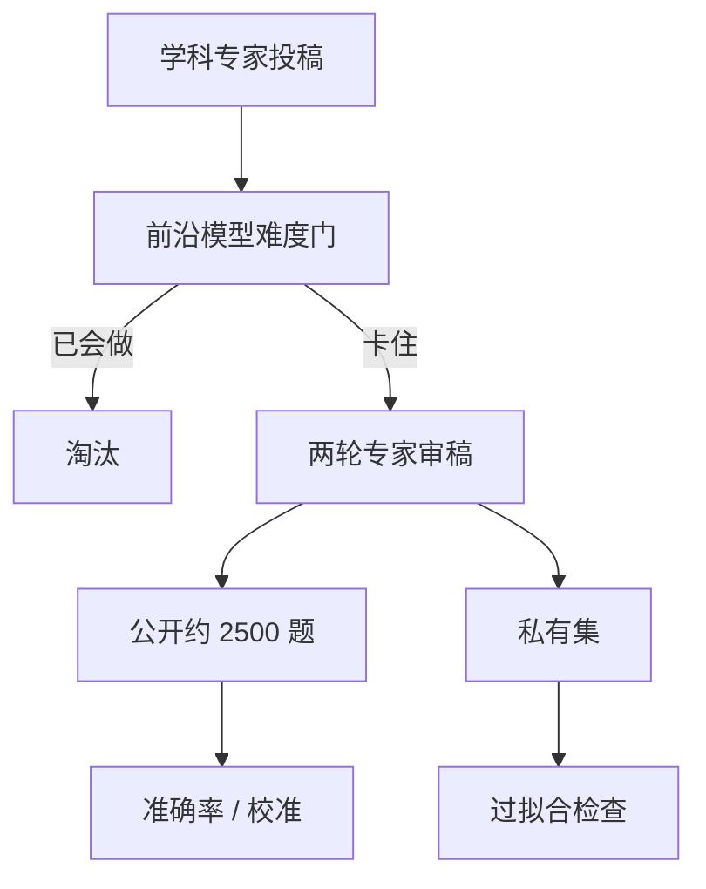

# Humanity's Last Exam

    
流行基准已经跟不上难度：前沿模型在 MMLU 一类考试上超过九成，排行榜失去分辨率；需要一套专家级、可自动评分、又不能靠上网检索秒答的闭卷题，才能继续量能力。

    <footer>—— Phan et al. / CAIS & Scale, Humanity's Last Exam, Nature 2026</footer>

Humanity's Last Exam（HLE）是 Center for AI Safety 与 Scale AI 组织的专家级闭卷基准：约两千五百道题，覆盖上百个学科，题型是选择题与短答案精确匹配，一部分带图。Phan、Gatti、Han、Li 与 Hendrycks 等人把目标写得很窄——不是开放写作，不是实验室操作，而是「人类专家前沿上、答案唯一、可机器核对、且不能靠检索快速解决」的学术题。2025 年 1 月以 arXiv:2501.14249 发布，2026 年 1 月收入 *Nature* 第 649 卷。公开题在 lastexam.ai 与 Hugging Face 的 `cais/hle`；另留私有集查过拟合。本篇写这张卷子相对 [MMLU](/llm/mmlu) 改了哪一层协议、分数该怎么读，以及「最后一场闭卷考试」这个名字承诺了什么、承诺不了什么。

## 问题

[MMLU](/llm/mmlu) 在 2021 年是宽覆盖知识探针；到 2024–2025 年，前沿模型公开分经常越过 90%。饱和之后，剩余误差被提示措辞、解码种子和题面歧义吞掉，榜上的两个百分点不再对应能力。污染同步变差：公开选择题会进入预训爬虫与题解博客，[n-gram 重叠](/llm/contamination-ngram) 只能事后估计上限。需要一张更难、更新、且对检索不友好的卷子，否则「又涨了」无法区分记忆、工具和推理。

HLE 要挡的是三类捷径。第一是旧题记忆：投稿必须原创或对已发表材料做非平凡综合，并先拿当时的前沿模型打一遍，模型已经会做的题直接淘汰。第二是检索秒答：题面设计成不能靠把问题丢进搜索引擎复制答案。第三是开放评分：不收主观论述，答案短、可核对，才能在实验室之间对表。这三条加在一起，才把「专家闭卷」从口号收成可运行的数据集。

### 难度门在人审之前

收集漏斗大约是七万次尝试、约一万三千道过模型门槛的题，再经两轮研究生以上审稿，最后定稿两千五百道。投稿时就要被若干前沿模型卡住——选择题还要求平均不低于随机。人审再查是否歧义、是否可检索、解答是否成立。发布后还有社区纠错与赏金，把可检索或有错的题换掉。2025 年 4 月的定稿明确删过被标记的题。流程的含义是：HLE 的难度有一部分是相对于「出题那年的模型」定义的；模型变强以后，同一道题不再自动保持区分力。「先用模型筛掉会做的题」会把基准钉在当时的失败模式上。这能保证发布日很难，却也引入选择偏差：模型已经会的专家技能进不了卷子，模型碰巧都不会的冷门细节反而容易留下。读总分时要记得，题库不是从人类课程大纲均匀抽样的。

## 方法

官方集约 2500 题、上百科目。约 14% 需要读图，属多模态；约 24% 为五选一或更多选项的选择题，其余为短答案精确匹配。数学占比高，用来压深推理而不是事实检索。计分主指标是准确率；论文同时报校准，用 RMS 校准误差看模型是否在不会时仍报高置信。发布初期多数前沿模型校准误差超过约 70%：错了还很自信。这比准确率更能说明「像专家」还是「会填空」。

协议必须锁死。是否允许思维链、是否允许代码解释器、是否允许上网，会把 HLE 从闭卷知识考变成工具考。原文的定位是闭卷学术能力；后来的排行榜若打开搜索与长推理，应单独成表，并与 [动态基准](/llm/live-benchmarks) 的时间窗一起声明。私有集用来查公开题是否被训进去：公开分猛涨、私有分不动，就是过拟合或泄漏，不是能力。

$$
\mathrm{Acc}(M)=\frac{1}{|Q|}\sum_{q\in Q}\mathbf{1}\bigl[\mathrm{grade}(M(q),y_q)=1\bigr]
$$

$\mathrm{grade}$ 对选择题是选项匹配，对短答案是规范化后的精确匹配。题面含 LaTeX 与图像时，多模态编码器与渲染管道都是成绩的一部分，不能只报文本模型。

### 公开集与私有集是同一协议的两半

公开 2500 题的作用是让社区能本地复跑、做错误分析、写解题器。私有集的作用是在模型与爬虫都见过公开题之后，仍有一根没被记忆污染的尺。两者题型应同分布，否则「私有分低」可能只是更难的另一张卷。HLE-Rolling 一类后续滚动集把题当成有寿命的对象，承认静态「最后一场考试」会过期；这与动态基准是同一逻辑，只是 HLE 原论文的主交付仍是那次定稿的闭集。

## 机制

HLE 测的不是「会不会说专家的话」，而是在答案空间被钉死后，模型能否走到唯一正确点。选择题干扰项按专家误解来写；短答案不允许用流畅的错句子得分。于是预训练里的「高频续写」不再自动等于高分。多模态题还要求图中的结构、符号或实验装置被真正读进推理，而不是忽略图像只做文本常识。

### 校准失败与思维链不是同一件事

校准差说明内部不确定性没有对齐到正确率。模型可以在不会的题上输出很长的思维链，链的存在本身被当成自信。闭卷协议若不把置信度或「我不知道」写进计分，这些链只增加输出 token，不增加信息。这对 [百万 token 成本](/llm/cost-per-mtok) 也有含义：HLE 上用测试时计算硬抬分，账单按输出计，性价比必须和准确率一起报。

HLE 故意做成「最后一场闭卷学术考」：再难的闭卷选择题，也覆盖不了开放研究、实验设计、工程交付与价值判断。高分说明闭卷专家题上的文本（及部分视觉）推理接近或超过出题年的人类专家样本，不说明可以替代同行评审或执业许可。

## 边界与工程取舍

名字里的 Last 是修辞：闭卷、可自动评分、宽学科的学术基准可以再出，而且必须再出，否则 2026 年的卷子会在 2028 年重演 MMLU 的饱和。赏金与共作者激励能抬题质，也会抬「能难倒当时模型」的选择偏差。禁止大规模杀伤性武器相关内容是安全边界，不是能力边界。英语题面为主，全球专家出题，但评分语言仍是英文，跨语言能力不能从总分里读出来。

比较模型时必须写清：截止日期、是否工具、是否多模态、公开还是私有、哪一版题库。把带搜索的智能体分数拿去打原文的闭卷表，是在比较两场考试。把 HLE 当唯一发布门禁，会选出「闭卷学术竞赛机器」，漏掉代码仓库、多轮工具和指令遵循。

私有集降低题面泄漏，挡不住用同一批公开样例蒸馏答题格式，也挡不住把公开题的「风格」合成进指令数据。它是过拟合的上界检查，不是无污染证明。真正要时间切分时，应看滚动集与训练截止日期，而不是只看「我们还有私有题」。

## 小结

- HLE 用约 2500 道专家级闭卷题（选择 + 短答案，部分多模态）接替已饱和的 MMLU 式知识榜。
- 出题漏斗先用当时前沿模型做难度门，再经专家审稿；题相对「出题年的失败模式」而不是均匀课程大纲。
- 主指标是可自动核对的准确率，校准误差揭示会不会在不会时仍报高置信。
- 公开集可复现，私有集查过拟合；工具、思维链与检索必须分表。
- Last 是闭卷学术考的修辞上限，不是能力的全局上限；滚动集承认题会过期。
- 出处：Phan et al., *Humanity's Last Exam*, arXiv:2501.14249；*Nature* 649, 1139–1146 (2026)；CAIS / Scale，https://lastexam.ai。
