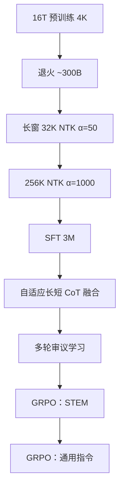

# Hunyuan-TurboS

    
AMF / MF 把 Mamba2 的线性复杂度与少量 GQA 注意力拼成可服务的 560B MoE；自适应长短思维让简单题秒回、难题再进入深想。

    <footer>—— Tencent Hunyuan Team，Hunyuan-TurboS: Advancing Large Language Models through Mamba-Transformer Synergy and Adaptive Chain-of-Thought，arXiv:2505.15431</footer>

[Hunyuan-Large](/llm/hunyuan) 是 389B/52B 的纯 Transformer MoE。**TurboS** 换骨架：Hybrid-Transformer-Mamba2-MoE，**560B 总 / 56B 激活**，官方称工业界首个大规模部署的 Mamba 系模型。混元 T1 是在 TurboS 上做长链后训练的慢思考产品，本篇不把 T1 的推理行为写进 TurboS 默认。结构数字以 2505.15431 为准。

## 问题

旗舰助手要同时满足：首字延迟、长文 256K、以及可选的深推理。纯 Transformer MoE 的 KV 随层与长度涨，[Hunyuan-Large](/llm/hunyuan) 用 GQA+CLA 压缓存，仍是二次注意力主导。纯 Mamba 长程精确检索弱。需要一种层配比：FFN（容量）占一半，注意力只留针检索所需的一小撮，其余用 Mamba2 走 $O(n)$。

产品上还要避免「所有请求都按 R1 计费」。自适应长短 CoT：简单查询走短链或无思考，复杂题再展开反思与回溯。这与 Seed 的 AdaCoT、Qwen3 的 think 开关同一产品问题，实现必须写进后训练奖励，而不是只做解码开关。元宝要同时服务闲聊与竞赛，若默认深想，首字时延与 KV 会把并发打穿；若默认短答，STEM 子集的 Arena 名次又守不住。TurboS 把这道产品约束写进同一套权重，而不是像 T1 / Turbo 那样让用户选两个检查点。

### 与 Large 权重不可互换

Large 是 64 层、1 共享 + 16 特化、top-1。TurboS 是 **128 层**（57 Mamba + 7 Attention + 64 FFN）、FFN 为 1 共享 + 32 特化、每 token 激活 **1 共享 + 2 特化**。词表同为 128K 不意味可以套 Large 的服务栈：Mamba 状态、块模式与专家数都变了。

元宝「万亿 MoE」仍无层表。TurboS 的 560B 是报告里可引用的旗舰结构，不要用它去填 2024 年 2 月那句产品宣传。

## 方法

**结构。** 隐宽 5120，专家中间宽 17024。注意力 64 头 / 8 KV 头（GQA），QK-Norm。Mamba2：64 并行头、SSM group 16、状态维 128、chunk 128。原子块 **AMF**（Attention→Mamba2→FFN）与 **MF**（Mamba2→FFN）交错；注意力约占 5.5%、Mamba2 约 44.5%、FFN 50%。容量因子 $\gamma=1.5$。预训练 **16T** token，序列 4096，AdamW $\beta_2=0.95$、weight decay 0.1。

**退火与长窗。** 预训练结束后余弦退火约 **300B** token，学到 $5\times 10^{-6}$，混入高质量预训练子集、代码、STEM、指令与长链。报告强调退火仍要保留高质预训练切片，否则下游与泛化会掉；指令数据提前进入退火，是为了给后续 RL 留出容量，而不是把 SFT 做完。对网页继续做开式续写损失、只对 QA 切片加目标损失，避免基座一开口就变成出题器。超长思维链若在 4K 上截断会丢掉答案，留到长窗阶段再训。随后课程把窗口 4K→32K→**256K**，NTK-aware 位置编码 $\alpha=50$（32K）与 $\alpha=1000$（256K），32K 约 30B、256K 约 20B，短:长 ≈ 3:1。

**后训练四段。** （1）SFT：约 **3M** 指令，按主题与多维质量过滤。（2）**Adaptive Long-short CoT Fusion**：教师经 SFT + 专用 RL（难度自适应与 CoT 压缩奖励），把长链无损压缩、重排，使学生能自行选短/长策略；报告称 Arena 上效果接近重推理模型，生成 token 约为一半。（3）Multi-round Deliberation Learning：在模拟评测环境与其它混元模型对打，多 LLM 裁判 + 人工，找能力缺口再 SFT。（4）两阶段大规模 RL，算法为 [GRPO](/llm/grpo)：先 STEM 推理，再全场景指令。基础设施 Angel-RL（训练推理一体，TP/PP/EP/CP）；推理 AngelHCF，Mamba 状态用 fp32，相对纯 Transformer 的 Hunyuan-Turbo 约 **1.8×** 吞吐。

### 评测口径

LMSYS Chatbot Arena 分数 **1356**，报告当时列总体约前 7，数学 / 多轮 / 长查询等子集进入前 5；中、法、西文子集称前 1。23 项自动基准平均 **77.9%**。Arena 是盲评 Elo，自动基准是另一张表，不要把 1356 与 77.9% 加总成单一「超过 o4-mini」。对照 Gemini-2.0-Flash-001（1352）与 o4-mini-2025-04-16（1345）绑定报告写入时的排行快照。

## 机制

Mamba2 负责长序列状态压缩，稀疏的 softmax 层负责需要精确键值匹配的依赖，MoE FFN 提供条件计算容量。AMF 保证每隔一段就有一次注意力「校准」，MF 则在两次注意力之间用线性核消化长度。GQA 把仅存的注意力层的 KV 再压一档。这与 Large 的 CLA（跨层共享 KV）是不同的压缩轴：TurboS 是**少放注意力层**，Large 是**层间复用 KV**。

自适应 CoT 的机制与 [Seed-1.6](/llm/seed-1-6) 同类：训练期用难度与长度相关的奖励，使策略学会何时付思维税。教师先把长链做无损压缩与可读性重排，学生学的是「何时调用深想」，而不是把思维标签写进每一个 system prompt。审议学习则把「跟其它检查点比输赢」写成迭代 SFT 数据，类似拒绝采样，但多了多裁判与人工把关，针对的是 Arena 式盲评会暴露的能力缺口（多轮、长查询、语种），而不是再刷一道 MATH。两阶段 GRPO 先钉可验证 STEM，再放通用 RM，避免一开始就用偏好模型打竞赛题。Mamba 状态在长生成里对精度敏感，推理栈把 SSM 状态放到 fp32，是同一机制在数值上的补丁：线性核省的是注意力 FLOPs，不是浮点动态范围。

报告写 TurboS 相对许多推理模型推理成本更低，依据是自适应短链与 Mamba 吞吐，不是 56B 激活比 37B 更小。激活更大，省的是 KV 与深度思考的触发率。

### 部署内核不是论文公式

AngelHCF 为 Mamba 的 prefill/decode 与专家并行单独优化；状态用 fp32 是因为低精度 SSM 状态会在长生成里漂。只把 Hugging Face 权重塞进纯 Transformer 服务栈，延迟曲线对不上 1.8× 那句。上下文并行的 state-passing 是他们 RL 框架的工程点，复现算法不必复现该通信。

## 边界与工程取舍

闭源旗舰。可核对的是论文超参与 Arena / 自动榜；完整 16T 配比与 3M 指令不可字节级复现。T1 是 TurboS 衍生的慢思考模型，用户在元宝里选 T1 或 R1，不等于 TurboS 默认深想。Large 的 256K 开源权重不能当 TurboS 的本地替代。

GRPO 阶段的组大小、KL、是否 clip-higher **未**在摘要级叙述里给全，不要把 DeepSeekMath 的 $G=64$ 抄过来。Arena 排名会变；引用 1356 要带报告版本。自动基准 77.9% 是 23 项平均，单项以原文表为准。

「首个工业部署的大规模 Mamba」是腾讯的产品声明，对照的是当时公开可服务系统，不是否认 Jamba 等开源混合模型的存在。

### 何时不必用 TurboS

要可下载 256K MoE，用 Hunyuan-Large。要开源长思维与 1M 输入，看 [MiniMax-M1](/llm/minimax-m1)。只要算法论文，TurboS 的贡献在混合层配比与自适应 CoT，不在新的优势估计器。

## 小结

- TurboS：560B/56B，128 层 AMF/MF（7 注意力 + 57 Mamba2 + 64 MoE FFN），1 共享 + 2/32 特化，预训练 16T，窗口 256K。
- 后训练：3M SFT → 自适应长短 CoT → 多轮审议 → 两阶段 GRPO（STEM 再通用）。
- Arena 1356（报告当时约前 7），23 项自动平均 77.9%；相对纯 Transformer Turbo 约 1.8× 推理。
- 与 Hunyuan-Large、元宝万亿、T1 检查点均不可互换。
- 出处：Tencent Hunyuan Team，*Hunyuan-TurboS*，arXiv:2505.15431，2025。
