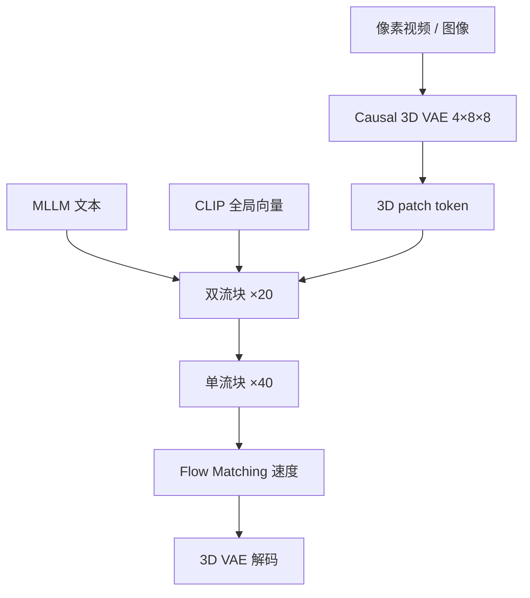

# HunyuanVideo

    
我们训练了超过 130 亿参数的视频生成模型，当时是开源里最大的一档；专业人工评测上整体满意度高于 Gen-3、Luma 1.6 以及三家国内头部商用模型。

    <footer>—— Hunyuan Foundation Model Team, HunyuanVideo: A Systematic Framework For Large Video Generative Models, arXiv:2412.03603</footer>

腾讯混元团队在 2024 年 12 月公开 HunyuanVideo：系统报告加代码（[Tencent/HunyuanVideo](https://github.com/Tencent/HunyuanVideo)），arXiv:2412.03603。动机写得很直：图像生成已有强开源基座，视频仍被闭源拉开；MovieGen 等强模型当时也未把开源里程碑落地。报告的贡献按系统拆：数据策展、架构、按缩放律定 13B、训练与推理基建。人工评测用超过 1500 条代表性提示、约 60 人评审。本篇写这一版开源基础模型，不把后续 HunyuanVideo-I2V 或社区量化当成原文规格。

## 问题

随机把 Transformer + Flow Matching 的数据、算力、参数一起放大，报告认为**不够省**。他们声称找到一条最多可省约 5 倍计算仍达到目标性能的缩放策略，再在此之上训 13B。视频还有四件必须同时成立的事：画质、运动、文视频对齐、语义切镜。缺一就会在人工评审里输给商用模型。

数据侧，原始互联网视频时长与质量混杂，直接训会把模糊、静帧、水印、烧录字幕写进先验。文本侧，短标题不够描述镜头运动；纯稠密描述又冗长失真。基础设施侧，高分辨率长视频在单卡上编解码会爆显存，DiT 的激活也随 token 二次膨胀。问题因而是整条系统，而不是只换骨干。

### 先定图像缩放律，再导出视频规模

团队先做一类 DiT-T2X：T5-XXL 文本、同一 3D VAE、交叉注意力注文本，DDPM + v-prediction，92M 到 6.6B 七档，在 256px 上拟合计算 $C$ 与最优参数 $N$、数据 $D$ 的幂律。再用图像包络上的检查点初始化，做视频版幂律，最后权衡训练与推理成本，把基础模型定在 **13B**。图像与视频缩放律算出的 token 数只对应各自**第一阶段**；从低分辨率到高分辨率的课程缩放，报告留作未来工作。不要把 13B 写成「参数越多越好」的口号，它是这条包络上的工程点。

人工评测的「最高整体满意度」特别写在运动上领先。闭源对照会迭代；引用时锚定报告当时的 Gen-3、Luma 1.6 与三家国内商用模型，不要用后年来的可灵或 Veo 3 回写。

## 方法

3D VAE 用 CausalConv3D。视频形状 $(T+1)\times 3\times H\times W$ 压到 $(\frac{T}{4}+1)\times 16\times\frac{H}{8}\times\frac{W}{8}$。与多数工作不同，他们**不从图像 VAE 膨胀初始化**，而是从头训，视频与图像按 $4:1$ 混合。损失为

$$
\mathrm{Loss}=L_1+0.1\,L_{\mathrm{lpips}}+0.05\,L_{\mathrm{adv}}+10^{-6}L_{\mathrm{kl}}.
$$

课程从低分辨率短视频到高分辨率长视频；为高运动，在 $1\sim 8$ 里随机抽帧间隔。推理用时空重叠分块再线性融合，并在训练中随机开关分块，以免训推不一致。报告给出的重建 PSNR：ImageNet 256 上 33.14，MCL-JCV 上 35.39，高于表中的 FLUX-VAE、OpenSora-1.2、CogVideoX-1.5、Cosmos-VAE。

扩散骨干走**双流到单流**：先 20 个双流块让视频 token 与文本 token 各学各的调制，再 40 个单流块把二者拼接做多模态融合。隐维 3072，FFN 12288，24 头，头维 128。位置是三维 RoPE，通道切成 $(d_t,d_h,d_w)=(16,56,56)$。图像当单帧视频，3D 卷积 patchify。文本：指令微调过的 MLLM 做细粒度语义，另加 CLIP-Large 最后一个非 padding token 作全局引导，加进时间步嵌入；MLLM 因果注意力后再接双向 token refiner。训练目标是 Flow Matching：logit-normal 抽 $t$，线性插值构造 $x_t$，预测速度，MSE 对齐 $u_t$；推理用一阶 Euler ODE。

### 数据是分层过滤，不是「互联网全吃」

镜头用 PySceneDetect 切分，Laplacian 找清晰起帧，内部 VideoCLIP 做去重与约 1 万概念中心的重采样。过滤含 DOVER 美学、清晰度、光流运动、TransNet V2 切镜、OCR 去字、YOLOX 类去水印边框。阈值随阶段收紧，空间从 $256\times 256\times 65$ 升到 $720\times 1280\times 129$。最终 SFT 约 100 万条人工标注，拆成美学（色彩、光、主体、布局）与运动（速度、动作完整、运动模糊）。图像另建十亿级与数亿级两档。字幕用内部 VLM 写成 JSON：短描述、稠密描述（含运镜）、背景、风格、景别、光线、氛围，再加 14 类运镜分类器的高置信结果，dropout 与排列组合成不同长度，以提高泛化。

## 机制

全注意力被写成三条理由：比拆开的时空注意力更强；图像与视频统一；能借用 LLM 系加速。双流避免文本与视频在早期互相干扰调制；单流才做融合——这与 SD3 / FLUX 一类 MMDiT 叙事相近，但是视频 3D token。Flow Matching 的时间步平移：推理步少时加大 shift $s$（50 步用 7，少于 20 步用 17），把算力堆在早期大变化的 $t$，从而 10 步也能看。提示改写用 Hunyuan-Large：多语、结构标准化、简化术语，再 self-revision；另有 LoRA 版加速。

预训练课程：图像 256px 多宽高比 → 256/512 混合尺度（避免只训 512 后忘掉 256）→ 视频短低分 → 长低分 → 长高分，每阶段按比例混图像，减轻视频数据稀缺与灾难遗忘。这与「一步到位 720p 65 帧」相反：先学低频概念与短时动作，再学切镜与细节。

MLLM 文本编码器的好处是视觉指令对齐与系统指令可控；代价是因果注意力对双向上下文不如 T5，故加 refiner。不要把混元对话模型的参数量当成视频 DiT 的 13B。

### 基建决定 13B 是否训得动

报告单列训练与推理加速：并行、内核、步数。分块 VAE 使单卡能编任意分辨率时长。这些不是算法新定理，但没有它们 13B 只是纸上规模。开源的是基础模型与若干应用代码；内部 GDPR、合成与隐私计算只说明数据合规原则，不提供数据集下载。

## 边界与工程取舍

13B「开源最大」是报告撰写时的陈述，随后 [Wan 2.1](/llm/wan-2-1) 的 14B 会改写这句话。人工评测不是 FVD 表。VAE 分块仍可能在接缝留痕迹。结构化字幕绑定内部 VLM，复现数据管道成本高。提示改写会改变用户原句风格，应用层要允许关闭。Flow Matching 的 shift 是推理超参，与训练 logit-normal 不是同一分布，步数改了要重调 $s$。

不要把 MovieGen 的未开源模块画进混元。不要用社区 I2V 插件的层当作基础模型架构。与可灵比较时：可灵只有新闻稿级 DiT + 3D VAE；混元有块数、RoPE 切分与损失系数，二者不可用同一张「骨架图」混画。

出处：Hunyuan Foundation Model Team，*HunyuanVideo: A Systematic Framework For Large Video Generative Models*，arXiv:2412.03603。代码 https://github.com/Tencent/HunyuanVideo。Flow Matching 引用 Lipman et al.；双流设计对照 SD3（报告 [47]）。

## 小结

- HunyuanVideo 是腾讯开源的 13B 文生视频基础模型：Causal 3D VAE + 双流/单流 Transformer + Flow Matching。
- 文本条件为 MLLM 细粒度特征加 CLIP 全局向量；位置为三维 RoPE。
- 数据经分层过滤与 JSON 结构化字幕；SFT 约 100 万人工精选。
- 规模由图像再视频的缩放律选定；训练走分辨率与时长课程。
- 当时人工评测相对 Gen-3、Luma 1.6 与三家国内商用模型整体领先，运动项尤其明显。
- 出处：arXiv:2412.03603。
