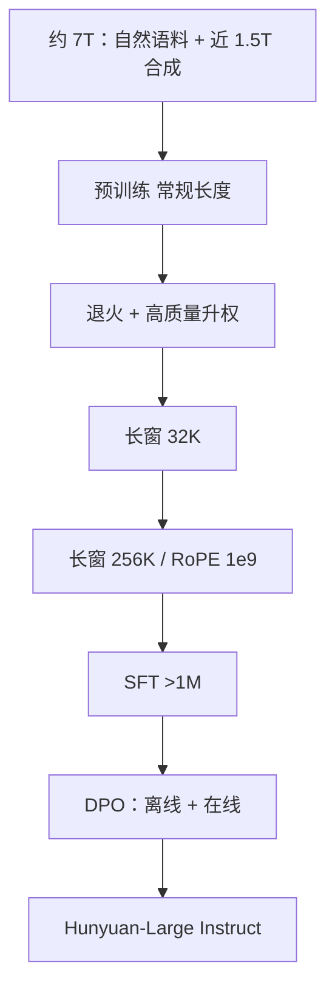

# Hunyuan 大模型

    
开源的 Hunyuan-Large 用 3890 亿总参数、520 亿激活，配混合路由、跨层 KV 压缩与专家分学习率；预训练约 7T，其中近 1.5T 为合成。

    <footer>—— Tencent Hunyuan Team，Hunyuan-Large: An Open-Source MoE Model with 52 Billion Activated Parameters by Tencent，arXiv:2411.02265</footer>

腾讯混元是一条产品线加一条开源线。闭源旗舰从 2024 年 2 月起以 MoE 服务元宝（Yuanbao）及微信、QQ 等内部场景，报告原文写「万亿参数量级」；这一句是公开叙事，**没有**放出对应权重或层表。真正能按检查点核对的是 2024 年 11 月开源的 **Hunyuan-Large**：Transformer MoE，**389B 总 / 52B 激活**，上下文到 **256K**，代码与权重在 GitHub / Hugging Face。本篇以 2411.02265 为骨架写开源 MoE 的数据、路由与压缩；闭源 Turbo / T1 / TurboS 只引用官方博客与模型卡已写明的规格，不为元宝旗舰伪造专家数。

## 问题

开源侧当时缺一个「总参数接近四百亿、激活仍可服务」的 Transformer MoE：稠密 70B 激活太大，Mixtral / DeepSeek-V2 一类要么总参数偏小、要么激活与长窗不能同时给。混元要把内部已经跑通的 MoE 经验落到可下载权重上，同时回答三件工程事：专家负载不均时 token 被丢、decode KV 随层与头线性涨、共享专家与路由专家的有效 batch 差一个数量级因而不能共用同一学习率。

长上下文若在预训练全程用 256K，注意力二次项会把 7T 预算吃穿。需要先在常规长度上把知识与推理训满，再短距退火到 32K、256K。合成数据则用来补自然网页在数学、代码、低资源上的密度缺口——报告强调合成量比此前文献高一个数量级，而不是另发明一种注意力。

### 闭源万亿与开源 389B 不是同一检查点

Hunyuan-Large 论文引言写：元宝自 2024 年 2 月采用万亿参数 MoE。这是产品声明，不能把 Large 的 16 个特化专家、1 个共享专家、top-1 路由写成元宝旗舰的结构。读混元先分清：**可复现的是 Large；不可下载的只写官方句子。**

词表 128K：100K 来自 tiktoken，另加 28K 中文。报告称相对 Llama 3.1 分词，字符/token 从 2.78 升到 3.13。部署不能直接套 Llama 词表。

## 方法

预训练约 **7T** token，中英为主，过滤写作质量、教育价值与毒性，并匿名化隐私。其中近 **1.5T** 为四步合成：种子指令生成 → 澄清 / 自指令扩增 / 升难度 → 多规格专家模型写回答 → 评论模型与自洽过滤。合成对准数学、代码、低资源与高教育价值域。

结构：64 层，隐藏 6400，注意力 80 头、**GQA 8 个 KV 头**，SwiGLU，RoPE。专家是 **1 个共享 + 16 个特化**，每 token 再激活 **1** 个特化专家。相对纯 top-$k$ 丢弃超额 token，报告提出 **recycle routing**：超容专家上的 token 随机再分到尚未满容的特化专家，避免关键信息在训练里被扔掉。

### GQA 加跨层注意力压缩 KV

推理 KV 同时从「头」和「层」两头压：GQA 把 KV 头收到 8；**CLA**（Cross-Layer Attention）每两层共享一份 KV。报告对比 MHA / GQA / MQA / CLA，最终 GQA+CLA 相对 MHA 在 bf16 字节账上大约省 **95%** KV。这是服务 256K 的前提，不是新的打分函数。

### 专家分学习率与 MoE 缩放

共享专家每个 token 都走，特化专家大约只见 $1/16$ 的有效 batch。AdamW 下最优学习率随 batch 变；报告把共享专家取 $\epsilon_{\mathrm{opt}}(B)$，特化专家按 $\epsilon_{\mathrm{opt}}(B/n)$ 下调，比例约 **0.31**。缩放律在 10M–1B 激活、最多 100B token 的小 MoE 上拟合，算力按激活参数写 $C \approx 9.59 ND + 2.3\times 10^{8} D$，得到最优激活约 58B、最优数据约 5.6T；实际取 52B 与 7T，落在曲线平坦区。学习率：预热 → 长程缓降 → 最后 5% token 退火到峰值的十分之一，并升权最高质量数据。随后两段长窗：32K 再 256K，各约 10B，自然长书与代码约占 25%，RoPE base 在 256K 段升到 **1e9**。

后训练：SFT 超过 100 万条、3 epoch，MoE 上用注意力 dropout 0.1、隐层 dropout 0.2；RLHF 走 **DPO**，离线偏好集与当前策略采样加奖励模型选优劣对，并对 chosen 加 SFT 项、EMA 防奖励黑客。

## 机制

混合路由把「所有 token 都该会的」放进共享专家，把领域特化留给 16 路 top-1。recycle 不改变路由 logits 的数学，只改变超容时的丢弃策略：训练稳定性来自少丢信息，不是来自更高容量因子。专家分学习率承认 MoE 里有效 batch 异构；若仍用同一 $\epsilon$，共享专家要么学太慢、要么特化专家过冲。

GQA+CLA 把 KV 从 $4 n_h d_h \ell$ 收到 $2 n_g d_h \ell$。CLA 的代价是相邻层必须共享键值几何，长程依赖若主要靠被共享的那一层，质量会敏感；报告主张在他们的设置里副作用不大。256K 能力来自退火阶段的自然长文混合，而不是把 7T 全部改成超长序列——每段约 10B 就够针测与常规榜同时站住。

### 合成数据补的是密度不是新目标

四步合成仍是因果语言建模的 token，只是分布被拉向解题与代码。过滤靠评论模型与自洽，失败样本不会进 1.5T。把「数量级更大的合成」理解成「用教师模型蒸馏出可验证子集」，而不是混元发明了新的预训练损失。

Hunyuan-Large 预训练表报 MMLU 88.4、相对 Llama 3.1-70B 明显高、与 405B 同桌。这是 Base 数字；Chat/Instruct 另表。不要用 Base MMLU 去对元宝产品体验。

## 边界与工程取舍

开源 Large 验证的是「52B 激活 MoE + 256K」，不是腾讯云 API 上每一个 hunyuan-* 名字。后续公开的 **Hunyuan-TurboS**（官方称 Hybrid-Transformer-Mamba MoE，总约 560B、激活约 56B）与 **Hunyuan-T1**（在 TurboS 上做推理后训练）是另一代结构，本篇不把 Mamba 层写进 Large。Yuanbao 万亿 MoE 无开源层表，禁止用 16 专家去反推。

许可、下载与 256K 推理实现以当时 Hugging Face 模型卡为准；CLA 需要实现跨层共享 KV，朴素 Llama 形服务栈不会自动省那 95%。合成数据管线不可复现到字节级，社区只能复现架构与公开权重，不能复现 7T 配比。

报告写 Large 相对 MHA 省约 95% KV，是 GQA 与 CLA 的乘积，不是「8 个 KV 头单独做到」。只开 GQA 关 CLA，字节账对不上表 2。

## 小结

- Hunyuan-Large：389B/52B Transformer MoE，1 共享 + 16 特化（激活 1），GQA+CLA，预训练约 7T（含约 1.5T 合成），窗口到 256K。
- 训练要点：recycle routing、专家分学习率、MoE 缩放律定 52B 与 7T，后训练为 SFT + DPO。
- 元宝万亿 MoE、TurboS/T1 只引用官方公开规格，与 Large 权重不可互换。
- 出处：Tencent Hunyuan Team，*Hunyuan-Large*，arXiv:2411.02265，2024；闭源产品以腾讯云混元文档与官方 T1/TurboS 说明为准。
