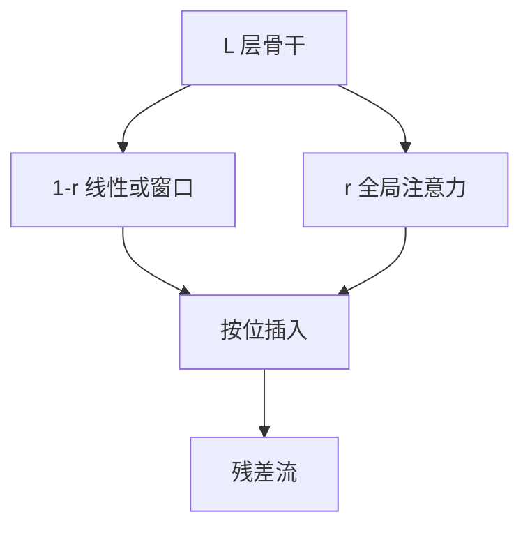

# 混合比与层排布

大多数层走线性时间混合，少数层保留全注意力，用层比而不是单一算子去打吞吐与召回的折中。

<footer>—— Lieber et al., Jamba, 2024；De et al., Griffin, 2024</footer>

线性侧已经有 [S4](/llm/hippo-s4)、[选择性扫描](/llm/selective-scan)、[GLA](/llm/gated-linear-attention)、[长卷积](/llm/long-convolution)。注意力侧仍是 [SDPA](/llm/sdpa)。本课补**混合比**：在 $L$ 层里放 $r$ 层注意力、其余线性，以及注意力放浅、放深还是均匀插。主干 [Jamba](/llm/jamba)、[Griffin](/llm/griffin-hybrid) 是实例；补层写的是排布原则。后课用召回基准解释为何 $r$ 不能到 0。

## 问题

全注意力质量好、缓存与平方训练贵。全线性快、精确检索差。缺口是把架构搜索收成两个整数问题：注意力层数占比，以及这些层在深度上的位置。只说「混合」而不报比与位，检查点不可比。

[YOCO](/llm/yoco) 是极端排布：前半写 KV、后半读。混合比更一般：任意层可标成 Attn 或 SSM。二者都承认层功能可以分化，不要每层同一算子。

MoE 切的是 FFN 专家，混合比切的是序列混合算子。可以同时出现（Jamba），但本课只谈序列混合的层比。

## 方法

记注意力层集合 $\mathcal{A}$，$|\mathcal{A}|/L=r$。经验区间常在 $r\in[1/8,1/2]$：Griffin 用局部窗口加少量全局，Jamba 用 Mamba 层为主、每隔若干层插注意力。排布模式：

- 均匀：每 $s$ 层一个注意力，其余 SSM / 卷积 / 窗口。
- 末端加重：深层多注意力，浅层线性快速消化局部。
- 前端写记忆：浅层注意力建可检索表，深层线性读状态（近 YOCO）。

训练必须按最终 $r$ 进行。把全注意力模型推理时丢掉若干层注意力换成 SSM，没有对应权重。从稠密注意力 upcycle 到混合，要重训或蒸馏，不是改配置文件。

### 局部与全局

窗口注意力常被算进「线性」预算里，因为它缓存 $O(w)$ 不是 $O(n)$。报混合比时要声明窗口算哪一侧，否则 $r$ 被低估。Griffin 的局部卷积 / 窗口与全局注意力的分工，应写成「全局注意力层数」而不是含糊的「注意力层数」。

## 机制

线性层负责填满深度、提供多时间尺度与廉价容量；注意力层提供内容寻址，打破线性召回上限。均匀插入让每隔几层就有一次精确检索，梯度也能定期穿过 softmax 路由。注意力全堆在底部，深层线性可能读不到新的检索结果；全堆在顶部，浅层线性已经把精确身份抹成状态摘要，注意力只能在糊表示上打分。

$r$ 过小，召回基准先塌、困惑度后塌。$r$ 过大，回到内存墙。合适的 $r$ 随任务变：代码与多跳检索要更高 $r$，日志与音频可更低。

同 $r$ 不同位，质量可以差一截。报数字时附排布图，不要只附百分比。

## 边界

混合比不是缩放律里的普适常数。宽度、状态维、窗口宽度都与 $r$ 交互。下一课用受控基准证明线性层单独不够，给「为什么 $r>0$」提供证据，而不是再列一种新算子。服务侧 KV 缓存只统计注意力层；报延迟时应用实际 $|\mathcal{A}|$ 而不是 $L$。

## 小结

- 混合比 $r$ 与注意力层的深度位置是两个设计量，必须一起报。
- 线性层买深度与吞吐，注意力层买内容寻址；全堆一端会废掉另一端。
- 窗口层不要偷偷算进全局 $r$。
- 不能在推理时把注意力层改成 SSM 来冒充混合检查点。
- 出处：Lieber et al., 2024；De et al., 2024。
