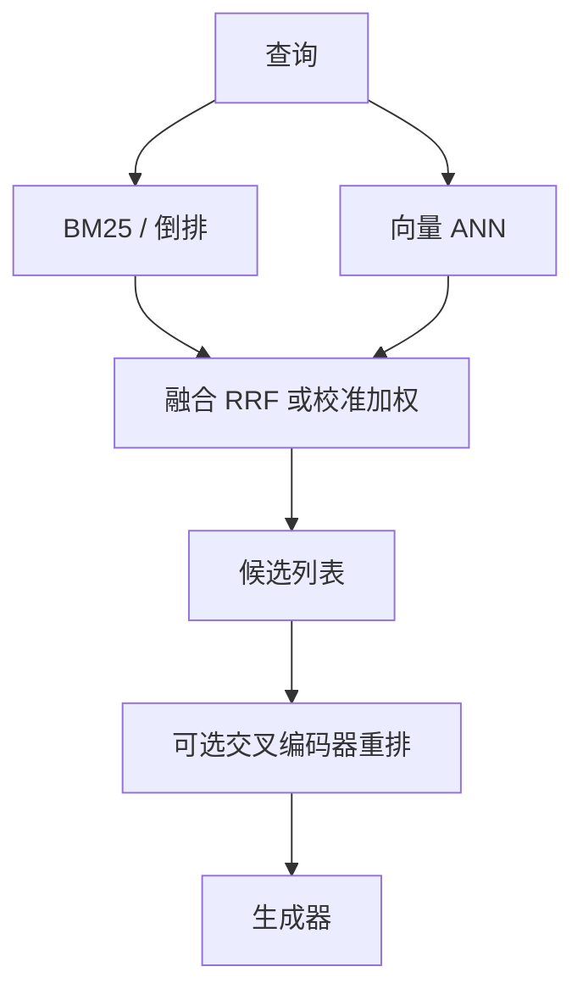

# 混合检索

    
词法模型精确匹配稀有标识符，稠密向量捕捉改写与同义；把两条排序列表融合成一条，比指望单一空间打天下更稳。

    <footer>—— 词法侧以 Robertson 的 BM25 为默认；融合常用 Cormack 等人的 Reciprocal Rank Fusion；稠密侧接 Lewis 的 RAG 检索器传统</footer>

只做向量近邻时，查询里的订单号、报错码、函数名、药品商品名经常输给「语义更流畅」但不含该字符串的段落。只做 BM25 时，用户换一种说法（「怎么把请求拆成多段预填」对上「chunked prefill」）会零召回。混合检索让稀疏词法通道与稠密向量通道并行取候选，再融合成分数列表，送给生成器或[重排序](/llm/rerank)。它不是新的嵌入模型，而是承认两种失败模式正交。本篇写 BM25 通道、双编码器通道、以及 RRF 与分数校准为什么不能互相替换。切分仍是共同前提，见 [向量检索与切分](/llm/rag-chunking)。

## 问题

稀疏检索把文档看成词袋：词频、逆文档频率、长度归一。BM25 对 *恰好出现的词* 极强，对同义与拼写变体弱（除非加词干、同义词表或拼写校正）。稠密检索把意思压进固定维向量，对改写强，但对高 IDF 的短标识弱——这些词在嵌入训练里出现少，向量被周围虚词带走。真实查询混合了两种需求：一句自然语言里夹着一个 `ECONNRESET`。单通道系统会在 A/B 里各赢一半查询，线上却表现为「有时神准有时瞎」。

融合也有问题。BM25 分数与余弦相似度不可比：前者随查询词数和文档长度变，后者大约在 $[-1,1]$ 或归一后的内积范围。线性加权若不做校准，权重会随语料漂移而失效。需要一种对分数尺度不敏感的融合，或一种在验证集上估权重的校准。还要决定：融合前每路取多少候选，融合后截到多少再进生成器。

### 词法通道：BM25

BM25 的核心是饱和的词频与 IDF。实现上要注意分词与查询分词一致：中文要有明确的分析器，代码与错误码应走 keyword 字段而不是被切成单字。字段加权（标题 > 正文）往往比调 $k_1,b$ 更有效。过滤（租户、语言、版本）应在倒排里做，与向量侧同一套元数据，否则两路候选的权限集合不一致，融合会把无权限文档抬上来。

BM25 不是「过时的基线」点缀。对标识符、专名、编号，它经常是主通道，向量是辅通道。反过来在纯开放问答、短问长答且没有专名时，向量可以主、BM25 辅。主辅应由查询类型决定，而不是由架构时尚决定。

## 方法

两路索引共享文档 ID 与切分版本：同一块既有倒排条目又有向量，否则融合后的 ID 对不上原文。查询时并行：一路分析器走 BM25 Top-$n_s$，一路嵌入走 ANN Top-$n_d$。$n_s$ 与 $n_d$ 通常大于最终 $k$，以便融合后仍有足够独特块。缺一路结果时（新文档只写了倒排、向量还在排队），融合应退化为单通道，而不是整次检索失败。

融合最常用 Reciprocal Rank Fusion：对每个文档累计 $1/(c+r)$，$r$ 是它在该路的名次，$c$ 是常数（常用 60）。RRF 不看原始分，只看名次，因此不怕 BM25 与余弦量纲不同。若要坚持线性加权，先把两路分数在验证查询上做 min-max 或 z-score，再扫 $\alpha$。有的系统按查询特征路由：含数字、含代码 token、引号内短语则提高词法权重。路由错误会比固定 RRF 更伤，要有回退。

### 向量通道：双编码器

向量通道沿用 RAG 的双编码器：文档块离线嵌入，查询在线嵌入。它负责改写、多语言近似、以及「用户没说出术语但描述了现象」。切分对两路的影响不同：过短的块对 BM25 仍可能靠一个关键词命中，对向量则上下文不足；过长的块对 BM25 会稀释 TF，对向量会平均化。混合不能当切分失败的补丁，但可以降低「只靠一路时切分必须完美」的压力。嵌入版本与分析器版本要一起记录，否则线下评测的融合权重不能搬到线上。

## 机制

RRF 的直觉是：两路都排得很靠前的块应优先；只在一路排第一、另一路没有的块仍保留，但分数低于双命中。这天然抑制「向量近邻里的主题相似但关键词全无」独占 Top-1，也让「BM25 精确命中但语义段落不完整」有机会被向量侧的姐妹块补上——前提是切分让姐妹块有独立 ID。常数 $c$ 降低极端第一名的垄断；$c$ 过小则第一名过强，$c$ 过大则名次差被抹平。

校准加权能表达「本语料上向量整体更准」，但当查询分布切换（从客服 FAQ 转到工单号查询）权重会错。生产上更稳的是 RRF 加轻量路由，而不是一套全局 $\alpha$ 吃所有流量。融合之后若仍接重排，混合的任务是 *召回*：宁可多给交叉编码器 50–100 条，也不要在融合阶段用过小的 $k$ 把真值切掉。重排再负责精度。

不要把 SPLADE、ColBERT 与「BM25+向量」混称为同一种混合。SPLADE 学稀疏向量，ColBERT 做 token 级延迟交互，它们是第三种索引形态。本篇的混合特指词法倒排与句级双编码器两条现成通道的融合。

### 融合：RRF 与分数校准

RRF 忽略绝对分，因而也忽略「BM25 分很高是因为查询词全是停用词」这类信号——分析器应先去掉无意义查询。校准加权能用上绝对分，需要稳定的分数分布，ANN 的近似、分片、副本之间应避免分数不可复现。评测要按查询类型切片：有标识符的、纯改写的、混合的，分开报召回@k。只报一个 macro 平均，会让主通道选错。

## 边界与工程取舍

混合翻倍的是 *检索* 基础设施：两套索引、两套延迟、两套更新。文档删除必须两路都删，否则权限泄漏。延迟上可并行，尾延迟取 max 再加融合，通常仍远小于交叉编码器重排。极短查询（一个词）BM25 足够，向量可能把同主题长文推上来；极长查询（整段日志）应先抽关键 token 再走词法，把整段塞进嵌入也可能超模型长度。

不要为混合而混合：验证集上单通道已饱和时，第二路只增加近重复。近重复抑制（MinHash / 标题去重）在融合后比融合前更重要，因为两路会把同一节的不同切块都送上来。出处以 BM25 综述、RRF 的 SIGIR 短文、以及稠密检索 / RAG 论文为准，不要伪造「Hybrid RAG 2024 标准公式」的 arXiv。

查询里的引号短语应走词法强制匹配（phrase query），不要指望融合权重「学会尊重引号」。用户已经用标点表达了精确意图，丢掉是产品 bug。

## 小结

- 词法通道保标识符与专名，向量通道保改写；失败模式正交，故值得融合。
- 两路必须共享块 ID、切分版本与权限过滤。
- RRF 按名次融合，避免 BM25 与余弦量纲不同；线性加权需要校准且怕分布漂移。
- 混合主攻召回，精度交给可选重排；融合前的 $n$ 应大于最终 $k$。
- 切分失败不能单靠混合修复；近重复会在双通道下放大。
- 按查询类型切片评测，避免一个平均分掩盖主通道选错。
- 出处：Robertson & Zaragoza, BM25 综述；Cormack et al., Reciprocal Rank Fusion, SIGIR 2009；Lewis et al., RAG, NeurIPS 2020。
