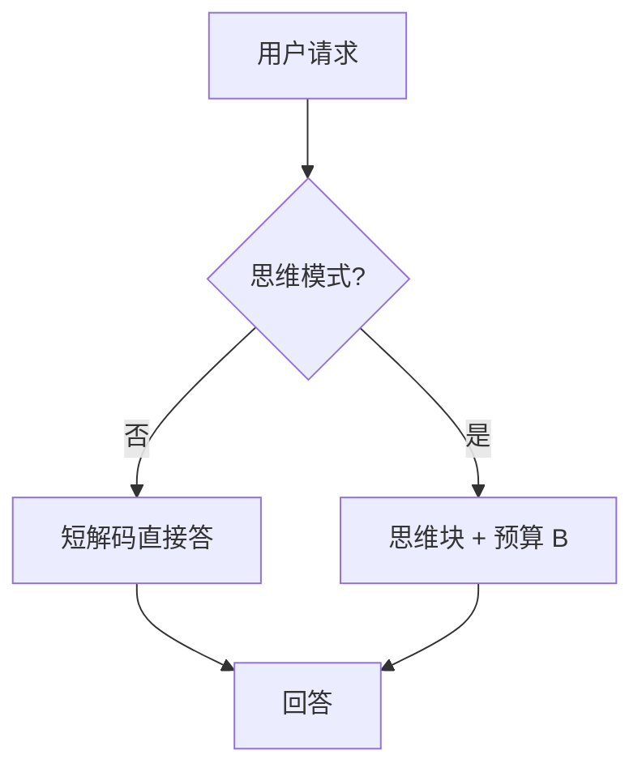

# 混合思考模式

不是每条用户消息都值得八百 token 草稿纸；同一模型要能在「直接答」与「先想」之间切换。

<footer>—— Qwen3 的 thinking / non-thinking；Claude 的扩展思考开关；R1 相对普通聊天模型的部署现实</footer>

[上一课](/llm/thinking-budget-adaptive)假定已经在思维模式里，只调预算。缺口是：**多数助手流量是寒暄与简单指令，强制长链又贵又像过度思考。** 混合思考：路由或提示决定是否进入思维块。Qwen3 把两种模式做进同一套权。本课写切换，不重写 R1 训练。

## 问题

R1 类 RL 改变 decode 分布，默认变长。接到通用助手，延迟与风格都不对。混合：system / 用户开关、分类器路由、或模型自己决定。自己决定会 Goodhart——模型可能对所有题都「觉得该想」，因为训练里想了才有 $R$。需要：简单题无思维也能得高分的数据，否则开关形同虚设。

两种模式的 KL 锚可能不同：非思维拴短 SFT，思维拴长链策略。一套 PPO 混训要分模式采样，否则一种分布吃掉另一种。

### 开关是产品合同

用户关思考仍偷偷想，或开思考却空链，都是合同失败。评测要分模式强制。计费若按输出 token，隐藏链必须声明。

蒸馏小模型常常只有思维模式轨迹，没有混合，不要称为「同样的开关」。R1 蒸馏是后课。

## 方法

数据：短答示范 + 长链示范，用控制 token 或分段标签标明模式。训练：混合 batch，损失只在对应段；RL 时简单可验证题允许 $G$ 条短答，难题强制思维。路由：轻量分类器或提示词，阈值在延迟金标上扫。解码：非思维低 $\tau$、短 $L$；思维按上一课预算。

与拒绝训练：安全拒应走短模式，避免在隐藏链里生成有害推理再摘要成拒——监视与产品都更干净。

## 机制

模式切换是条件分布：$\pi(y\mid x,m)$。$m$ 若只在推理注入、训练未见，又是 train-serve gap。RL 只在 $m=\mathrm{think}$ 上有校验器梯度时，非思维模式会退化成未对齐基座。应用少量有用 RL / DPO 维持短模式。

用户可见的「正在思考」UI 不等于 $m=\mathrm{think}$。内部可能始终 think 再摘要。

## 边界与工程取舍

路由错误代价不对称：该想不想，准确率掉；不该想却想，费用涨。应偏向可配置而不是全自动。分类器路由要用延迟金标标定，不要用思维 token 数当难度——那会把已经过度思考的请求继续送进长模式。下一课过度思考：自动路由失败时的典型症状。

两种模式都要进训练分布。路由用延迟金标标定，不要用已经很长的思维当作「该想」的证据。

## 小结

- 混合思考让同一权在短答与长链间切换；训练必须见过两种 $m$。
- 若 RL 只奖长链，开关会失灵，简单题也满预算。
- 安全拒优先短模式。
- 计费与评测按模式分表。
- 出处：Qwen3 混合思考；DeepSeek-R1 部署对照；OpenAI / Anthropic 的思考档位产品化。
