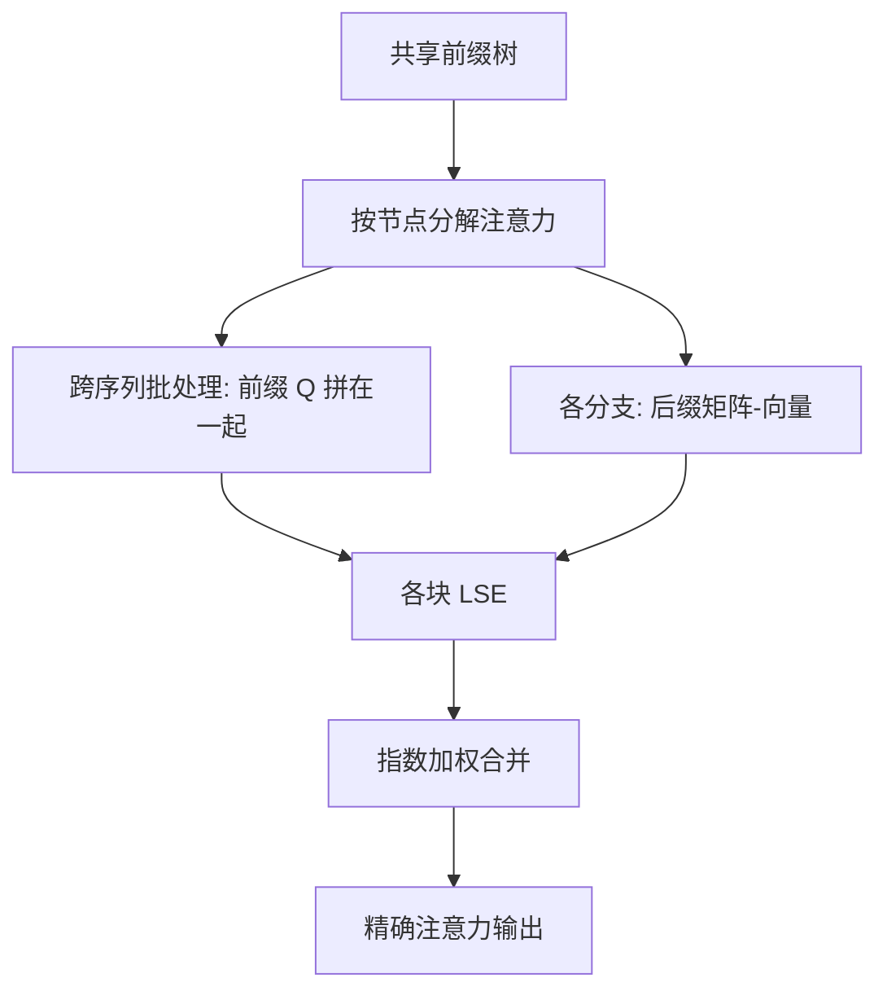

# Hydragen 共享前缀投机

    
共享前缀上的注意力不要对每条序列各做一次矩阵-向量乘；把查询在序列间拼起来，前缀 KV 只读一遍，softmax 分块再按对数配分函数拼回。

<footer>—— Juravsky, Brown, Ehrlich, Fu, Ré, Mirhoseini，Hydragen: High-Throughput LLM Inference with Shared Prefixes，arXiv:2402.05099</footer>

分页缓存消掉的是**存储**上的重复前缀；FlashAttention 与 PagedAttention 在解码时仍对每条序列独立读那一段 $K,V$，带宽账按 batch 再乘一遍。Juravsky 等人的 Hydragen 消掉的是**读取**：把完整注意力拆成「共享前缀」与「各自分支后缀」两次计算，前缀侧把各序列当前查询拼成矩阵，一次矩阵-矩阵乘喂给 Tensor Core。数学上仍是精确的缩放点积注意力。树状共享——少样本根、题干、再分出许多候选——同一套分解沿树节点递归，这正是投机解码、自洽采样、竞赛编程里「一条前缀、许多草稿」的访存形态。本篇写这条核，不把它写成 Hydra 草稿头（那是 Medusa 系的另一篇论文）。

## 问题

解码一步 $N_q=1$、$N_{kv}\gg 1$，注意力是访存墙。批处理能把 MLP 变成矩阵乘，却不能提高注意力的算术强度：每条序列的 KV 不同，仍是许多独立的矩阵-向量乘。共享系统提示、少样本、或投机树的公共祖先，使各序列的 $K,V$ 在前缀上逐 token 相同。Kwon 等人的 PagedAttention 让它们指向同一物理页，显存省了；核若仍按序列循环读页，HBM 流量并不省。Hydragen 要解决的是：在精确 softmax 的约束下，如何让前缀 KV 的每次加载被整个 batch 的查询摊销，并走上 Tensor Core。

投机验证把问题推得更尖。草稿树里，从根到各叶子的路径高度重叠；一次目标模型前向要对许多查询位置做注意力，它们共享祖先 KV。SpecInfer、Medusa 的树注意力已经在掩码上表达这种共享；若核不按树分解，验证阶段会把同一段前缀 KV 按候选条数重复读。Hydragen 的层次分解就是为这种树准备的，而不只是「聊天机器人共用系统提示」。

### 分块 softmax 才能拆开再合并

softmax 的分母跨整段序列。把 $K,V$ 切成前缀与后缀后，不能把两次注意力输出直接相加。Hydragen 借用 FlashAttention 的分块技巧：每次子计算额外留下对数配分 $\mathrm{LSE}(Q,K)=\log\sum\exp(QK^\top/\sqrt{d})$，再按

$$
\mathrm{SDP}(Q,K,V)=\frac{O_1 e^{\mathrm{LSE}_1}+O_2 e^{\mathrm{LSE}_2}}{e^{\mathrm{LSE}_1}+e^{\mathrm{LSE}_2}}
$$

拼回。这是恒等式，不是近似。树有更多节点时，沿节点做同样的加权合并即可。

Hydragen 与「前缀缓存」常被写成同一功能。缓存决定块在不在显存；Hydragen 决定注意力核怎么读这些块。只有缓存、没有分解，大 batch 长前缀时注意力仍会先于 MLP 成为墙。论文用 CodeLlama-13B 对 vLLM：前缀 16K 时端到端吞吐可到约 32× 量级，前缀从 1K 增到 16K 时 Hydragen 吞吐掉不到 15%，基线掉超过 90%——数字绑在大 batch 与 MHA 模型上。

## 方法

### 前缀一次、后缀仍按序列

对 batch 内共同前缀，把各序列当前 query（投机树里则是该节点上的所有查询）拼成 $Q_{\mathrm{pref}}\in\mathbb{R}^{B\times d}$，对单一份 $K_{\mathrm{pref}},V_{\mathrm{pref}}$ 做注意力，得到 $O_{\mathrm{pref}}$ 与 $\mathrm{LSE}_{\mathrm{pref}}$。后缀 KV 互不相同，仍走普通解码核（论文实现用 xformers 的 Triton 核以支持变长）。最后按上式合并。层次情形：每个树节点对其全体子孙的查询做一次批处理注意力，节点 KV 只读一遍。

实现可以很薄。作者强调非层次输入甚至不必写自定义 CUDA：前缀走 `flash-attn`，后缀走变长核，再写一个合并 LSE 的 Triton 核。这与 PagedAttention 必须改读块表的核不同。代价是：前缀必须真正逐 token 相同（含位置）；树的划分要与调度器一致，否则「共享」只存在于故事里。

### 何时端到端会动

注意力必须已经是墙。小 batch、短前缀、模型读权重才是瓶颈时，Hydragen 几乎无感。GQA/MQA 缩小 KV 后，同样长度下注意力更轻，加速比下降，但更小的 KV 允许更大 batch，而加速比随 batch 与前缀长度涨——论文把这条权衡写清楚了。后缀很长时，未优化的那一半重新主导，树应在共享深层切，而不是只切一个全局系统提示。

## 机制

### 算术强度从哪来

前缀注意力的 $N_q$ 从 1 变成 batch（或该节点的子孙查询数）。同一 $K_{\mathrm{pref}}$ 的元素被多次乘加，算术强度上升，Tensor Core 可参与。HBM 上前缀 KV 的读次数从 $O(B)$ 降到 $O(1)$（对该核而言）。后缀不变，所以总加速被「前缀长度 / 全长」限制。投机树浅而宽（许多候选、公共前缀长）时，Hydragen 的杠杆最大；深而分叉早的树，共享段短，接近基线。

与 Medusa/EAGLE 的关系是互补：那些方法决定**猜哪些 token**；Hydragen 决定**验证这些 token 时注意力怎么算**。DeepSeek-V3 的 MTP 草稿很浅（$D=1$），共享前缀几乎是整段已接受上下文，验证时 batch 内多请求若还共享系统提示，可以两级叠加：请求间 Hydragen，请求内 MTP 链。不要把 Hydragen 的 32× 吞吐写成投机算法的接受率。

CodeLlama-13B 用多头注意力，KV 比 GQA 的 Llama-3 更「重」，论文数字偏乐观于现代 GQA 服务栈。引用时应写模型与是否 GQA，以及 batch、前缀、后缀长度。APPS 竞赛编程上层次共享相对单级再减约 55% 评测时间，说明树分解不是玩具。

### 精确性边界

合并公式在 fp16/bf16 下与普通注意力一样要防 LSE 溢出，通常做相对最大值。因果掩码：前缀内部已是因果算完的 KV，解码步的查询对前缀全可见，对后缀因果。树注意力还要屏蔽「不能看见兄弟草稿」的位置——那是掩码问题，Hydragen 的分解必须在掩码切分后的块上做，否则会泄漏未接受的草稿 token。

## 边界与工程取舍

Hydragen 不替代分页与基数树：没有共享存储，批处理前缀注意力还要把前缀 KV 在逻辑上当成一份。它也不近似：不要写成「牺牲质量换速度」。产品若 batch 常年是个位数，优先 GQA、量化、投机草稿质量，而不是先上 Hydragen。自定义注意力（MLA、稀疏）需要把分解接到对应核上，不能假设 `flash-attn` 的 MHA 接口直接等于 MLA 的 576 维。

与 Hydra（Ankner 等，顺序相关的 Medusa 头）只是名字接近。写文献相关工作时点明：一篇优化共享前缀的**精确注意力实现**，一篇优化草稿头的**投机质量**。

出处：Juravsky 等，*Hydragen*，arXiv:2402.05099，代码 jordan-benjamin/hydragen。对照 Kwon 等 PagedAttention；Dao 等 FlashAttention；投机树见 SpecInfer / Medusa。ICLR/NeurIPS 投稿条目以 OpenReview 为准，引用 arXiv 即可。

## 小结

- Hydragen 把共享前缀与独有后缀的注意力拆开，用 LSE 精确合并，前缀侧跨序列批处理查询。
- 省的是前缀 KV 的重复读取与矩阵-向量，不是另一套注意力公式。
- 层次分解对准投机树、少样本加多候选等树状共享。
- 加速随 batch 与前缀长度涨；短前缀、GQA、小 batch 时杠杆变小。
- 与草稿算法正交：Hydragen 加速验证时的注意力核。
- 出处：Juravsky 等，arXiv:2402.05099。
