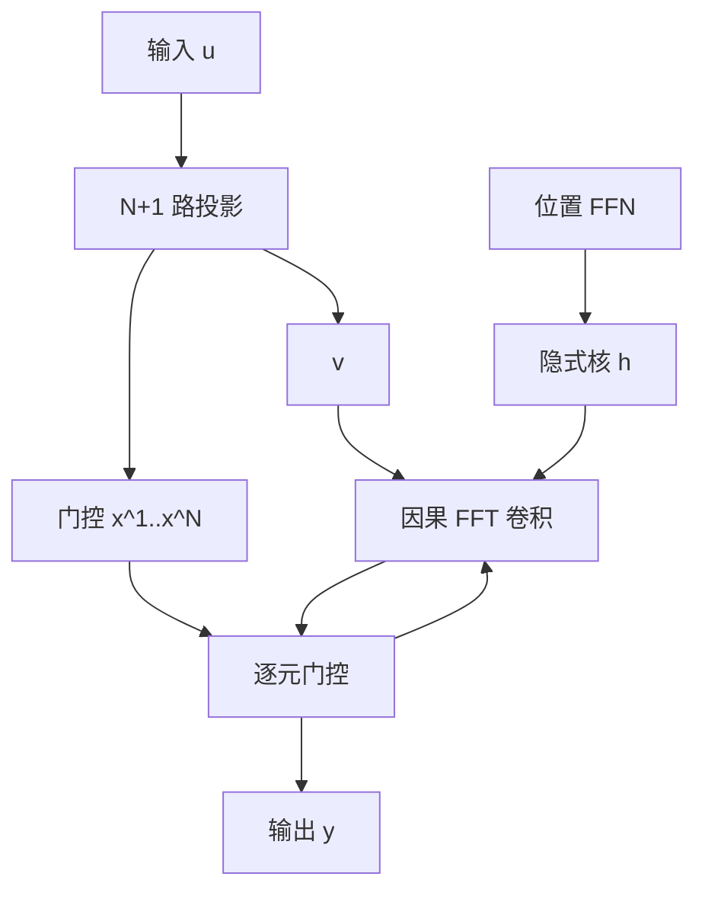

# Hyena

    
注意力是数据控制的稠密矩阵；Hyena 用隐式长卷积与逐元门控的递推去因子化同一类算子，次二次求值，参数不随长度涨。

    <footer>—— Poli et al., Hyena Hierarchy: Towards Larger Convolutional Language Models, ICML 2023</footer>

次二次层要追上注意力，低秩或稀疏往往还得混回若干稠密注意力头。Poli、Massaroli、Nguyen、Fu、Dao 等人 2023 年的 Hyena 不走逼近 softmax 的路，而是直接构造一个**数据控制的线性算子**，使其矩阵形式是对角门控与 Toeplitz 卷积的交替乘积。算子由「隐式参数化的长卷积 + 逐元门控」递推定义，阶数（order）控制因子个数。短阶时覆盖 [H3](/llm/h3) 一类特殊情形；更长的阶给出更大的数据控制矩阵，而不物化 $L\times L$ 的注意力表。求值用 FFT 卷积，$O(L\log L)$。在数千到数十万长度的推理任务上，Hyena 相对纯 SSM / 传递函数算子可高出五十多个点，并在 WikiText103 与 The Pile 上达到当时无稠密注意力架构的最好质量，2k 长度训练算力约省 20%，8k 上比高度优化的注意力快约 2 倍、64k 上可达约 100 倍。本篇写 Hyena 算子本身，不把后续 HyenaDNA 的基因组实验展开。

## 问题

注意力对输入 $u$ 形成一个矩阵 $A(u)$，再乘值。$A(u)$ 的每个元素都可以依赖整段 $u$，这是「 unrestricted context」；代价是 $O(L^2)$。次二次方法若只近似 $A(u)$ 的低秩或稀疏图案，会在需要密集数据控制的推理任务上崩——论文用这类任务当过滤器：过不了过滤器的算子，放大之后也很难只靠宽度补回来。

H3 已经表明：长卷积加一两次乘法，能补上 SSM 的联想回忆。下一步是：把「门控–卷积」当成可堆叠的因子，而不是固定的两层 SSM；并且卷积核不要存 $L$ 个 tap（那会让参数随长度线性涨），而要用一个小网络从位置映射到滤波器，即隐式参数化。目标是 drop-in 替换注意力：输入输出形状不变，复杂度亚二次，参数亚线性于 $L$，且不必与 softmax 层杂交。「数据控制」指矩阵元素是输入的函数。卷积本身不是数据控制的——同一条 $h$ 扫所有样本。Hyena 的控制来自门控对角阵，卷积只提供平移等变的长程混合。

## 方法

### 阶为 $N$ 的 Hyena 算子

将输入投影成 $v,x^1,\ldots,x^N$ 共 $N+1$ 路，并学习滤波器 $h^1,\ldots,h^N$。递推为

$$
z^1 = v,\qquad z^{n+1}_t = x^n_t \odot (h^n * z^n)_t,\qquad y = z^{N+1}.
$$

$h^n * z^n$ 是因果长卷积。矩阵语言里，每一步左乘一个对角阵 $D_{x^n}$（由 $x^n$ 填对角）和一个 Toeplitz 阵 $T_{h^n}$。整个算子是

$$
y = D_{x^N} T_{h^N}\cdots D_{x^1} T_{h^1} v,
$$

一张数据控制的 $L\times L$ 矩阵的因子化，求值时绝不把该矩阵展开。阶 $N=2$ 时已接近 H3 的「门、长混合、门」骨架；更大的 $N$ 增加因子深度，也增加投影路数。

### 隐式滤波器：参数与长度解耦

$h$ 不存成长度为 $L$ 的向量。一个小 FFN（或 SIREN 一类）吃位置特征——$\sin,\cos$、归一化时间、常数项——输出该位置的滤波器值。参数量与 $L$ 无关，上下文在长度上不受限，这一点与注意力相同。求值仍用 FFT：$h$ 先被物化成长度 $L$ 的核（或按块），再 $\mathrm{FFT}^{-1}(\mathrm{FFT}(h)\odot\mathrm{FFT}(z))$。因果通过把核与信号补零或使用因果 FFT 约定保证。

短卷积常加在投影上，先抽局部特征再进长程 Hyena，避免长核去拟合本该由 3–5 阶 FIR 完成的邻域。论文把滤波器参数化列为影响最大的设计选择之一：同样是长卷积，隐式核比对角 SSM 的传递函数更容易学到需要的长阶响应。

### 不杂交注意力的缩放证据

此前次二次模型要在尺度上对齐 Transformer，往往插入稠密注意力层。Hyena 的主张是：过滤器任务上已经匹配注意力后，纯卷积语言模型可以在标准语料上靠近 Transformer 质量。The Pile / WikiText103 上的结果用来支持「不是玩具长度上的巧合」。速度数字绑定在当时的注意力实现与长度上：长度越长，FFT 相对 $L^2$ 越明显；短于 2k 时优势缩小，与所有亚二次方法一致。隐式核在每一步都被物化成长度 $L$ 的 $h$。省的是参数不是这 $L$ 个数的计算。若 FFN 在每个时间步、每个通道都用未融合的 MLP 现场算 $h$，生成核的时间会压过 FFT 本身。

## 机制

注意力的 $A(u)_{ij}$ 可以直接是 $q_i^\top k_j$。Hyena 的等价矩阵每个元素是若干门控与卷积系数的多项式型组合，感受野仍是全局的（因果下三角），但交互必须通过这条因子链。表达力来自：门控让不同样本走不同的有效卷积；长核让远处的 $v$ 仍能进来；多阶让「先比较再混合再比较」成为可能，这正是 H3 诊断里联想回忆需要的乘法深度。

与 SSM 的差别主要在参数化。对角 SSM 的核是指数模态的叠加，衰减形状受极点约束；Hyena 的核由 FFN 自由生成，可以更尖、更振荡，也更容易过拟合到训练长度上的伪周期。这是 64k 加速好看、外推长度时要重新生成 $h$ 的原因：位置特征里若含 $t/L_{\mathrm{train}}$，测试长度一变，核的形状会变。

数值上 FFT 卷积对精度敏感，半精度下应用 FP32 累加或拆成实部更高精度。因果掩码不能事后乘在 $L\times L$ 矩阵上——那张矩阵不存在——必须在核的支撑与前缀填充上保证。训练并行（整段卷积）与推理逐步（线性递推或滑动 FFT）需要同一条核；推理若改成截断 FIR，等于改了算子。

## 边界与工程取舍

Hyena 替换的是注意力算子，不是整个块：FFN、残差、归一化仍在。精确、任意位置的内容寻址仍可能弱于 softmax，极端针测不要只看 Pile 的损失。阶 $N$ 加大线性增加投影与卷积次数，3 左右是论文常用区，再深未必值得。

硬件上，FFT 与 GEMM 的屋顶线不同。FlashAttention 把 $L^2$ 的常数压得很低之后，Hyena 的交叉点向更长的 $L$ 移动。部署前要在目标长度测，不能引用 2023 年 8k/64k 的倍速当作今天的数字。与 [Mamba](/llm/mamba) 比：Mamba 走选择性扫描与 SRAM 友好的递推；Hyena 走 FFT 与隐式核。长卷积生态的融合核少于 Mamba 的 scan，工程成熟度是真实约束。

隐式 FFN 的位置编码不要和 RoPE 混用在同一条 $x$ 上而不做消融：一个在投影空间旋转内容，一个在滤波器空间看绝对/相对时间，失败模式缠在一起。「100× at 64k」比较的是算子墙钟，假设实现合理且 batch 能喂满设备。单请求、短解码步上，FFT 的启动开销可能让递推 SSM 反而更合适。

## 小结

- Hyena 用隐式长卷积与门控的递推，因子化数据控制的线性算子，作为注意力的亚二次替换。
- 参数由位置 FFN 生成核，不随 $L$ 线性增长；求值 $O(L\log L)$。
- 低阶包含 H3 类结构；更高阶增加乘法–卷积深度，无需杂交 softmax。
- 过滤器任务与 Pile 上的质量用来说明能力缺口被缩小，而不是低秩逼近碰巧过了语言建模。
- 核的隐式参数化是双刃剑：表达力强，长度外推与 FFT 数值要单独管。
- 短序列与未融合实现上不一定快；交叉点随注意力内核成熟度右移。
- 出处：Poli et al., *Hyena Hierarchy: Towards Larger Convolutional Language Models*, ICML 2023。
