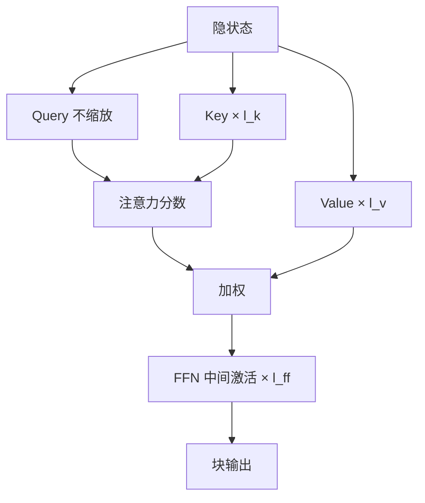

# IA3

不必插入矩阵，也不必低秩分解权重；用三条与通道同长的向量去放大或抑制键、值与前馈中间激活，冻结模型就能转向少样本任务。

<footer>—— Liu 等，Few-Shot Parameter-Efficient Fine-Tuning is Better and Cheaper than In-Context Learning，NeurIPS 2022</footer>

IA3 的全称是 Infused Adapter by Inhibiting and Amplifying Inner Activations：往内部激活上注入抑制与放大。它来自 Liu 等人的 T-Few 工作，对比的对象不只是 LoRA，更是上下文学习（ICL）：在少样本预算下，改极少量参数往往比把例子塞进提示更稳、更便宜。实现上，IA3 是三组可学习缩放向量，分别乘到注意力的键、值，以及 FFN 的中间激活。没有瓶颈 MLP，没有 $BA$，参数量比大多数适配器再低一到两个数量级。

## 问题

ICL 把示范放进上下文，权重零更新。示范一长，推理成本线性涨，且对模板极其敏感。全参或 LoRA 在少样本（每类几个例子）上又容易过拟合：可训练自由度远大于数据。需要一种更新，其自由度与通道数同阶而不是与 $d^2$ 同阶，才能在极小数据上正则自然成立。

Houlsby 适配器仍是两张矩阵；LoRA 即便 $r=1$，每层仍有 $d+k$ 个参数乘上目标模块数。若任务只是「把某些通道拧响、把另一些拧死」，矩阵是浪费。逐通道缩放正是这一假设的极小实现：与 LoRA 的低秩加性不同，它是对角乘性。问题是：乘在哪一处的激活上，才能既改注意力读什么、又改 FFN 记什么，同时起步不破坏预训练。

### 乘性门控与加性增量

加性 PEFT 写 $h+ \Delta(h)$，起步 $\Delta=0$ 即恒等。乘性写 $l\odot h$，起步必须 $l=\mathbf{1}$ 才恒等；若 $l$ 初始化在零附近，整层激活被掐断。IA3 的初始化纪律因此与 LoRA 的 $B=0$ 对称而相反：从全 1 出发，而不是从全 0。搞反初始化，基座前向第一步就坏。

IA3 不是 LoRA 的 $r=1$ 特例。$r=1$ 仍是加性秩一矩阵；IA3 是对角乘子，作用在指定激活上，不构造 $\Delta W$。

## 方法

在多头注意力里，对键、值做逐通道缩放：

$$
K \leftarrow l_k \odot K,\qquad V \leftarrow l_v \odot V,
$$

$l_k$、$l_v$ 与键（值）的特征维同长，对序列位置广播。查询不乘，避免与键双重缩放把 logits 尺度搞乱；分数的改变交给 $l_k$，读出的改变交给 $l_v$。在 FFN 里，对中间激活（非线性之后、上投影之前或按实现约定的那一处）乘 $l_{\mathrm{ff}}$。三组向量组成全部可训练参数。Liu 等人把这套缩放与 T-Few 的损失、数据配方一起用，在少样本分类与指令任务上显示：参数远少于适配器，效果优于把同样例子用于 ICL。

前向其余部分与冻结基座完全相同。没有额外层，推理多的只是三次按通道乘法，极易融进邻近内核。多任务即多套 $(l_k,l_v,l_{\mathrm{ff}})$，体积按层数乘宽度线性增长，仍远小于一份 LoRA。

## 机制

### 抑制与放大如何改注意力

$l_k$ 小于 1 的通道，使该维在点积里变哑，对应特征不再主导匹配；$l_k$ 大于 1 则把匹配钉在这些维上。这是在冻结的 $W_K$ 之后做通道重加权，等效于给键投影的每一行乘一个正数（或负数，若允许 $l$ 变号）。$l_v$ 不改谁匹配谁，改匹配之后读出的内容：某些值通道被放大，等于任务更依赖这些头通道所编码的信息。二者分工接近「选邻居」与「选邻居身上的哪部分」。

$l_{\mathrm{ff}}$ 作用在 FFN 的宽中间层，那里通道数是隐宽度的若干倍（GLU 则更宽）。逐通道门控可以关闭与任务无关的专家式方向、放大相关方向，而不增加 FFN 的秩。少样本时，这种「开关」比学习一张新的下投影更不容易过拟合：每个通道一个标量，梯度是该通道激活与上游误差的乘积，平滑且维数低。

T-Few 的结论是条件性的：在他们的少样本设定与损失下，PEFT 优于 ICL。它没有说生产环境里永远不该用上下文示范。IA3 是那篇工作里把参数压到极低的那一种注入，配方里还有损失设计与数据，不只是三条向量。

### 为何比 ICL 更省、有时更稳

ICL 每条查询都要重复示范 token，Prefill 随示范长度涨。IA3 把示范里的可迁移部分写入 $l$，推理时查询不必再带那些例子。稳定性来自归纳偏置：能改的只有通道增益，模型无法用额外自由度去背单条训练句的表面形式——至少远难于 LoRA 或全参。这在 $n=4$ 或 $8$ 的少样本分类上是优点；在需要大量新知识写入的 SFT 上则是上限：对角乘子改不了投影子空间的张成，只能在已有通道上拧旋钮。

## 边界与工程取舍

IA3 不替代 LoRA 做领域适配。预训练里没有的方向，放大现有通道也变不出来。知识密集、风格重写、长指令 SFT，仍应选权重侧 PEFT 或全参。IA3 的主场是：基座已具备能力、缺的是少样本条件下的任务开关，且不想付 ICL 的上下文税。

缩放作用点必须与实现一致。有的模型把 QKV 合成一张矩阵，注入要拆开 $K$、$V$ 再乘。GLU FFN 的「中间激活」有门与值两条，乘在哪一条结果不同，应与论文实现或所在 PEFT 库的默认对齐，并在日志里打印 $l$ 相对 $1$ 的偏离，确认真的在学。允许 $l$ 变负等于允许通道反相，表达力略增，也更容易训崩；有人把 $l$ 参数化成 $1+\delta$ 或软加正约束。

把 IA3 与 Adapter 都叫「适配器」会造成配置错误：有人按 Houlsby 去找 down/up 矩阵，发现只有向量，以为没加载成功。检查点体积是几 MB 而不是几百 MB，往往是正常信号。

### 与 LoRA、Adapter、前缀的对照

Adapter 提供非线性瓶颈，参数中等，推理多两层。LoRA 提供加性低秩 $\Delta W$，可合并。前缀提供额外键值记忆。IA3 提供对角乘性门控，参数最少，几乎无额外层。少样本开关优先 IA3 或 Prompt Tuning；需要新子空间优先 LoRA；需要非线性插入优先 Adapter；需要任务记忆槽优先前缀。混用可以，但少样本下自由度一加回去，过拟合优势就消失。

## 小结

- IA3 用向量对键、值与 FFN 中间激活做逐通道缩放，初始化为全 1 以保持恒等起步。
- 参数量与通道数同阶，远低于瓶颈适配器与常规 LoRA。
- $l_k$ 改匹配所用的特征，$l_v$ 改读出，$l_{\mathrm{ff}}$ 在 FFN 里做通道开关。
- 来自 T-Few：少样本下这种 PEFT 可以比把例子塞进上下文更稳、推理更便宜。
- 乘性门控变不出预训练没有的方向，不适合当领域重适配的唯一手段。
- 注入点必须与 QKV 融合、GLU 结构对齐，否则等于没打到目标激活。
- 出处：Liu 等，*Few-Shot Parameter-Efficient Fine-Tuning is Better and Cheaper than In-Context Learning*，NeurIPS 2022。
