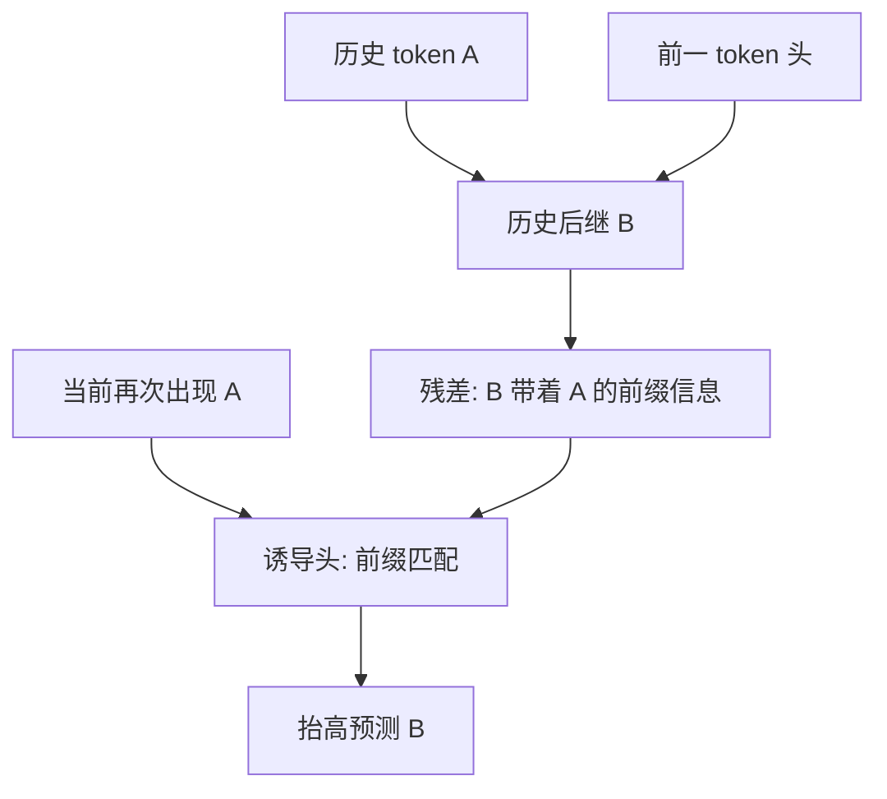

# In-context Learning 的诱导回路

诱导头是一类注意力头，实现一种简单算法：把形如 [A][B] … [A] 的序列补成 [B]。

<footer>—— Olsson et al., In-context Learning and Induction Heads, Transformer Circuits Thread / arXiv:2209.11895, 2022</footer>

上下文学习（in-context learning, ICL）指模型在前向里根据当前提示里的示例调整预测，而不改权重。GPT-3 把这一现象做成了公开事实：同一组参数，提示里多几个示范，下游任务就能换。机制解释长期缺位。Olsson、Elhage、Nanda 等人在 Anthropic 的 Transformer Circuits 线索里提出：两层注意力即可组成一条「诱导回路」（induction circuit），其核心构件是诱导头（induction head）。小模型上有因果证据，大模型上有时间对齐与消融的间接证据。本篇只写这条回路是什么、如何在残差流里接力、以及它解释 ICL 的边界。

## 问题

自回归损失随序列位置下降，是 ICL 的操作定义之一：越往后，模型越能利用已经出现过的模式。这和「在权重里记住某条事实」不同。后者是参数记忆；前者是把当前上下文当临时程序。Brown 等人展示了 few-shot 提示有效，却没有指出是哪一类子计算在复制模式。若没有可检验的内部对象，ICL 只能停留在行为描述。

诱导回路要回答的是更窄的问题：给定前文出现过 `[A][B]`，当再次遇到 `A` 时，模型如何把 `B` 的 logits 抬起来。这是模式补全，不是语义推理。Olsson 等人的主张是：大量所谓「上下文学习」在机制上就是这种补全的模糊版本——`[A*][B*] … [A] → [B]`，其中 `A*` 与 `A` 在某个空间相近。

### 一层注意力做不到前缀匹配

单层注意力头可以做「把上一位置的值抄过来」，也可以做「按内容寻址当前 token」。要把「当前 token 等于历史上某个 token」与「那个 token 的后继是什么」拼起来，至少需要两次注意力的组合：第一次把前一 token 的身份写进当前位置，第二次用这个身份去匹配更早的前缀。Elhage 等人在 *A Mathematical Framework for Transformer Circuits*（2021）里已经在两层纯注意力模型中拆出这条组合；一层模型里找不到真正的诱导头。

把 ICL 等同于「提示里有示例所以会做任务」会漏掉机制。示例可以当示范，也可以当可复制的 n-gram。诱导回路解释的是后者如何在注意力里落地；任务抽象、指令遵循还需要别的电路，不能把 few-shot 的全部增益记在诱导头上。

## 方法

标准诱导回路由两个注意力头接力。设当前 token 为 $A$，历史上曾出现 $A\,B$。

第一头是「前一 token 头」（previous-token head）：在位置 $t$ 主要关注 $t-1$，把 $t-1$ 的表示写进 $t$ 的残差。于是位置 $B$ 上带着「我前面是 $A$」的信息。第二头是诱导头本身：在新的 $A$ 上，查询去匹配那些「前面是 $A$」的位置，也就是历史上的 $B$；再把 $B$ 的值抄到当前输出，抬高再次预测 $B$ 的概率。算法写出来就是 $[A][B]\ldots[A]\to[B]$。

### 分数上的位移注意力

诱导头的查询-键几何常表现为一种「位移」：当前位置的查询与「前一位置的键」对齐，而不是与同一位置对齐。这和普通的相同 token 复制头不同。复制头把 $A$ 抄到 $A$；诱导头在第二次遇到 $A$ 时去抄 $B$。训练早期先出现复制与前一 token 行为，随后两者组合成诱导。Olsson 等人用注意力分数对「前一位置是否等于当前 token」的相关性来打分，把高分头标成诱导头候选。

在更大、带 MLP 的模型里，同一算法可以模糊化：匹配的是近邻而不是精确 token，值通路也可以经过 MLP 改写。此时不再要求注意力图看起来像严格的对角线位移，但因果角色仍是「根据前缀去取后继」。

## 机制

从残差流看，诱导是 QK 电路与 OV 电路的分工。QK 决定看谁：诱导头的 QK 实现前缀匹配。OV 决定抄什么：把被匹配位置上的后继 token 信息写进当前 logits。两层之间的组成发生在残差相加里——第一头的输出成为第二头的键或查询的一部分。这正是 Elhage 框架里「头与头组成」的典型例子。

### 与损失突跳的时间对齐

Olsson 等人给出六条互补证据，其中最醒目的是训练动力学：诱导头在训练中突然成形的时刻，与「损失随 token 下标下降」这一 ICL 指标的突跳重合。小的纯注意力模型上，敲掉诱导头会摧毁上下文学习；大模型上消融仍显著伤害模式续写，但对自然语言的伤害是相关而非完全充分。也就是说，诱导回路是 ICL 的一个主要机械来源，不是唯一来源。

「头」是实现单元，不是任务名称。同一个注意力头可以既诱导又做别的事；同一条 ICL 行为也可以由多头并行承担。把某个 head index 永久贴上「诱导」标签，只在特定检查点、特定度量下成立。

模糊诱导把精确复制推广到语义近邻：提示里是 `positive → 好评`，测试是 `negative → ?`，头可以按「标签槽」而不是按表面字符串去取。这已经接近 few-shot 分类。但要从「复制后继」走到「执行未在权重里出现过的算法」，中间仍有一层任务抽象，目前没有被诱导回路单独证完。

## 边界与工程取舍

因果证据的强度随模型变弱。两层注意力模型可以近乎完全归因；GPT 规模模型只能做相关、消融与注意力可视化。MLP、多层叠加、以及多头同时匹配，都会让「这一头就是 ICL」的叙事过满。实践上更稳妥的说法是：诱导回路解释了 ICL 里那部分「看前文找同类前缀、抄后继」的计算，并解释了为什么 ICL 能力会在训练中突然抬头。

评测时不要只用自然语言准确率。应同时看：重复 n-gram 的续写、随机字符串的 few-shot 复制、以及把诱导头零化后这两类任务的掉点。自然语言掉点小、复制任务掉点大，说明回路在，但日常能力已被别的电路稀释。

诱导头依赖因果掩码下的过去上下文。把同一套分析套到双向编码器上，前一 token 头的定义会变。解码器-only 语言模型是这条回路被写清楚的原产环境。

## 小结

- 诱导回路用「前一 token 头 + 诱导头」实现 $[A][B]\ldots[A]\to[B]$ 的模式补全，是 ICL 的一条可检验内部机制。
- 一层注意力无法完成前缀匹配与后继复制的组合；两层组成是最小实现。
- QK 负责找谁，OV 负责抄什么；模糊匹配把精确 n-gram 推广到近邻槽位。
- 训练中诱导头出现的时刻与 ICL 指标突跳对齐；小模型上有因果消融，大模型上是强相关。
- 不要把全部 few-shot 任务抽象都算进诱导头；它解释复制与模式续写，不自动解释任意算法执行。
- 出处：Olsson et al., *In-context Learning and Induction Heads*, Transformer Circuits Thread, 2022（arXiv:2209.11895）；回路分解见 Elhage et al., *A Mathematical Framework for Transformer Circuits*, 2021。
