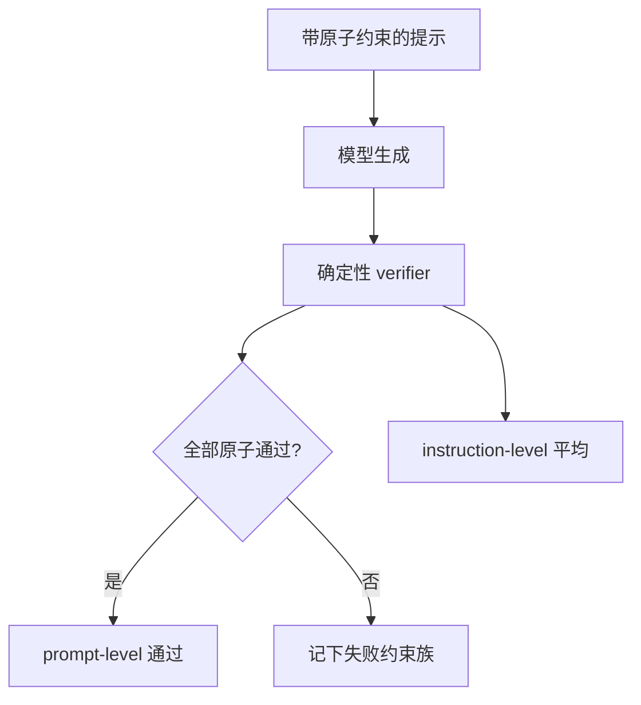

# IFEval 指令遵循

「写得有没有用」很难自动打分；「是否用了第二个词是 XXX 的句子、是否恰好三段、是否禁止出现某个词」可以写成程序，于是指令遵循终于有了一张不太靠主观的卷子。

<footer>—— Zhou et al., Instruction-Following Evaluation for Large Language Models</footer>

指令遵循（instruction following）常被对齐吹成产品核心，评测却长期依赖人工或大模型当裁判：有用、诚实、无害，三维都糊。Zhou 等人的 IFEval 走另一条路——只考**可验证约束**：字数上下限、指定段落数、必须包含或禁止某些关键词、标题格式、JSON、语言、标点、字母大小写等。每条约束对应一个确定性检查函数，对模型输出返回通过与否，不需要参考答案，也不需要对「写得好不好」达成审美共识。本篇把 IFEval 当作格式与约束层的尺子：它测的是模型愿不愿意、能不能把显式指令落实到表面形式上，而不是测知识、推理或偏好。

## 问题

聊天模型的失败有一类极具体：用户说「用不超过 80 字回答、不要用项目符号、最后用中文总结」，模型忽略其中一条或多条，内容可能仍正确。这类失败在 [MMLU](/llm/mmlu) 与 [GSM8K](/llm/math-bench) 上完全看不见，在 Arena 主观对比里也可能被「更有帮助」盖过去——评委常原谅格式，用户的下游解析器不会。需要把「有没有按我说的格式做」从「好不好」里拆出来，才能训练和回归这一层。

可验证性是拆的关键。若指令是「写得幽默一点」，检查函数写不出来，评测又退回主观。IFEval 故意收窄指令空间：只保留能写成 Python 谓词的约束，并组合进同一条提示（一条提示可含多个约束）。收窄的代价是覆盖不到模糊风格；换来的是实验室之间可以对表、可以进 CI。

### 提示里的约束不是聊天模板里的约束

系统提示、开发者策略、以及 IFEval 题面里的用户约束，对模型是不同通道。有的模型极听系统提示、不听用户的「必须用英文」；有的把用户格式当建议，被「作为助手你应该详尽」盖掉。评测必须固定模板与系统提示，否则比的是产品包装。约束解码、JSON mode 会把一部分 IFEval 项变成语法保证，分数上涨反映的是解码器，应分列「纯采样」与「带约束解码」两张表。

IFEval 的通过是表面匹配。模型可以在满足「恰好三个段落」的同时胡编事实，也可以用空洞句子凑字数。高分说明格式通道通了，不说明内容通道可靠。不要用它替代事实性或安全评测。

## 方法

Zhou 等人把每条实例做成「自然语言指令 + 若干原子约束」。评测时对输出 $o$ 跑全部原子检查，得到两种常用聚合：

$$
\mathrm{PromptAcc}=\frac{1}{N}\sum_{i}\mathbf{1}\bigl[\forall c\in C_i:\;c(o_i)\bigr],
\qquad
\mathrm{InstAcc}=\frac{\sum_{i,c\in C_i}\mathbf{1}[c(o_i)]}{\sum_i|C_i|}.
$$

Prompt-level 要求一条提示里所有约束同时满足，更接近用户体验（漏一条就算没遵循）。Instruction-level 按原子约束平均，更细，能看出是字数差还是关键词差。两者都应报；只报后者会掩盖「经常漏一条」的模型。

约束族要分列：长度、关键词、格式（markdown / JSON）、标点与大小写、语言、必须/禁止出现的短语等。长度类对分词器敏感——「不超过 100 词」在英文空格词与中文「词」上定义不同，实现必须与官方检查器一致，不能自己用 `len(tokens)` 另写一套还自称 IFEval。复现的正确姿势是调用原仓库的 verifier，而不是重新发明谓词。

### 组合约束与解码温度

多约束同时出现时，失败通常不是均匀的：模型会抓住「写一篇短文」丢掉「第二段必须以问号结尾」。这暴露的是约束之间的注意力竞争，而不是单一格式不会。评测应保留官方的组合，而不是拆成单约束刷分。温度与 `max_new_tokens` 会改长度类通过率：截断造成的字数不足不应算成模型「不会数数」还是「服务限制」要在协议里写清。贪心对格式类往往更稳，对需要多样性的内容类不是同一工作点；IFEval 默认应锁解码，与 Arena 的采样设定分开。

## 机制

可验证约束成功，要求模型在生成过程中维持一个对输出表面形式的监控：已经写了多少段、是否用过禁用词、下一个 token 会不会破坏 JSON。这可以靠内部状态，也可以靠把约束复述进思维——但 IFEval 并不要求思维链，许多约束在短答案上更易满足。对齐阶段若大量使用「详细、全面」的偏好数据，会与「不超过 20 词」系统性冲突：奖励模型偏爱长而全，IFEval 长度上限就会掉。这不是评分器坏了，是目标函数打架。

### 必须出现易、禁止出现难

关键词必须出现类，依赖的是服从，不是知识：词是给定的，模型只需插入。禁止类更难，因为自然续写会把禁用词带回来，尤其当禁用词与题目主题重叠。格式类（标题层级、markdown）依赖训练里见过的结构密度，也依赖聊天模板会不会自动加列表。语言类（「全程用中文」）会暴露代码切换：专有名词、引文、JSON 键是否算违规，以 verifier 为准。

把 IFEval 当强化学习奖励时，模型会过拟合检查器：用重复空行凑段落、用同形 unicode 绕过禁用词。Verifier 必须与发布协议一致，并抽查对抗绕过。可验证不等于不可博弈。

## 边界与工程取舍

IFEval 不覆盖：条件指令（若用户已登录则……）、多轮修订（「按我说的再短一点」）、冲突指令的优先级、以及工具调用格式之外的任务成功。它也不覆盖「隐含规范」——用户没说要简洁，但产品希望简洁。那些要靠内部规范集或人工。中文产品应补中文约束集：字数、标点、避讳词、公文格式；直接跑英文 IFEval 会低估中文格式问题、高估「会不会英文指令」。

与 [约束解码](/llm/constrained-decoding) 的关系：文法能保证的子集（JSON 语法、枚举）应从 IFEval 里划出，作为系统能力而不是模型能力。剩余的软约束（语气词禁止、段落计数）仍靠模型。混在一张表里，开 JSON mode 的系统会看起来「遵循指令强很多」。

人工评测与 Arena 仍然需要：可验证通过但无用、或略微违一点格式但极有用，产品上如何取舍，IFEval 不回答。它适合做回归门禁与对齐消融，不适合做唯一的助手质量分数。

检查函数的实现细节就是标准。空格、换行、中英文标点、是否算代码块里的词，都会改分。私自「改进」verifier 之后与论文数字对比，没有意义。

## 小结

- IFEval 用确定性检查函数测可验证的表面约束，把指令遵循从主观偏好里拆出来。
- 应同时报 prompt-level（全约束满足）与 instruction-level，并按约束族分列。
- 系统提示、聊天模板、约束解码和截断都会改分，须写入协议；复现应调用官方 verifier。
- 高分不保证内容正确；对齐里「写长」的偏好会与长度上限冲突。
- 可验证奖励可被博弈；中文产品需要中文约束集。
- 它不替代知识、数学、代码或 Arena 偏好评测。
- 出处：Zhou et al., *Instruction-Following Evaluation for Large Language Models*。
