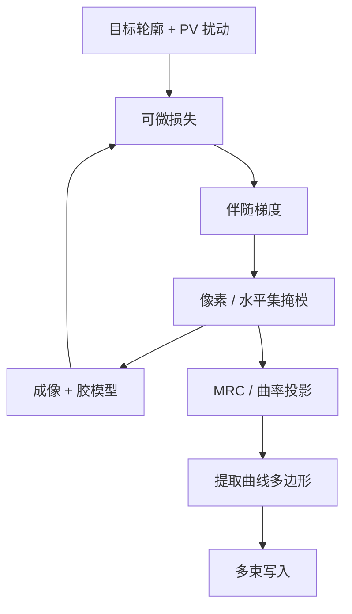

# 逆光刻 ILT 与曲线掩模

若正向成像是已知的，掩模应当由目标晶圆图形反演得到。曼哈顿折线只是写入工具的历史约束，不是光学的本征基。

<footer>—— 对照逆成像思路与 Mack 对掩模频谱、透镜通带的讨论</footer>

模型基 [OPC](/llm/opc) 在多边形边上做局部移动，搜索空间仍是「设计图形的形变」。逆光刻（Inverse Lithography Technology, ILT）把掩模当成像素或水平集，直接对前向模型求逆：给定目标轮廓与工艺窗口，反解透过率图，再把它收成可写的几何。曲线掩模是这条逆的自然输出——透镜通带里有效的形状本来就不是直角。长期卡住的不是算法存在性，而是 [VSB 写掩模](/llm/multibeam-mask-writer) 的炮数与全芯片算力；多束机台与 GPU 把这两道闸松开之后，曲线 ILT 才从热区补丁变成可讨论的量产选项。

## 问题

正向问题：掩模 $M$ 经成像算子 $\mathcal{I}$ 得到晶圆轮廓 $I=\mathcal{I}(M)$。OPC 限制 $M$ 与设计同拓扑、边只能法向挪。热区——紧孔、二维拐角、切层末端——需要的修正往往不在这个流形上：助条该长成自由曲线，主图形该变成光学上更圆的「岛」。继续切碎曼哈顿边，变量数目爆炸，MRC 尖角丛生，而空中像改善有限，因为高频直角会被 NA 滤掉。

逆问题病态：许多掩模对应几乎相同的低通空中像，噪声和模型误差会被放大。必须正则化（平滑、MRC、剂量/焦点鲁棒项），否则解在像素噪声里打转。问题因此是：在可制造约束下求一个稳定的逆，而不是求数学上的精确逆。

### 曼哈顿是写入基，不是成像基

VSB 电子束按矩形炮拼接。OPC 输出直角多边形，是为了让炮数可估、数据量可传。光学却在频率域工作：有效信息在截止频率以内。用大量小矩形逼近一条光滑等高线，是把写入工具的基强加给成像。曲线掩模改用样条或曲边多边形描述同一条等高线，数据量按控制点计，写入时间在多束机上近似与图形复杂度解耦。

「曲线」不是为了好看。目标是让掩模频谱把能量放在透镜能传的模态上，并让工艺窗口带变窄。若曲线化之后 PV-band 没有改善，只是增加了掩模数据体积，那就还不该上。

## 方法

ILT 的计算核是：像素化或水平集表示 $M$，用可微的成像与抗蚀剂模型求轮廓或强度相对目标的损失，反传更新 $M$，再投影到 MRC（最小宽度/间距、曲率、面积）。鲁棒 ILT 在剂量、焦点、掩模误差的若干扰动上同时求损失，避免只在名义点漂亮。输出先是灰度或水平集，再提取曲线轮廓，做掩模厂能接受的分档与简化。

全芯片纯 ILT 的变量数是 OPC 碎片的数量级之上。实践是分层：SMO 定光源；常规 OPC 覆盖大部分；ILT 打在窗口不够的热区，或对关键层做「全芯片曲线但有简化预算」。GPU 把前向与梯度从按周变成按夜，见 [cuLitho](/llm/computational-litho-gpu)；没有这条算力，ILT 只能当研究。

### 从像素到可写曲线

像素解不能直接写。要提取等值线、合并碎片、限制曲率、对齐到电子束网格，并保证相邻曝光场拼接处连续。MRC 对曲线是新语言：不再只是边平行间距，而是曲率半径、颈宽、孔的圆度。掩模检测（AIM、SEM）也要从直角边算法改成曲边计量。ILT 项目失败，常常失败在这条后处理链，而不是优化没收敛。

## 机制

损失对掩模像素的梯度，本质上是伴随成像：把晶圆上的轮廓误差反投到掩模平面。低通特性意味着梯度本身是光滑的，这解释了为什么无约束 ILT 会倾向曲线——梯度下降在通带内走，不会稳定出尖锐直角，除非正则化强行推回曼哈顿。加入曼哈顿约束等于在解上再投影一次，损失通常回升，窗口变差；这正是「曲线有光学收益」的来源。

与 SRAF 的关系：ILT 会自发「长出」助条状结构，因为它们降低损失。不必先跑一套规则助条再 OPC。坏处是助条可能违反 MRC 或在某些工艺角印出来，必须靠鲁棒项和投影把它们按住。EUV 掩模 3D 让梯度还含阴影与多层膜，曲线在不同取向上不该对称，算法若用 DUV 薄掩模伴随，会收敛到错误形状。

ILT 不是「更强的 OPC」这么一句升级。OPC 是在多边形流形上的局部搜索；ILT 换了表示与可行集。把 ILT 当 OPC 的更高迭代次数，会低估数据格式、写入与检测要改的量。

### 热区 ILT 与全芯片 ILT

热区模式把计算和掩模复杂度限制在已知难点，集成风险低，但要有可靠的热区筛选，否则漏网图形在硅上才出现。全芯片曲线追求统一窗口与统一数据路径，却把多束产能、数据准备和检测一起绑死。量产节奏通常是：先热区，再关键层全芯片，再随写入与 GPU 日历扩张。

## 边界与工程取舍

ILT 吃模型误差的方式与 OPC 不同：它会把模型漏洞拟合成奇怪的掩模纹理，看起来损失很低，硅上却是新热区。校准与验证必须用独立的晶圆数据，而不是同一套紧凑模型的自洽。随机胶效应仍不在可微均值模型里，曲线掩模不能替代 [抗蚀剂与剂量](/llm/euv-resist) 的统计工作。

掩模数据量、解密传输、以及知识产权边界（曲线特征难以人工解读，却更难做传统「多边形等价」比对）都是 TAPOUT 合同的一部分。没有多束机，曲线 ILT 会把 VSB 写入时间拉到不可接受；有多束机而无 GPU，全芯片逆也排不进日历。三者要一起成熟。

引用 ILT 收益时写清：相对的是规则 OPC 还是模型 OPC，层别，是否含蚀刻，以及掩模写入是 VSB 还是多束。只报热区 clips 的窗口，不能外推到全芯片产率。

## 小结

- ILT 对前向成像求正则化的逆，表示从多边形边变成像素或水平集。
- 曲线是通带内梯度下降的自然几何；曼哈顿主要是 VSB 写入遗留约束。
- 可制造性取决于 MRC 投影、曲边检测与多束写入，而不只是优化器。
- 全芯片 ILT 受算力与数据路径限制，量产多从热区切入。
- 模型误差会被逆问题放大，必须用独立硅数据验证。
- 与 SMO、OPC、多束、GPU 是同一条链上的不同闸门。
- 出处：逆光刻与曲线掩模公开文献；Mack 成像框架。
