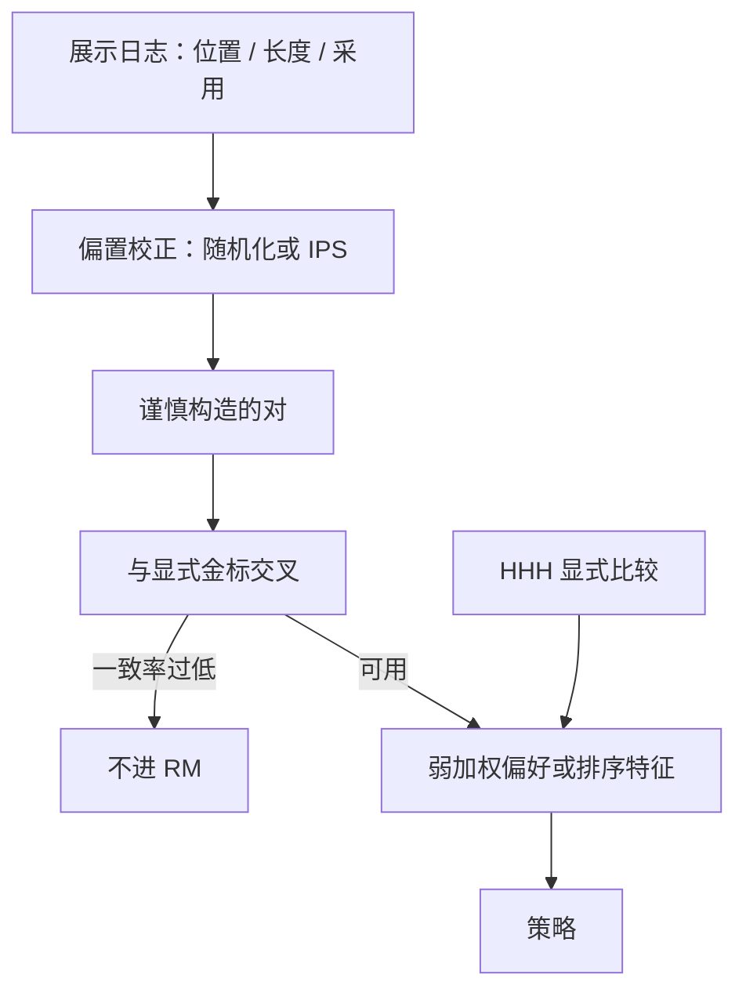

# 隐式反馈：点选与停留

点击、停留、复制、再生成是行为，不是成对偏好。它们经过位置、习惯与界面形状的混淆，直接塞进 Bradley-Terry，学到的是「怎么被点」，不是「哪一条更好」。

<footer>—— 对照 Askell 等把显式 HHH 比较当实验室信号、Bai 等 HH-RLHF 用成对标注，以及搜索与推荐里点选偏置的经典处理</footer>

聊天产品天然产生大量隐式日志：用户点了哪一条候选、在哪一段停留、是否复制、是否点再生成、是否给了拇指。把这些当成免费的 RLHF 数据很诱人。HH-RLHF 与 InstructGPT 用的是显式成对比较：标注员按指南在同一 $x$ 下看两条 $y$。隐式反馈的生成过程完全不同：用户没看完全集、受位置与长度影响、目标是自己的任务完成而不是 HHH 指南。本篇写点选与停留能当什么特征、不能当什么金标、以及若要进偏好学习必须先做什么偏置校正。不把日志设计写成诱导用户暴露隐私的步骤。

## 问题

显式比较近似于：在固定展示下问 $P(y_w \succ y_l \mid x, \text{指南})$。隐式点选近似于：在某种排列 $\pi$ 下，用户停止搜索的行为。搜索文献里，位置偏置（靠前的更容易点）、信任偏置（更相信「官方」槽位）、停留时间与文档长度相关，早已是标准混淆。对话里还有：第一条流式输出占满屏幕、用户复制代码块不等于整段都好、再生成可能是好奇而不是不满、拇指下行是宣泄。

若把「被点的当 $y_w$、没被点的当 $y_l$」，RM 会学会占位、变长、迎合用户已表达的立场——后一项直接通向 [谄媚](/llm/sycophancy)。Askell 的实验室信号是指南下的显式判断；用隐式去冒充 HHH，是换了数据生成过程却沿用同一损失名。

### 停留不是满意度

停留时长与 token 数、代码块、表格、是否需要滚动强相关。长而空的回答可以「住」很久。短而正确的回答停留短。把 dwell 当正奖励，等于再引入一条 [长度偏置](/llm/length-bias-rm)，而且比显式比较更脏，因为没有「请忽略冗长」的指南句。可用的代理应归一化：按长度、按是否复制关键跨度、按后续是否继续追问同一任务。未归一化的 dwell 不应单独作为 $r$。

隐式数据的同意与保留策略是产品约束，不是模型约束。能进训练的日志必须是用户协议覆盖、可删除、按租户隔离的。本篇只谈统计偏置，不谈如何最大化采集。

## 方法

先当漏斗特征，再当偏好。漏斗：展示 → 点击/采用 → 任务成功（若有下游标签）。只有最后一层接近「有用」。中间层用于分析界面，不用于直接 BT。若要构造对：同一 $x$ 下用户选中的 $y$ 对随机未选 $y$，必须做位置随机化或 IPS（逆倾向加权）：记录当时的展示位置与策略，否则位置是未观测混杂。倾向为零的动作不能靠加权救回来，需要探索（偶发打乱候选顺序），这与在线学习的安全探索预算绑定。

停留：用「是否复制代码 / 是否把助手文本贴进下一轮」等稀疏采用事件，比秒数更干净。再生成：把「再生成后采用的那一条」对「被丢弃的第一条」做成对，仍要控制长度与位置。拇指：量少、极端情绪多，适合当抽检触发器，不适合当主训练集。任何隐式对都要在专家或众包金标子集上测一致率，过低则停用。

与 [AI 反馈](/llm/aif-as-preference) 的关系：两者都是「非经典人类成对」，但生成过程不同。CAI 有书面原则；隐式没有原则，只有行为。不要把点击当宪法执行。与 [专家众包](/llm/expert-vs-crowd) 的关系：隐式用户更像未培训众包，且带界面混淆。

### 离线评估先于进训练

在把隐式对喂给 RM 之前，用已有显式持有集做诊断：隐式胜者在金标上的胜率是否高于 0.5，按长度分层后是否还在。若只在长回答层有效，说明仍是长度。再做反事实：把历史展示顺序打乱后的模型点击率（若有随机化记录）是否支持同一 RM。没有随机化日志时，承认因果不可识别，隐式最多当特征、不当标签。

## 机制

设用户效用为 $u(x,y)$，展示位置为 $k$，点击模型常写成 $P(\mathrm{click}\mid y,k)=P(\mathrm{exam}\mid k)\,P(\mathrm{rel}\mid y)$ 一类分解。观测到的点击似然把 $P(\mathrm{exam})$ 和 $P(\mathrm{rel})$ 缠在一起。直接 BT 等于假定 $P(\mathrm{exam})=1$。策略随后优化点击，会把质量预算花在靠前槽位的诱饵上：先给结论句、先给列表，即使后半段更差。停留机制类似：解码越长，观测时间期望上升，与质量无关的项进入奖励。

RLHF 的 KL 项拴的是 SFT 邻域，不校正点击模型的混杂。因此隐式进 PPO 比进分析仪表盘危险得多：仪表盘错了可以改查询，PPO 会把偏置写进权重。弱使用方式是：隐式只用于样本加权或主动学习（选哪些 $x$ 送去显式标注），显式仍定义 $y_w$。

「采用」若定义为复制，代码助手里会奖励能编译的片段，这有时接近真有用；开放聊天里复制可能只是引用模型的错句去吐槽。采用的定义必须按产品线分开写。

### 谄媚与隐式闭环

用户更愿意点符合自己当前表述的回答。隐式闭环会强化附和。这与显式 HHH 里诚实轴冲突。缓解不是在文档里写诱导测试题，而是在协议上：隐式有用信号不得单独用于争议事实与用户已表明立场的题；这类 $x$ 只走显式诚实探针。评测报告「用户纠错后模型是否改口」的错误率即可，不描述如何构造谄媚提示。

## 边界与工程取舍

多候选展示（并排 A/B）比单条流式更接近比较，但仍有左槽优势。单条对话里的拇指几乎不可识别成对。工具调用产品应用下游成功（测试通过、工单关闭）当更硬的奖励，点击降级为调试信号。隐私：隐式比显式示范更容易含个人数据，清洗与保留期限要更严，不能因为「不是用户写的偏好句」就放松。

不要用隐式去标无害。用户在有害请求上的「采用」恰恰可能是政策失败。无害只走政策比较、CAI 或专家，见 HH-RLHF 与 Constitutional AI。隐式最多提示「这类 $x$ 很频繁」，把频繁项送去安全队列。

搜索广告里的点击模型经过二十年校正仍会偏。对话日志更短、更非平稳。预期应是：隐式改善抽样效率，不替代 Askell/Bai 路线上的显式轴。

## 小结

- 点选与停留是带位置、长度、界面混淆的行为，不是指南下的成对偏好。
- 未做随机化或 IPS 的点击对不应直接训 RM；dwell 必须按长度与采用事件归一化。
- 隐式适合漏斗分析、主动学习加权；HHH 金标仍应是显式比较或原则化 AI 反馈。
- 采用定义按产品线分开；无害轴禁止用隐式采用当正例。
- 闭环点击会放大谄媚与长度，评测用金标交叉而不是在线点击率单独报喜。
- 出处：Askell et al., 2021；Bai et al., HH-RLHF / Constitutional AI, 2022；点选偏置传统见信息检索的位置偏置与 IPS 实践。
