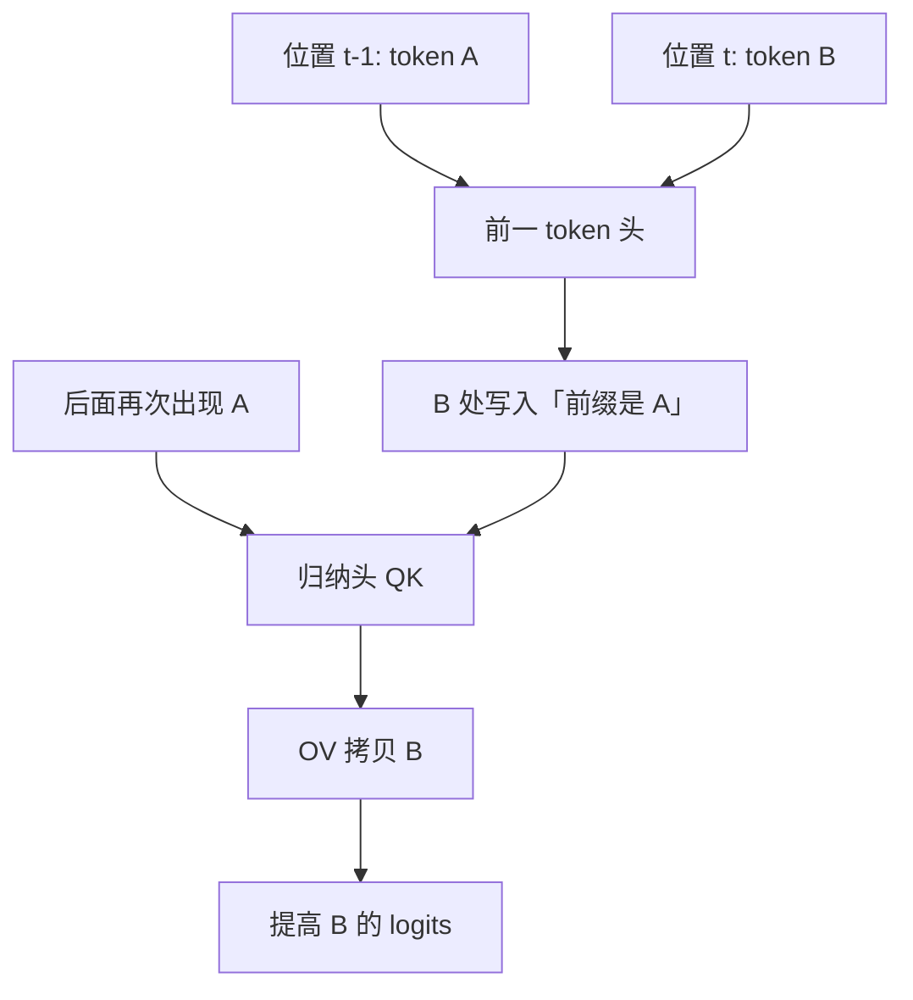

# Induction Heads 归纳头

    
归纳头实现一种简单算法：补全形如 [A][B] … [A] → [B] 的 token 序列。我们给出初步证据，说明它们可能构成大 Transformer 里大部分上下文学习（损失随 token 位置下降）的机制来源。

    <footer>—— Olsson et al., In-context Learning and Induction Heads, Anthropic 2022</footer>

归纳头（induction heads）是一类注意力头，专门做「刚才见过的模式再来一次」：当前 token 是 $A$，就去找上一次 $A$ 后面跟着的 $B$，然后提高 $B$ 的 logits。Olsson、Elhage、Nanda、Olah 等人 2022 年 3 月的 transformer-circuits 长文（arXiv:2209.11895）把这种头从两层注意力模型里的电路，外推成一般 in-context learning 的候选机制。他们给出六条互补证据：小模型上有因果，大模型上主要是相关；归纳头形成的时刻与训练损失上「上下文学习突然变好」的拐点重合。本篇写电路本身、它与 few-shot 的关系，以及假说在带 MLP 的大模型上变弱的那一段。

## 问题

GPT 一类模型不必更新权重就能利用提示里的例子，Brown 等人称之为 in-context learning。行为描述不等于机制。可能的实现有很多：把例子当检索库、把任务向量写进残差、或只是短程 n-gram 统计。需要一种可在权重里指认的算法，它在序列位置变长时降低损失，并且能被因果干预关掉。

最简可检验的算法是精确复制：`[A][B] … [A]` 预测 `B`。若某种头专门做这件事，就可以在注意力图、组成电路和消融上抓住它。再问第二句：这种头是否也做模糊匹配——`A*` 像 $A$、$B*$ 像 $B$ 时仍能补全——从而承担更一般的 few-shot，而不只是抄 token。

### 两层注意力已经够写完最小电路

一层注意力很难同时「知道自己的前一个 token 是谁」和「去远距离找上一次相同 token」。标准故事是两条头分工。前一 token 头（previous-token head）把「我前面是 $A$」写进 $B$ 的位置；归纳头在后一层用当前 $A$ 去匹配那些被写过「前面是 $A$」的位置，于是对齐到上一次的 $B$，再把 $B$ 的值拷过来。Elhage 等人 2021 年的 *A Mathematical Framework for Transformer Circuits* 提供了 QK/OV 分解语言；Olsson 这篇把该语言用在归纳算法上。「头」是注意力的一条输出通道，不是一个神经元。归纳性是对 QK 模式与 OV 拷贝的描述，同一头还可以兼做别的。用平均注意力图上「看起来像归纳」来点名，必须补一条因果：敲掉它，`[A][B]…[A]→[B]` 是否变差。

## 方法

在两层、仅注意力的模型里，可以画完电路并做激活修补：把归纳头的输出换成对照运行的输出，精确复制任务应崩溃。证据清单还包括：归纳头在训练中突然出现，与上下文学习能力的相变同一窗口；在更大模型里，具有归纳注意模式的头与 in-context 损失相关；扰动这些头伤害的是依赖上下文的那部分损失，而不是零样本的静态知识；把序列打乱使归纳线索失效时，相关头的贡献下降。大模型带 MLP，无法像两层模型那样做完备的电路证明，作者明确把那部分标成相关证据。

$$
\text{当前 }A\ \xrightarrow{\text{QK 匹配「曾以 }A\text{ 为前缀」的位置}}\ \text{取其 OV 中的 }B
$$

模糊版把 $A$ 换成近邻 $A^*$，匹配发生在某种相似性空间而不是 token 相等。这是从精确复制走向 few-shot 类比的跳板，也是大模型假说里最难严格验证的一步。

### 六条证据不是六次重复

时间重合、小模型因果、大模型相关、扰动、模式补全、以及与框架级电路分析的一致性，各自排除一种替代解释。例如「只是头变强了」解释不了为什么拐点与归纳模式同时出现；「只是注意力变尖」解释不了 OV 必须拷贝后继 token。读者应把清单当联合论证，而不是只引用注意力可视化那一张图。可视化既不能区分拷贝与匹配，也看不到 [叠加](/llm/superposition-hypothesis) 下方向的混合。

## 机制

### QK 匹配与 OV 拷贝缺一不可

QK 电路负责「去哪看」：归纳头的查询来自当前 $A$，键来自被前一 token 头标记过的位置。OV 电路负责「看完写什么」：值应接近 $B$ 的嵌入或残差，才能在解嵌处抬高 $B$。两条缺一不可。只有 QK 像归纳、OV 在写别的东西，则只是检索头；只有 OV 能拷贝、QK 乱看，则是盲目复制。完整归纳头是匹配加拷贝。

与 in-context learning 的桥梁是：few-shot 例子可看成许多 `[输入模式][输出模式]` 对。若归纳电路能在相似性空间里匹配模式，而不是只匹配表面 token，它就能把「上一个例子的输出格式」拷到当前题。这解释了为什么 ICL 随上下文长度变好——更多先前出现的 `[A][B]` 可供匹配——也解释了为什么打乱例子顺序或破坏间隔会伤成绩。它不自动解释需要多步推理的 ICL；那些可能要 MLP 与更深电路。

训练损失里随位置下降的那一部分，论文当作 ICL 的操作定义。这比「会做 few-shot 分类」更宽：包含简单的重复抄写。因此「归纳头解释大部分 ICL」中的 ICL 是这个宽定义。若把 ICL 理解成只含指令归纳与抽象类比，证据强度应下调到「必要组件，未必充分」。

## 边界与工程取舍

小模型因果强、大模型相关弱，这是作者自己的分层。MLP、多层残差、[叠加](/llm/superposition-hypothesis) 都会让「一个头 = 一个算法」失效：归纳计算可能散在若干头与 MLP 特征上。后来的工作指出功能向量、任务向量与归纳头相互作用，归纳头不是 ICL 的全部。敲掉所有看起来像归纳的头，模型仍会保留部分上下文敏感行为。

工程上，归纳头依赖 KV 里真的存着上一次 $A$ 与 $B$。超长上下文、稀疏注意力、KV 压缩若丢掉「上一次出现」的键，复制电路会静默失败。这与 [百万 token 成本](/llm/cost-per-mtok) 无关，却与缓存驱逐有关：被丢掉的不是任意 token，可能是归纳匹配所需要的那一次出现。解释行为退化时，应先查是否还留着可匹配的前缀，再查权重是否坏了。

不要把注意力图上的「对角线 + 平移」图案一律命名为归纳头。许多头会看最近 token，图案相似、算法不同。命名应绑定：是否完成 `[A][B]…[A]→[B]`、消融是否选择性地破坏该任务、以及是否与训练拐点同期出现。图案是筛子，不是定义。

## 小结

- 归纳头用 QK 找到「上一次当前 token 出现之处的后继」，用 OV 把该后继拷到现在。
- 最小实现常需前一 token 头与归纳头两层配合。
- Olsson 等人用六条证据论证：它们可能是宽定义下大部分 in-context learning 的机制来源。
- 两层注意力模型上有因果；带 MLP 的大模型上以相关为主，假说强度下降。
- 模糊匹配把精确复制接到 few-shot 类比，但仍不是多步推理的充分机制。
- 出处：Olsson et al., *In-context Learning and Induction Heads*, Anthropic, 2022, arXiv:2209.11895；电路语言见 Elhage et al., *A Mathematical Framework for Transformer Circuits*, 2021。
