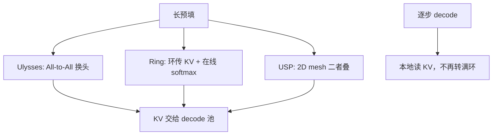

# Context Parallel 推理

DeepSpeed-Ulysses 沿序列切开输入，在注意力前用 All-to-All 把头维与序列维对换；Ring Attention 则在设备环上传递 KV 块，与分块注意力重叠。

<footer>—— Jacobs et al.，DeepSpeed-Ulysses，arXiv:2309.14509；Liu、Zaharia、Abbeel，Ring Attention，arXiv:2310.01889</footer>

上下文并行（context parallel, CP）让每张卡只持有一段连续 token，用集体通信补齐注意力的全局依赖。它和 Megatron 序列并行同切 $s$，但切进了注意力内部：没有通信，查询看不见其他卡上的键。训练里这条轴已经成熟——Ulysses 的序列–头 All-to-All、Ring Attention 的环形 KV、Fang 与 Zhao 的 USP 把二者织成 2D mesh。推理要单独写，因为预填和 decode 的 $n_q$ 差两个数量级。长提示的预填，$n_q=n_k=s$，CP 能把单卡放不下的 $s$ 摊开；逐步生成 $n_q=1$、$n_k=s$，再走一圈 $C$ 步 P2P 会把 TPOT 打死。本篇写推理工作点上怎么选 Ulysses、Ring 或干脆不用 CP。

## 问题

单卡 HBM 装不下预填的 $Q,K,V$ 工作区，或 FlashAttention 的分块仍因 $s$ 太大而 OOM。权重已经 TP/EP 切过，KV 也量化了，剩下的墙是 **这一次前向的序列维**。重计算帮不上预填的 TTFT。必须让每卡只存 $s/C$ 的激活，并在注意力里把缺失的 KV 补回来。

补法两类。Ulysses：All-to-All 把 $(s/C,\,h)$ 换成 $(s,\,h/C)$，本地跑满长度注意力（可复用 FlashAttention），再 All-to-All 换回。Ring：每卡固定本地 $Q$ 块，KV 块在环上转 $C-1$ 步，每步做分块 SDPA，用在线 softmax 累加，算术上等价于全局注意力。USP（arXiv:2405.07719）指出：Ulysses 的 $C$ 不能超过头数（GQA 下更严），Ring 把大 GEMM 切碎会伤占用率，于是用 2D mesh 一行 Ulysses、一列 Ring。

### Decode 逐步几乎不应走满环

生成一步，$Q$ 只有一行。Ulysses 仍要把这一行和全部头做 All-to-All，对端数 $C$ 大时延迟是纯税。Ring 仍要转一圈才能让这一行见过全部 KV 块——若 KV 已经按序列分片存在各卡，每步 P2P 的直径是 $C$。服务期更常见的做法是：预填用 CP 把长提示算完，把 **完整或分页的 KV** 收集到 decode 卡上（或 PD 分离后的 decode 池），decode 不再开 CP。Liu 等人论文声明 Ring 也适用于 inference，指的是「序列长度随设备数线性涨」的离线 / 长生成实验设定，不是高 QPS 的在线 TPOT。

CP 不降低 $O(s^2 d)$ 的注意力 FLOPs，只是每卡算 $O(s^2 d/C)$。要降 FLOPs 只能改算法（窗、稀疏、线性）。推理规划里把 CP 写成「更快的注意力」是错的；正确写法是「单卡内存够不够放下这次预填」。

## 方法

**预填 Ulysses**：设备沿序列切 $C$ 份。投影可在分片上做完，注意力前 All-to-All 换头。本地核看见满 $s$、较少头，GQA 时 KV 头 $h_{\mathrm{kv}}$ 必须 $\ge C$ 或先复制 KV 头。两次 All-to-All 体积与 $b s d$ 同阶。优点是注意力实现几乎不用改；缺点是 $C$ 受头数限制，跨节点 All-to-All 的对端多。

**预填 Ring / Megatron CP**：不换头。本地 $Q$ 与当前 KV 块做 Flash 式分块注意力，同时把 KV 发给环上下一家。在线 softmax 维护 $(m,\ell,O)$。因果掩码按 **全局下标**：卡上局部 0 可能对应全局 $s/C$ 起。实现漏掉跨块 max 传播，会出现一段注意力被单块主导。通信是邻居 P2P，易与计算重叠；$C$ 可以大于头数。

**USP 式 2D**：节点内用 Ulysses 吃 NVLink 的 All-to-All，节点间用 Ring 吃 IB 的 P2P。推理预填跨机时，这比单一 $C=64$ 的大环更常见。Fang 与 Zhao 在两台 8×A800 上用 SP 把 Llama-3-8B 训到 208K，报过约 47% MFU——那是训练数字，推理预填只能借拓扑，不能借 MFU。

### KV 布局是预填与 decode 的合同

CP 预填结束时，KV 可能仍按序列分片躺在 $C$ 张卡上。Decode 若继续该布局，每步都要远程读 KV。两种收口：All-Gather 成每张 decode 卡一份（内存换延迟）；或保持分片，decode 用一次针对 $n_q=1$ 的窄通信（类似一次短 Ring）。在线服务几乎总选前者或 PD 分离后的专用 KV 传输，因为 TPOT 比再省一份 KV 副本更贵。分页 KV 还要在 gather 时按块表对齐，不能假设连续 $s/C$。

因果与滑动窗在切分下必须用全局下标。RoPE 的 $\theta$ 同样。块间漏传表现为「某段距离的依赖消失」，损失未必 NaN，要用定点距离的复制探针回归。

## 机制

Ulysses 的通信体积在「$s$ 与 $C$ 同比增加」时保持每卡常数——这是 Jacobs 等人相对「随 $s$ 涨的序列并行」的理论卖点。推理预填若 $s$ 涨而 GPU 数不涨，$C$ 不变，体积仍随 $s$ 线性涨，常数通信那条定理用不上。Ring 每步 P2P 体积 $\propto b(s/C)d$，总流量 $\propto bsd$，与 All-to-All 同阶，但延迟结构是 $C$ 跳邻居，而不是一次 $C$ 对端的集合。

在线 softmax 的结合律使分块与精确归一化相容：两段键的 $(m,\ell,O)$ 可合成全局量。这与 FlashAttention 单卡分块是同一代数；Ring 只是把块放到不同卡。浮点顺序不同，末位有差，目标是同类误差，不是 bitwise 复现。

GQA / MQA 让 Ulysses 先碰壁：$h_{\mathrm{kv}}<C$ 时无法按 KV 头切开。Ring 与 USP 的 Ring 维不受此限。推理模型普遍 GQA，纯 Ulysses 的 $C$ 往往只能取 2、4、8，超长 $s$ 仍要靠 Ring 维。

### 和 Megatron SP、和 EP 的边界

SP 在注意力外切 Norm 激活，CP 在注意力内补 KV。二者可叠：节点内 TP+SP，跨节点 CP。通信域必须分开记账。EP 切的是专家，不是 $s$；长预填的 MoE 仍要在 CP 分片后的 token 上做 dispatch。通常先在分片上路由，dispatch 的 token 集合是「本卡这段序列」，专家计算不需要看见其他段的 $x$，但负载统计的 $T$ 是全局的，EPLB 要用全局直方图。

Decode 侧若坚持 CP，只适合离线长生成、batch=1、可接受与 $C$ 成正比的逐步延迟。这与 V3 在线解码的 EP320 路线相反：后者把 KV 放在 decode 池本地（MLA 压缩后），不靠环传 KV。

## 边界与工程取舍

短提示不要开 CP。All-to-All 或环的启动开销会高过省下的内存。阈值取决于 $s$、$d$、节点内还是跨节点，应用一次 OOM / 非 OOM 的扫描，而不是抄训练 208K 的配置。

不要用训练 MFU 或「百万 token 上下文」的论文句子当在线 SLA。Liu 等人消除的是单设备内存上限；Jacobs 等人消除的是随长度涨的通信阶。在线系统还要 TTFT、TPOT、并发。CP 预填加速 TTFT 的条件是：单卡本来算不下或算得很碎，摊开之后占用率上升；若单卡已经能 Flash 满 $s$，加 CP 只会加通信。

文档位置、ALiBi、滑动窗都要按全局下标测试。USP 的 2D mesh 画错会让 All-to-All 走 IB、Ring 走 NVLink，两条路径都走最慢的那种。拓扑是一等公民。

出处：Jacobs et al.，*DeepSpeed Ulysses*，arXiv:2309.14509；Liu, Zaharia, Abbeel，*Ring Attention*，arXiv:2310.01889；Fang & Zhao，*USP*，arXiv:2405.07719。Megatron `context_parallel_size` 是环形族的工程实现，细节以框架为准。Korthikanti 的 SP 见序列并行推理专文。

检查点与投机解码：CP 预填的 KV 收集必须在草稿模型与验证模型之间对齐分片，否则投机的接受率测量会掺进布局 bug。多模态长图文把「序列」换成视觉 token 时，切分点不要落在一张图的中间块而不改掩码。

## 小结

- 推理 CP 主要用于长预填：每卡一段 $s$，用 Ulysses 换头或 Ring 传 KV 补全局注意力。
- Decode 逐步 $n_q=1$ 时满环 / 满 All-to-All 通常不值得；应把 KV 收拢到 decode 池。
- Ulysses 受头数（尤其 GQA）限制；Ring 的 $C$ 可更大，但占用率与直径是代价。
- FLOPs 仍二次；CP 买的是单卡内存与可扩展的 $s$，不是更低复杂度。
- 因果、RoPE、在线 softmax 必须按全局块正确实现，否则长程依赖静默消失。
- 出处：Jacobs et al.，arXiv:2309.14509；Liu et al.，arXiv:2310.01889；Fang & Zhao，arXiv:2405.07719。
