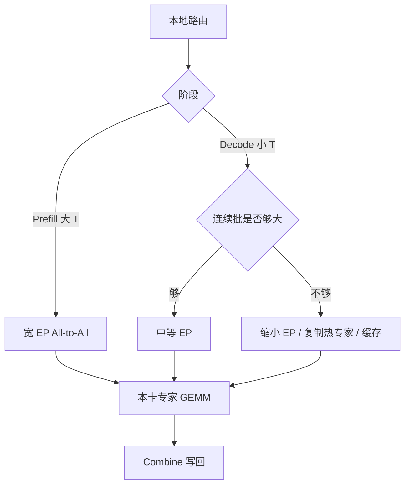

# 专家并行推理

    
训练期大 batch 让 All-to-All 的 payload 盖住启动开销；decode 一步几个 token 时，同样的专家置换会变成延迟墙，推理拓扑不能照抄预训练网格。

    <footer>—— 对照 GShard / Switch 的专家并行语义，以及 DeepSeek-V2/V3 开源栈在推理期宽 EP、窄 TP 的部署约束</footer>

[专家并行](/llm/expert-parallelism) 的语义在推理里同样没变：专家沿设备切开，token 两次 All-to-All 找专家再回家。变的是 batch 与是否必须全体专家常驻。预训练微批大、路由分散，EP 是放下数百专家的正道。服务 decode 每步每请求一个 token，连续批不够时 All-to-All 的启动延迟高于 GEMM；Mixtral 8 专家常常整份复制或走 TP，因为 $N=8$ 放得下。DeepSeek-V3 一类 256 路由专家放不进单卡，又要避免 MLA 在 TP 维上复制潜投影，开源栈才走向「注意力复制、专家 EP、TP 常取 1」。本篇写推理期 EP 的通信、与 [专家缓存](/llm/moe-inference-cache) 的分界，以及 prefill/decode 两套 batch 画像。

## 问题

MoE 推理的显存主角是专家权重，不是 37B 激活。全部复制到每张生成卡，671B 级放不进节点；全部走训练式大 EP，decode 小 batch 的 All-to-All 时延可能高过稀疏 GEMM 省下的时间。第三条路是单机 [专家缓存](/llm/moe-inference-cache)：热专家留 HBM，冷的从主机搬——那是权重移动，不是 token 置换。EP 推理指的仍是「专家住在固定卡上、token 去找它们」。问题是何时 EP、EP 组跨多宽、如何避免 decode 被集合通信打死。

Prefill 一次吃整段提示，token 多、路由发散，All-to-All payload 大，计算通信比接近训练，EP 很划算。Decode 路由往往更粘滞，payload 小，启动开销突出。PD 分离之后，两阶段可以选不同 EP 度：P 侧为吞吐上大 EP，D 侧为延迟上小 EP 或复制热专家。Colocate 则被迫共用。

### All-to-All 在 decode 上的税

每卡通信量仍近似 $2\cdot k\cdot (T/E)\cdot d\cdot s$ 字节量级，$T$ 是本步全局 token 数。Decode 时 $T$ 等于连续批大小（再乘 $k$ 路专家）。$T$ 小，$E$ 大，每对端只发几个向量，NCCL 走延迟区。负载不均让热专家卡既算得多又收得多，iteration 时间由它决定。训练可以用更大 microbatch 把直方图摊平；推理加 batch 会撞 KV 显存，而且不同请求的专家并集会变大，缓存局部性变差。

All-to-All 没有求和语义。实现误用 All-Reduce 会把不同 token 搅在一起。推理图里还要处理 padding 槽：容量因子留下的空 token 若进入通信，等于为空气付延迟。Decode 更应该在分发前丢掉空槽。

## 方法

常见推理拓扑：DP（或复制）打在注意力与共享专家上，EP 打在路由专家上，TP=1 或很小。路由在本地完成，dispatch / combine 两次 All-to-All，本卡跑 grouped GEMM。设备限制路由（V3 训练里每 token 最多到 4 节点）在推理是否保留，影响跨节点跳数：关掉会改善延迟、但与训练分布不一致，质量要重测。共享专家不上 EP，每张注意力卡常驻。

### Prefill 宽 EP，decode 先填 batch

Prefill 实例按专家数与节点拓扑取较大 $E$，让每卡专家份数 $N/E$ 适合 grouped GEMM。Decode 实例先用连续批把 $T$ 抬到 All-to-All 进入带宽区，再选 $E$；抬不上去就减小 $E$（每卡更多专家、更少对端），或对热专家复制、对冷专家缓存。DeepSeek 服务叙述里 MTP 头、MLA 吸收、EP 缓冲要同时进显存账；只报「37B 所以 EP 随便开」会漏掉 dispatch 缓冲区。

### 与 MLA、PD 分离叠加

MLA 吸收后 KV 小，注意力侧复制多份的成本低于把潜投影按 TP 切开再复制。EP 组跨节点时，decode 的 KV 按注意力副本分片，有效缓存容量随 DP 份数涨。PD 分离：prefill 池 EP 可以跨更多节点换吞吐；decode 池 EP 应尽量落在 NVLink 域，因为步延迟预算是 TPOT。KV 从 P 传到 D 时，D 侧的专家布局不必与 P 相同——KV 在注意力，不在专家——但路由偏置 $b_i$ 必须随权重加载，否则 decode 负载与训练不一致。

## 机制

推理 EP 仍是置换：计算密度来自「每 token 只激活 $k$ 个专家」，通信密度来自「这 $k$ 个可能不在本卡」。当 $T$ 大，GEMM 盖通信，稀疏优势可见；当 $T$ 小，通信盖 GEMM，稀疏优势只留在显存（每卡不必存全部专家）。这与稠密 [推理 TP](/llm/infer-tp) 相反：TP 的 All-Reduce 在 decode 是固定次数的同步，EP 的 All-to-All 对端数随 $E$ 涨。细粒度小专家更依赖 batched GEMM 把同卡多专家打成一次核，否则算力密度比通信更差。

专家缓存与 EP 可以分层：跨节点 EP 放下「这一组卡负责的专家全集」，组内再对极冷专家 offload。两者移动的对象不同，日志要分开：NCCL 耗时对 EP，PCIe 耗时对缓存。命中率故事见专家缓存专文；本篇只强调：EP 不能靠缓存消除 All-to-All，只能靠 batch 或缩小 $E$ 减轻它。

V3 的无辅助损失偏置是模型状态。推理 EP 若丢 $b_i$，热专家会与训练末期不同，All-to-All 直方图也会变。延迟回归时先查偏置是否加载，再查 NCCL。

### 质量与性能的同一条路由

关掉设备限制、改 $k$、改容量因子，都会同时改延迟与输出。推理优化若只在通信层丢 token 或乱序 combine，数值就错了。正确的优化是：预分配接收缓冲、把空槽移出 NCCL、通信与 GEMM 重叠、按节点限制的同一套路由。DeepSeek 开源栈缺 grouped GEMM 或偏置时，延迟与质量都不可比报告。

## 边界与工程取舍

$N$ 小到单机常驻，不要为了「有 EP」而 EP。$N$ 大到必须切，decode 的第一约束是连续批与 TPOT，不是把训练 $E$ 抄过来。EP 组跨太多 InfiniBand 跳数时，decode 可能不如单机缓存。量化专家减体积，等效提高每卡可驻专家数，从而允许更小的 $E$。

不要把 EP 写成 TP。TP 切同一矩阵宽，通信是 All-Reduce；EP 切不同专家，通信是 token 置换。配置项 `tp_size` 与 `ep_size` 必须分开。不要给「推理 EP」伪造独立论文编号：语义来自 GShard / Switch，规模与设备限制来自 DeepSeek-V2/V3 技术报告（arXiv:2405.04434，2412.19437），服务侧约束见开源栈说明。PD 分离文献（DistServe、Splitwise）不规定 MoE 的 $E$，但规定了 P/D 可以不同并行度——MoE 上这恰好是 EP 该用的自由度。

测 EP 加速比要分 prefill tokens/s 与 decode tokens/s。用端到端混合流量会把「prefill 很赚、decode 在亏」平均成一个假的 1.x。

## 小结

- 推理 EP 仍是两次 All-to-All 加本地专家 GEMM；decode 小 batch 时启动延迟会吃掉稀疏优势。
- Prefill 适合宽 EP；decode 先抬连续批，否则缩小 $E$、复制热专家或走缓存。
- DeepSeek 类 MLA+MoE 常见注意力复制、宽 EP、窄 TP；路由偏置与设备限制属于模型状态。
- 专家缓存移动权重，EP 移动激活，日志与 NCCL 组都要分开。
- $N$ 小就不要 EP；$N$ 大也不要照抄训练网格。
- 出处：Lepikhin et al. GShard；Fedus et al. Switch Transformers；DeepSeek-V2/V3 技术报告与开源部署说明。PD 两阶段不同并行度见 Zhong et al. DistServe。
