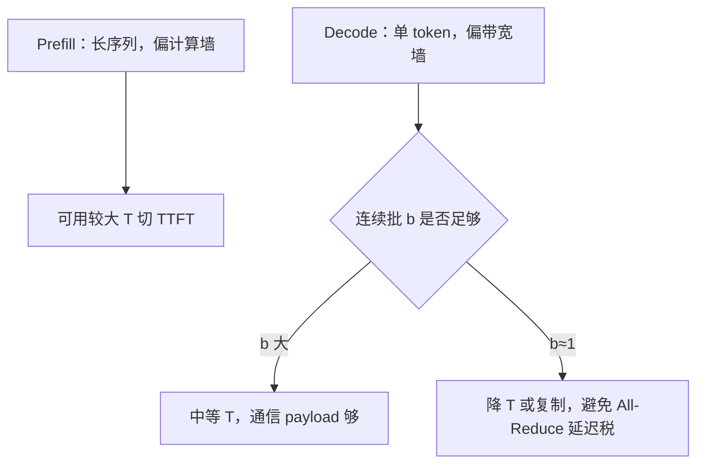

# 推理张量并行

    
训练期大微批让层内 All-Reduce 算得过；decode 一步一个 token 时，同一条 All-Reduce 变成延迟税，张量并行度不能从预训练配置原样抄来。

    <footer>—— 对照 Shoeybi 等 Megatron-LM 的切法，以及 DistServe 对 intra-op 并行与 TTFT/TPOT 的讨论</footer>

[张量并行](/llm/tensor-parallel) 的数学在推理里没有变：列并行接行并行，注意力按头切，用 All-Reduce 还原完整乘。变的是 roofline。Prefill 一次吃完提示，序列长、算力密，接近训练前向；decode 每步 batch 里每个请求只多一个 query token，算术强度掉到带宽墙，层内集合通信的**启动延迟**从可重叠的背景噪声变成步时间的主角。Zhong 等人的 DistServe 把 intra-operator 并行（即这里的 TP）写成：能缩短执行时间，尤其对 prefill 的 TTFT 有用，但要求 NVLink 一类高带宽，并且和 decode 的 batch、SLO 绑在一起。本篇只谈推理期怎么选 $T$，不重写 Megatron 的行列配对公式。

## 问题

单卡放不下权重时，推理也必须切模型。候选有三条：复制（数据并行实例）、[流水线](/llm/infer-pp)、张量并行。复制要求每卡一份完整权重；PP 在 decode 上气泡大；TP 能把一层矩阵切开、用通信换更短的单层计算。训练集群上 $T=8$ 很常见，因为微批大、计算盖得住 All-Reduce。服务上若把同一 $T$ 打到 decode 实例，每步两次（注意力输出、MLP 输出）跨卡同步，payload 只有 $b\times 1\times d$，带宽用不满，延迟按同步次数线性加。

GQA / [MLA](/llm/mla) 还改了「按头切」的账。KV 头少于 $T$ 时，要么无法整除，要么复制 KV 分片，TP 省下的 KV 内存被复制吃回。MLA 的潜向量若在 TP 组内每卡各持一份完整吸收投影，DeepSeek 服务侧会明确建议窄 TP、宽专家并行。问题是：prefill 与 decode 是否必须同一 $T$。

### Prefill 与 decode 的 intra-op 动机不同

DistServe 指出：提示不算太短时，prefill 接近 compute-bound，intra-op 能把 TTFT 的执行段切短，SLO 越紧越值得加 $T$。Decode 在小 batch 时是带宽墙，加 $T$ 减少的是每卡要读的权重，这有利于步延迟，但 All-Reduce 次数不变（每层仍要同步）。$T$ 增大，每卡 GEMM 更窄，更难喂饱 Tensor Core，通信占比上升。于是同一模型在 PD 分离之后，prefill 池可以用较大 $T$ 换 TTFT，decode 池用较小 $T$ 甚至 $T=1$ 加复制，换 TPOT 与更简单的通信域。

「执行时间」不是端到端延迟。DistServe 强调延迟还包括排队。TP 缩短单次 prefill 执行，若因此能用更少卡达到 TTFT SLO，排队也会变；若盲目加 $T$ 导致实例数变少，排队可能反而变长。选 $T$ 要和复制数一起搜，不能单独调。

## 方法

推理 TP 仍落在 NVLink 域：节点内 2/4/8 卡一组。嵌入与 LM 头可按词表切。Decode 开启 CUDA Graph 时，All-Reduce 必须能进图，或整段 TP 通信用可捕获的内核；否则图捕获失败，步延迟回退。连续批处理把多个请求的单 token 拼成 $b>1$ 的 decode batch，All-Reduce 的 payload 变成 $b\times d$，延迟占比下降——这是「decode 也能用较大 $T$」的主要条件。Batch 上不去时（显存被 KV 占满、或流量低），应降 $T$、换复制。

### 与 GQA、MLA、投机解码叠在一起

GQA：KV 头数须能被 $T$ 整除，否则 padding 或复制。MLA：潜在 KV 的切分不能假设「一头一卡」；开源栈常见注意力复制、专家走 EP，$T=1$。投机解码的验证步一次吃进树节点，序列宽度 $>1$，瞬时更像一小段 prefill，TP 的计算通信比暂时变好；不能据此把 decode 稳态的 $T$ 调到验证步的最优。验证步与普通 decode 步若共用同一并行度，应按稳态 TPOT 选，让验证步偶尔偏贵。

### DistServe 里与 inter-op 的分工

Intra-op 减执行时间、要高带宽；inter-op（流水线）几乎线性加吞吐、少减单请求执行时间。Prefill 在紧 TTFT 下偏向 intra-op；decode 在要拉大 batch、SLO 不太杀 TPOT 时偏向复制或流水线扩吞吐。PD 分离之后两阶段可以选不同组合：这是 colocated 服务做不到的——colocate 时同一组卡必须同时伺候两种 roofline。带宽不够跨节点时，TP 组绝不能跨机；那是训练里已经成立、推理里更成立的约束，因为 decode 更怕延迟。

## 机制

一次 decode 步的时间粗分为：读权重、本地 GEMM、All-Reduce、写 KV。$T$ 把前两项摊到多卡，第三项加上 $(T-1)$ 相关的同步。当 GEMM 时间 $\gg$ 同步时间，$T$ 有益；当 GEMM 已经只剩几十微秒，同步一次可能同量级甚至更大。Prefill 的 GEMM 按 $s$ 放大，同步按激活体积 $b s d$ 放大，但算术强度高，重叠更好。这就是「同一 $T$、两段寿命」的机制。

数值上 All-Reduce 求和顺序使不同 $T$ 的 logits 非比特一致。服务一般不要求跨并行度比特复现，但 A/B 评测应固定 $T$。投机解码的拒绝采样对 logits 差敏感，TP 度改变若伴随非确定性通信，接受率会漂一截，调试时要先锁并行度再谈 [接受率](/llm/spec-acceptance-rate)。

推理 TP 不减小每个请求看见的序列长度。它减小每卡隐藏宽与每卡权重。有人说「TP 之后上下文可以更长」——那是省下的权重显存让给了 KV；序列维没有被 TP 切开。切序列是上下文并行，另一条轴。

### 显存与 KV

权重显存约 $\Phi/T$。KV 在按头切的实现里也可除以 $T$，这是长上下文 decode 用 TP 的第二个理由。MLA 吸收后 KV 已经小，再 TP 切注意力收益变薄，还可能复制潜投影。规划时应写清：这次 TP 是为了放权重、为了切 KV，还是为了切 TTFT。三个目标对应三个最优 $T$，很少重合。

## 边界与工程取舍

小模型 $T=8$ 几乎总是通信亏。70B 级在 2×80GB 上 $T=2$ 常是放得下与同步可接受的折中。PD 分离后不要强制 P 实例与 D 实例同构：DistServe 的搜索空间就是让它们的 GPU 数与并行策略分开。Chunked-prefill 与 piggyback 是 colocate 下缓和干扰的办法，不是 TP 的替代；分离之后 chunked-prefill 的动机变弱，但 TP 仍在。

不要把训练的 sequence parallel 打开当推理默认：推理 decode 序列维是 1，切序列没有对象。也不要把专家并行的 All-to-All 算进 TP 的 All-Reduce 预算。NCCL 组必须分开。引用 Megatron 证明切法正确；引用 DistServe（arXiv:2401.09670）证明 prefill/decode 对 intra-op 的偏好不同。不要给「推理专用 TP 算法」伪造一篇不存在的 arXiv。

测 TP 加速比时用单步 decode 时间，不要用含 prefill 的端到端。TTFT 改善、TPOT 恶化是典型错配：说明 $T$ 是按 prefill 选的，却打在了 decode 实例上。

## 小结

- 推理 TP 切法与训练相同，但 decode 小 batch 时 All-Reduce 延迟主导，不能照抄预训练 $T$。
- Prefill 偏计算墙，紧 TTFT 可加大 intra-op；decode 要看连续批大小，batch 不够就降 $T$ 或复制。
- PD 分离允许两阶段使用不同 $T$；colocate 则被迫共用。
- GQA/MLA 改变按头切与 KV 收益；投机验证步不能单独决定稳态 $T$。
- 权重、KV、TTFT 三个目标对应不同最优并行度。
- 出处：Shoeybi 等 Megatron-LM；Zhong et al., *DistServe*，OSDI 2024，arXiv:2401.09670。
