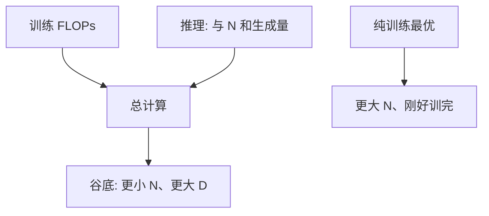

# 推理算力最优

Chinchilla 的谷底最小化训练 FLOPs 上的损失；若部署要服务大量生成 token，过度训练一个较小的模型，往往比训练计算最优的大模型更便宜。

<footer>—— Hoffmann et al., 2022 已区分训练最优与部署；Sardana 等, Beyond Chinchilla-Optimal: Accounting for Inference, 2024</footer>

[上一课](/llm/emergence-debate)把「必须更大才有能力」降级为需检验的叙事。缺口是账本：主干 [Chinchilla](/llm/chinchilla) 的谷底是 **训练** $C_{\mathrm{train}}\approx 6ND$ 上最小化损失。一旦推理 token 数 $T_{\mathrm{inf}}$ 很大，总成本含 $C_{\mathrm{inf}}\propto N T_{\mathrm{inf}}$（每生成 token 与参数量近线性）。Sardana 等人把推理写进目标，谷底移向更小 $N$、更大 $D$（过度训练）。本课写这本账，不重拟合 $\alpha$。

## 问题

训练最优：给定 $C_{\mathrm{train}}$，选 $N,D$ 使损失最低，大约 $D\propto N$。部署最优：给定训练预算**加上**预期生成量，最小化损失或在固定损失下最小化总 FLOPs。大模型每 token 推理更贵。若你预期服务 $10^{12}$ 生成 token，把预算从「再加宽 2×」挪到「同宽多训 4×」可能更优：训练更贵一点，推理便宜很多。Hoffmann 已经警告不要把训练最优当部署最优；Sardana 等人给出显式曲线。

这与涌现叙事冲突的点在于：产品若真需要某能力，应先看较小但过度训练的模型在连续度量上是否已够，而不是先跳到训练最优的更大 $N$。

推理成本还含 KV 缓存与批大小，不完全是 $N$。本课用 $N$ 当一阶代理；服务课里的 paged attention 会改常数，不改「更小更久 vs 更大刚好训完」的方向。

## 方法

估计：

1. 训练 FLOPs $C_{\mathrm{train}}(N,D)$。
2. 预期生成 token $T_{\mathrm{inf}}$（含失败重试与内部思维链）。
3. $C_{\mathrm{inf}}\approx \kappa N T_{\mathrm{inf}}$，$\kappa$ 含解码系数（小于训练的 6，因无反向，且解码阶段按生成长度计）。
4. 在若干 $(N,D)$ 上用已拟合的 $L(N,D)$ 估损失，画 $L$ vs $C_{\mathrm{train}}+C_{\mathrm{inf}}$。

$T_{\mathrm{inf}}$ 不确定时做敏感性：内部工具多、长 CoT，谷底更靠左（更小 $N$）。只做一次学术 benchmark 然后存档的模型，$T_{\mathrm{inf}}\approx 0$，回到 Chinchilla。

过度训练的极限受 [重复数据](/llm/multi-epoch-repetition) 约束：没有足够 $U$ 时，$D$ 不能无限加。推理最优不能在数据墙之外假装成立。

## 机制

损失对 $N$ 与 $D$ 都递减但边际递减。推理成本对 $N$ 近线性、对 $D$ 在部署期为 0。于是最优点满足：再加一点 $N$ 带来的损失下降，刚好被未来所有生成 token 的额外费用抵消。$T_{\mathrm{inf}}$ 越大，抵消越早，$N$ 越小。蒸馏、量化、投机解码降低 $\kappa$，会把谷底往回推向更大 $N$——它们与过度训练是替代关系，应进同一张账，不要分开吹。

## 边界

本课不把 MoE 的「稀疏 $N$、密 FLOPs」算完，稠密升级课会碰到：推理期若只激活部分专家，$\kappa$ 变。也不处理延迟 SLA：有时必须更大模型换更短 CoT，总 FLOPs 不是唯一目标。

内部思维链把 $T_{\mathrm{inf}}$ 放大数倍时，应重新跑敏感性，而不是沿用「普通聊天」的谷底。下一课：无论最优在哪，超参与形状决策应先在小代理上做——但代理必须能复现大模型的不稳与数据制度。

## 小结

- 训练计算最优最小化 $C_{\mathrm{train}}$ 上的损失；计入推理后谷底移向过度训练的较小模型。
- $T_{\mathrm{inf}}$ 与长 CoT 把谷底进一步推左；仅存档评测则回到 Chinchilla。
- 数据墙 $f(R)$ 限制过度训练；量化与稀疏与「更小更久」是替代。
- 不要用涌现规模故事覆盖这本账。
- 出处：Hoffmann et al., 2022；Sardana 等, 2024。
