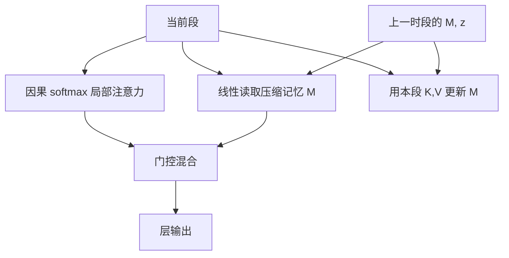

# Infini-Attention

局部因果注意力负责当前段，一块有界的压缩记忆以线性注意力方式累积全部过去；门控把两路读数拼回去，上下文可以无限，状态保持有界。

<footer>—— Munkhdalai 等，Leave No Context Behind: Efficient Infinite Context Transformers with Infini-attention，Google，2024</footer>

[Compressive Transformer](/llm/compressive-transformer) 用有限个压缩向量存旧激活；段再长，槽数仍随「要覆盖多远」涨。Munkhdalai 等人 2024 年的 Infini-attention 把远历史收进一个尺寸与 $d$ 有关、与序列长度无关的关联记忆，用线性注意力的累加规则更新，再用一个标量门把「当前段 softmax」和「记忆读取」混在一起。标题里的 Leave No Context Behind 指的是：每一段都会写入记忆，没有被滑窗丢掉的中间空洞——但写入是有损压缩，不是无损日志。本篇写这一注意力单元，不把 Google 内部的训练规模当成可复现配方。

## 问题

要无限上下文，朴素 softmax 做不到：KV 与 $t$ 线性，计算与 $t$ 二次。滑窗和 Λ 形做到了有界状态，却留下中间空洞。显式压缩槽把空洞填上，状态仍随覆盖距离变长。线性注意力、Performer 一类方法用 $\phi(q)^\top\sum \phi(k)v$ 把历史收进固定大小的矩阵，但单独拿来替换 LLM 里的 softmax，局部质量往往下降，短程语言建模变差。

Infini-attention 的问题设定是：保留段内标准因果注意力（局部精确），同时用固定大小的记忆吞下段外全部历史（全局有界），并让模型自己决定这一头、这一层该信哪一路。状态对 $t$ 的独立性是硬约束；「不丢上下文」是写入策略的软目标——每段都更新记忆，而不是丢段。有界状态不等于无损记忆。矩阵 $M\in\mathbb{R}^{d\times d}$ 的容量是常数比特，无限 token 写入必然碰撞。Leave No Context Behind 描述的是更新规则没有显式丢段，不是信息论上的无损信道。

## 方法

### 段内 softmax + 记忆读取

序列按段长 $n$ 切开。段内对当前 $n$ 个 token 做普通因果注意力，得到 $A_{\mathrm{loc}}$。与此同时，从压缩记忆 $M$ 里用线性注意力读取

$$
A_{\mathrm{mem}}=\frac{\sigma(Q)\,M}{\sigma(Q)\,z}
$$

其中 $z$ 是归一化统计量，$\sigma$ 是逐元非线性（论文用类似 ELU+1 的核，具体以实现为准）。$M$ 与 $z$ 在段与段之间传递，不随 $t$ 变长。

### 增量更新（含 delta 规则可选）

段算完后，用本段的 $K,V$ 更新记忆。基础形式是累加：

$$
M\leftarrow M+\sigma(K)^\top V,\qquad z\leftarrow z+\sigma(K)^\top\mathbf{1}
$$

这是线性注意力的结合律：历史核特征的外积累加。可选 delta 规则先检索旧值再写新值，减轻碰撞，使 $M$ 更接近「键上的内容可被覆盖」而不是纯求和。更新在段级进行，decode 时也可以每步做一次小更新，状态仍是 $(M,z)$。

### 门控混合

每一头一个门 $g\in(0,1)$（可从当前表示产生），输出

$$
A=g\cdot A_{\mathrm{mem}}+(1-g)\cdot A_{\mathrm{loc}}
$$

局部流畅默认走 softmax；需要远距时把门打开。门是方法的一部分：没有门、只把两路相加，尺度和噪声难以对齐。

## 机制

局部 softmax 提供训练分布里最成熟的短程计算：尖峰、竞争、汇点，都还在。线性记忆提供 $O(d^2)$ 状态上的全局草图：任意远的 $V$ 都以 $\sigma(k)$ 为地址加到 $M$ 里，查询用 $\sigma(q)$ 去内积。这解释了为何 passkey 一类「远处有一个几乎唯一的键」的任务，记忆通路可以成功——唯一键在 $M$ 里不那么容易被淹没；而「在一万个相似句子里找第三句」会碰撞。Delta 规则提高后者的几率，仍无保证。

门控解释了为何不必在所有层都做无限记忆。浅层可能 $g$ 接近 0，只做局部；深层把 $g$ 拉高，读篇章级摘要。这与「每层都接 XL 记忆」相比更省，也更符合不同层感受野不同的经验。复杂度：段内 $O(n^2)$，记忆读写 $O(nd^2)$ 量级，与段数（即总长度）线性，状态固定。这是相对 Compressive Transformer 显式槽位的关键差别——没有 $m_c$ 随覆盖距离涨。

实现时 $M$ 的数值范围会随段数漂移。必须有 $z$ 做归一，或对 $M$ 做缩放/衰减，否则后段读取会被早期累加的范数淹没。衰减等于温和地遗忘，会削弱「leave no context」的字面含义，却往往更稳。这是稳定性与口号之间的取舍，应在消融里写明。

## 边界与工程取舍

Infini-attention 是架构，通常需要从头训或至少训注意力与门。不能像 StreamingLLM 那样接到冻结的 Llama 上就宣称无限。Google 论文展示了长 passkey、长书摘要等，复现时数据配比、段长 $n$、是否用 delta，都会改结果；不要把报道中的 1M 长度理解成即插即用的产品开关。

与线性注意力全文替换相比，它保住了局部 softmax，这是能在语言建模上站得住的原因；代价是段内仍二次，段长不能放到整本小说。段长太短，局部上下文不够；太长，二次项和训练内存回来。和 Activation Beacon 相比：Beacon 在序列里插入可见的压缩 token，仍走 softmax；Infini 的记忆对后续 token 不可当普通 KV 寻址，只能经线性读取。调试时看不见「第 17 个压缩 token 被attend了多少」，只能看 $g$ 和 $M$ 的范数。

产品上若需要逐字引用远距条款，矩阵记忆不是合适的主通路，应外接检索。若需要「读完整本书再写摘要」，有界 $M$ 加上段内注意力是匹配的归纳偏置。不要用 NIAH 全绿当唯一验收——线性记忆对唯一针友好，对密集干扰不友好，RULER 类任务更能揭穿碰撞。验收时至少准备两套针：一套几乎唯一的 passkey，一套埋在重复句式里的事实。前者只证明写入没有中断，后者才证明 $M$ 还没被同类键挤成浆。两套都绿，才能说压缩记忆在该任务族上可用。

段与段之间的接口也要写进服务协议：checkpoint 必须保存每层每头的 $(M,z)$，不能只存当前段 KV。中断后续写时若丢掉 $M$，无限上下文立刻退化为滑窗。这与普通 KV 缓存的序列化格式不兼容，运维上要当成新的状态类型，而不是「再多存几页 KV」。

## 小结

- Infini-attention 把段内因果 softmax 与固定大小的线性压缩记忆经门控混合。
- 记忆更新是核特征的外积累加，可选 delta 规则；状态与 $t$ 无关。
- 「不丢段」指每段都写入，不是无损保存全部 token。
- 需要训练该注意力单元，不是冻结 LLM 的推理补丁。
- 段长是二次代价与局部质量的折中；数值上要对 $M$ 做归一或衰减。
- 唯一针、长摘要比密集多跳更适合这条通路。
- 出处：Munkhdalai 等，*Leave No Context Behind: Efficient Infinite Context Transformers with Infini-attention*，Google，2024；对照 Rae 等 Compressive Transformer（2020）与线性注意力路线。
