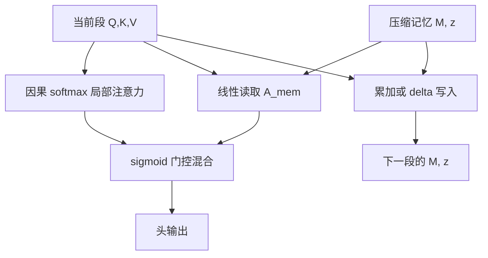

# Infini-Attention 原文

    
Infini-attention 把一块压缩记忆写进标准注意力：同一 Transformer 块里同时做掩码局部注意力与长期线性注意力，从而以有界显存处理无限长输入。

    <footer>—— Munkhdalai, Faruqui & Gopal, Leave No Context Behind，Google，arXiv:2404.07143，2024</footer>

Munkhdalai、Faruqui 与 Gopal 2024 年的预印本把无限上下文收成一个可替换的注意力算子，而不是另起一套记忆网络。算子名叫 Infini-attention：段内仍是因果 softmax，段外历史进一块尺寸只依赖头宽 $d$ 的关联矩阵，再用每头一个标量门把两路读数混回去。本篇按原文把这一算子写完——记忆如何读、如何写、delta 规则改了什么、门控接在哪——实验协议与「不丢上下文」的口号放到 [Leave No Context Behind](/llm/leave-no-context)。已有的架构导读见 [Infini-attention](/llm/infini-attention)。

## 问题

标准多头注意力的键值缓存随时间线性增长，分数矩阵随时间二次增长。要把 Transformer 接到「理论上无限」的输入上，必须换掉这一对增长，又不能把语言建模已经依赖的局部尖峰注意力一并换掉。Katharopoulos 等人的线性注意力给出固定大小的状态 $\sum\phi(k)v^\top$，单独拿它替换 softmax 时，短程竞争变弱，困惑度通常变差。Transformer-XL 与 Compressive Transformer 保留 softmax，但缓存或压缩槽的条数仍随要覆盖的距离上涨。

原文的问题因此是算子级的：在**同一个注意力块**里，能否同时保留因果 softmax 的局部精度，以及线性注意力的有界全局状态，并且让训练去学「这一头此刻该信哪一路」。状态对序列长度 $t$ 独立是硬约束；段与段之间必须能递推，以便把现有 LLM 的继续预训练接上去，而不是从零发明一种新的层类型。

### 有界状态与局部 softmax 不能互相替代

线性记忆的容量是 $O(d^2)$ 量级的常数比特，无限次写入必然碰撞；softmax 在长度为 $n$ 的段上精确，但段一封口，段外 token 就从键集合里消失。二者单独都不够。原文选择并存而不是折中成「一种更软的注意力」：局部通路继续走 $QK^\top$，全局通路继续走核特征的外积和。需要设计的是接口——查询如何读记忆、键值如何写记忆、两路输出如何对齐尺度。

原文把 Infini-attention 写成对多头注意力的即插替换，而不是模型最外层再挂一个记忆模块。每层每头都有自己的 $(M,z)$。这与「只在底层或顶层加记忆」的设计不同：深度方向上每一层都可以决定是否读远历史。

## 方法

记当前段长度为 $N$，头宽为 $d$。段内因果注意力与常规 LLM 相同，得到 $A_{\mathrm{dot}}$。压缩记忆是矩阵 $M\in\mathbb{R}^{d\times d}$ 与归一化向量 $z\in\mathbb{R}^{d}$。读取用线性注意力的结合律形式

$$
A_{\mathrm{mem}}=\frac{\sigma(Q)\,M}{\sigma(Q)\,z},
$$

其中 $\sigma$ 为逐元非线性。原文跟随 Linear Transformer，取 $\sigma(x)=\mathrm{ELU}(x)+1$，保证非负以便当核特征用。分母里的 $z$ 扮演「已写入质量」的角色，避免 $M$ 的范数随段数漂移后把读取撑爆。

### 累加更新与 delta 规则

段计算完成后写入记忆。最简规则是外积累加：

$$
M\leftarrow M+\sigma(K)^\top V,\qquad z\leftarrow z+\sigma(K)^\top\mathbf{1}.
$$

这正是线性注意力把历史收进固定矩阵的那一步。原文同时给出 **delta 规则**（来自快速权重与 DeltaNet 一族）：先按当前键把旧值读出来，再写入残差，

$$
M\leftarrow M+\sigma(K)^\top\Bigl(V-\frac{\sigma(K)M}{\sigma(K)z}\Bigr).
$$

累加把所有过去的值堆在同一地址上；delta 试图在相近键上做覆盖，减轻碰撞。消融里 delta 对长程检索更稳，但不是免费的：多一次读旧值，也更依赖 $\sigma(K)z$ 不要过小。

### 门控混合

两路输出用每头一个可学习标量 $\beta$ 混合：

$$
A=\mathrm{sigmoid}(\beta)\,A_{\mathrm{mem}}+\bigl(1-\mathrm{sigmoid}(\beta)\bigr)\,A_{\mathrm{dot}}.
$$

$\beta$ 可以做成与输入无关的参数，也可以从表示里投影出来；原文采用按头共享的门，使局部默认通路容易保留。没有门、直接相加，会把线性记忆的平滑读数叠到已经 saturating 的 softmax 上，尺度很难对齐。输出 $A$ 再走常规的输出投影与残差，块的其余部分（FFN、RMSNorm 等）不必改。

## 机制

段内 softmax 负责训练分布里已经成熟的短程计算：相邻句法、局部复制、注意力汇点。线性记忆把任意远的 $V$ 以 $\sigma(k)$ 为地址加进 $M$，查询用 $\sigma(q)$ 做内积。两者在表示空间上不必对齐——门控允许某一头几乎关闭记忆通路。这解释了原文何以能从已有 LLM 继续预训练：新引入的 $M$ 与 $\beta$ 可以先接近「不用记忆」，再慢慢承担长程。

Delta 规则改变的是写入语义。纯累加下，重复出现的键会把 $M$ 的对应方向拉成平均值；passkey 一类「几乎唯一的针」不容易被淹没，但「许多相似句子里的第三句」会糊。Delta 在键方向上更接近关联记忆的覆盖更新，检索冲突下降，数值上却更依赖归一化。原文把这一项写成可选项，而不是宣称压缩记忆已经是无损词典。

### 复杂度与状态

段内注意力 $O(N^2 d)$，记忆读写 $O(N d^2)$。总长度 $T=SN$ 时，计算对 $S$ 线性，状态始终是每头一个 $d\times d$ 的 $M$ 加一个 $d$ 维的 $z$。相对把 KV 存到 $T$，压缩比约为 $T/d$ 量级；原文在实验叙述里给出相对基线 Transformer 约 **114 倍**的记忆压缩，数字依赖段长与模型宽度，不能当成与 $d$ 无关的常数。Decode 时也可以每步做一次小更新，状态对象不变；checkpoint 必须保存 $(M,z)$，只存当前段 KV 等于丢掉全部远历史。

ELU+1 不是唯一合法的核。任何逐元正映射都可以代入同一套公式，但门控与 delta 的数值是跟着 $\sigma$ 的尺度走的。换核等于换记忆的地址几何，不能只改公式不重训门。

## 边界与工程取舍

Infini-attention 是要训练的算子。把冻结 LLaMA 的 SDPA 换成这段公式再跑 1M，门与 $M$ 都未经语言建模校准，局部通路会被乱门控污染。原文路线是继续预训练加下游微调，不是推理期补丁。段长 $N$ 是二次项与局部窗口的折中：太短，softmax 看不见够用的邻域；太长，训练显存回到普通长上下文。记忆对后续 token 不可当作普通 KV 寻址，调试时没有「第 17 个压缩槽被看了多少」的注意力图，只能看 $\mathrm{sigmoid}(\beta)$ 与 $M$ 的谱。

数值上 $z$ 必须陪伴 $M$。只累加 $M$ 而不归一，后段读取会被早期范数主导；若再对 $M$ 加衰减，稳定性上升，但「每段都写入且永不丢」的字面含义被削弱。半精度下 $d\times d$ 的外积和容易溢出，更新应在较高精度里做，或对 $\sigma(K)$ 做缩放。产品若要求逐字引用远距条款，矩阵记忆不是主通路；它匹配的是「读过即可、不必逐 token 驻留」的摘要与唯一针检索。

不要把 delta 规则理解成可以任意改写过去。它只在当前键的核特征方向上注入残差；正交方向上的旧内容基本不动。键若不能把不同事实分开，覆盖也覆盖不到正确的地址。

### 与线性注意力全文替换的差别

全文替换线性注意力，是把 softmax 从层里拿掉；Infini-attention 把 softmax 留在段内，线性部分只承担段外。这是原文能在 LLM 语言建模上站住的关键结构，也是复杂度仍含 $N^2$ 的原因。它不是 FlashAttention 的竞品：Flash 精确计算当前窗口的 SDPA，Infini 在窗口之外换了一种数学对象。二者可以叠：段内用精确核，段间用 $M$。

## 小结

- Infini-attention 原文把压缩记忆与因果 softmax 写进同一注意力块，用每头一门混合。
- 读取是 $\sigma(Q)M/\sigma(Q)z$；写入是核特征外积累加，可选 delta 覆盖。
- 状态为每头 $O(d^2)$，与总长度无关；段内仍二次。
- 核函数取 ELU+1 一类正映射；门控使继续预训练可以从「几乎不用记忆」起步。
- 它是需训练的算子，不是冻结模型上的无限上下文开关。
- 出处：Munkhdalai, Faruqui & Gopal，*Leave No Context Behind: Efficient Infinite Context Transformers with Infini-attention*，arXiv:2404.07143，2024。
