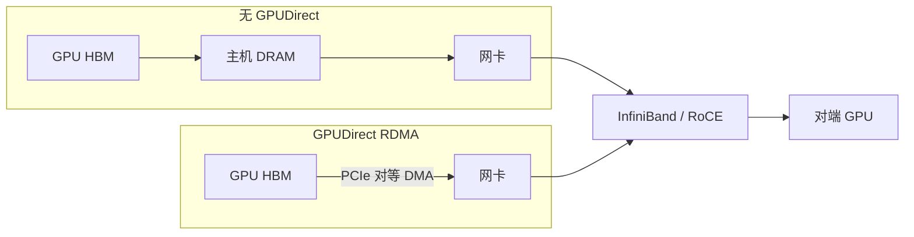

# InfiniBand 与 GPUDirect

    
跨节点的张量交换若必须绕道主机内存，网卡标称带宽再高，有效路径也被多一次拷贝钉死。

    <footer>—— NVIDIA GPUDirect RDMA：第三方 PCIe 设备可直接读写 GPU 显存，避开主机 DRAM 弹跳缓冲</footer>

[Scale-Up 与 Scale-Out](/llm/scale-up-vs-scale-out) 把机柜内 NVLink 域和机柜间数据中心网络拆成两层。本篇只谈 Scale-Out 这一层里、对大模型训练与推理最关键的两条技术：**InfiniBand**（以及同语义的 RoCE）作为跨节点传输平面，**GPUDirect** 作为让这块平面直达 HBM 的路径。没有 GPUDirect，NCCL 的跨节点 All-Reduce 会在 GPU 与网卡之间多走主机 DRAM；有了它，网卡 DMA 引擎对着 GPU 暴露的 PCIe 窗口读写，主机只在注册缓冲区时出现，不在数据路径上。Vera Rubin NVL72 一类机柜把 72 张 GPU 收成一块加速器之后，柜外仍然要靠这层网络把许多机柜收成集群，见 [Vera Rubin NVL72](/llm/vera-rubin-nvl72)。

## 问题

单机多卡的集体通信可以走 NVLink，跨主机就必须经过网卡。传统路径是：GPU 把张量拷到主机内存，网卡再从主机内存 DMA 到线路，对端反过来再走两趟。一次逻辑传输变成四次拷贝，CPU 缓存、主机内存带宽和 PCIe 根复合物都被占用。消息越大，弹跳的代价越明显；消息很小时，多一次同步与驱动往返也会把延迟抬进张量并行难以重叠的区间。

InfiniBand 本身解决的是「有一条低延迟、可 RDMA 的链路」，并不自动保证「这条链路从 GPU 出发」。网卡若只能看见主机虚拟地址，GPU HBM 对它仍是另一台设备。GPUDirect 要补的，正是让网卡成为 GPU 的 PCIe 对等体：注册过的 GPU 缓冲区可以直接作为 RDMA 的本地或远端内存。关掉这条路径，拓扑再漂亮，跨节点有效带宽也会掉到「先拷到 CPU 再上网」的屋顶线下。

### 弹跳缓冲如何把屋顶线砍断

设一次跨节点传输体积为 $n$ 字节，主机内存拷贝带宽为 $B_{\mathrm{host}}$，网卡线路带宽为 $B_{\mathrm{nic}}$。无 GPUDirect 时，墙钟至少包含

$$
T \gtrsim \frac{n}{B_{\mathrm{host}}} + \frac{n}{B_{\mathrm{nic}}}
$$

再加上两端的对称拷贝。有 GPUDirect 时，主机项从关键路径消失，时间更接近 $n/B_{\mathrm{nic}}$ 加上 PCIe 对等 DMA 的效率因子。预训练里数据并行的梯度、专家并行的 All-to-All、PD 分离的 KV 传输，都按这个公式付账。把厂商网卡标称 Gb/s 直接当成 NCCL `busbw`，等于假装弹跳不存在。

GPUDirect 是一组技术的总称。本篇的对象是 **GPUDirect RDMA**（网卡直达 GPU）以及它在存储侧的兄弟 **GPUDirect Storage**。GPU 之间经 NVLink 的点对点是另一条路径，见 [NVLink 6](/llm/nvlink-6)，不要把卡间互连写成「RDMA 网卡」。

## 方法

实践上，跨节点集体通信几乎总经过 NCCL（或等价库）的网络插件。插件用 InfiniBand Verbs 或 RoCE 发出 RDMA Write / Send，本地地址是已注册的 GPU 缓冲区。内核侧曾经依赖 `nvidia-peermem`（更早叫 `nv_peer_mem`）把 GPU 页登记进 InfiniBand 栈；较新的开放 GPU 内核模块与 Linux DMA-BUF 把同一件事收成内核内的缓冲区共享，NVIDIA 公开文档推荐优先走 DMA-BUF，而不是继续绑一套随内核版本重编的对等内存模块。

拓扑必须让 GPU 与网卡成为「近邻」。同一 PCIe 交换机下的 PIX 路径，对等 DMA 最干净；跨根复合物或跨 NUMA，有的平台会降级甚至禁止 GPUDirect。NCCL 用 `NCCL_NET_GDR_LEVEL` 一类开关决定在哪一层拓扑仍尝试直达。运维上先看 `nvidia-smi topo -m` 里 GPU 与 mlx 设备的相对位置，再跑与真实消息大小相近的 `nccl-tests`，确认日志里走的是 GDR 而不是 Host 路径。

### 与机柜内 NVLink 的分工

机柜内的张量并行、宽专家并行应落在 NVLink 域，不该仅仅因为「有 IB」就把 TP 组拆到柜外。InfiniBand 承担的是：数据并行梯度、跨柜流水线激活、检查点与存储、以及超节点装不下的那一段 All-to-All。Vera Rubin 公开材料把柜外扩展写在 Quantum-X800 InfiniBand 与 Spectrum-X 以太网上，和柜内 [NVLink 6](/llm/nvlink-6) 不是同一张图。软件若把 NCCL 默认套接字路径当成跨节点主路，等于主动放弃 GPUDirect。

SHARP 最初作为 InfiniBand 交换机上的集合规约出现：交换机在端口上做归约，减少树形 All-Reduce 的重复流量。Rubin 把同类能力做到了 NVLink 交换里，见 [SHARP](/llm/nvlink-sharp)。两层都可以叫「网内计算」，但一层吃的是柜外梯度同步，一层吃的是柜内 TP / 集合通信。不要把 IB SHARP 的加速比抄到 NVLink 域上当同一组数字。

## 机制

GPUDirect RDMA 的硬件故事是 PCIe 对等：GPU 把一块 BAR 窗口映射给对等设备，网卡的 DMA 引擎把 HBM 当成自己的本地缓冲。CUDA 用户态负责钉住、注册、同步；内核负责 IOMMU 与页表。数据平面上没有 CPU  memcpy。失败模式也因此是「对等关系不成立」：IOMMU 策略过严、GPU 与 NIC 不在同一 PCIe 域、驱动与 OFED 版本错位、容器没有把 InfiniBand 设备与 GPU 一起注入，都会让 NCCL 静默退回主机路径。

InfiniBand 相对以太网的传统优势是原生 RDMA、基于信用的流控、以及长期以来与 NCCL / MPI 的绑定。RoCE 把同类语义放到以太网上，Spectrum-X 一类 AI 以太网再补拥塞控制与自适应路由。对大模型程序员，协议名不如路径名重要：这条消息是否 GPU 直达、是否与计算重叠、是否和检查点抢同一条轨。GPUDirect Storage 把同一直达原则用到 NVMe / NVMe-oF：训练数据与检查点不必先在主机 DRAM 里转一圈，但存储平面仍应与梯度平面隔离，否则 step 时间会出现周期性尖峰。

看 `nccl-tests` 的 busbw，不要只看 `ibstat` 的链路速率。集体算法、消息大小、GDR 是否启用、GPU–NIC 亲和，都会让有效带宽远低于标称。调跨节点通信，先用同一形状的微基准对齐路径，再改并行度。

### 注册、同步与小消息

RDMA 要求内存被注册。频繁的小块注册会把驱动开销变成墙；训练框架因此预注册通信缓冲、用持久的 NCCL 通信子。小消息落在延迟区时，GPUDirect 减的是拷贝而不是启动延迟，加链路宽度帮助有限。这时应合并通信、加大 chunk，或把该进程组缩回 NVLink 域。decode 推理的逐步 All-Reduce 往往是这种小消息；跨柜 TP 比训练更不划算，原因正在这里，而不是 InfiniBand「不够快」。

## 边界与工程取舍

不要在只有 PCIe、没有 GPUDirect 的节点上假设「换一张更快的网卡就能线性加速跨节点 TP」。不要把 GPUDirect 写成可以取消层次化集体通信：节点内仍应先在 NVLink 上归约，再把每节点一份结果打到 IB 上，见 [预训练通信](/llm/pretrain-comm)。不要把某一代 ConnectX 的端口速率写成所有集群的物理定律；Vera Rubin 托盘上的 SuperNIC 规格以当时 NVIDIA 产品页为准，本篇不把某一栏 Tb/s 当成自己测的数。

昇腾、AMD 和其他互连各有自己的 GPU–NIC 直达机制，语义可类比，驱动与拓扑工具不能照搬。Kubernetes 里要同时注入 GPU 与 RDMA 设备，并保证 Pod 的 NUMA / PCIe 亲和；只挂了 GPU、网卡落在另一 NUMA，是线上最常见的「标称有 GDR、实测没有」原因。

出处：NVIDIA GPUDirect RDMA 与 GPU Operator 文档中的 PCIe 对等与 DMA-BUF 路径；NCCL 跨节点走 InfiniBand / RoCE 的公开实现。SHARP 在 IB 交换机上的集合规约见 NVIDIA 网络文档。不把未钉版本的 tokens/s 或某一机房的电缆测试写进正文。

## 小结

- InfiniBand / RoCE 是 Scale-Out 平面；GPUDirect RDMA 让网卡直达 GPU HBM，去掉主机 DRAM 弹跳。
- 无直达时，跨节点传输至少多一次主机拷贝，有效带宽被 $B_{\mathrm{host}}$ 卡住。
- 内核侧优先 DMA-BUF；GPU 与 NIC 必须在近邻 PCIe 拓扑上，否则 NCCL 会退回主机路径。
- 柜内高频通信仍走 NVLink；IB 承担 DP、跨柜 PP、存储与装不下的 EP。
- IB 交换机上的 SHARP 与 NVLink 交换内的 SHARP 同族不同层，数字不可互抄。
- 出处：NVIDIA GPUDirect / NCCL 公开文档；机柜内外分工见 [Scale-Up vs Scale-Out](/llm/scale-up-vs-scale-out)。
