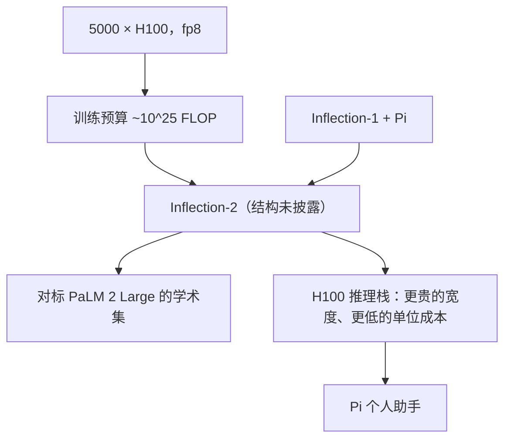

# Inflection-2

    
Inflection-2 在约 \(10^{25}\) FLOP 的训练预算上完成，与当时的 PaLM 2 Large 算力同档，并在多数公开学术基准上超过对方；它将用于驱动个人助手 Pi。

    <footer>—— Inflection AI，Inflection-2: The Next Step Up，2023 年 11 月 22 日</footer>

Inflection-2 是 2023 年 11 月的一篇**算力与基准博客**，不是 Llama 3 那种带层数表的技术报告。公司声称它是当时该算力档最强、全球能力第二（仅次于 GPT-4）的稠密级对手，训练用 **5000 张 H100**、**fp8 混合精度**、约 **\(10^{25}\)** FLOP。**参数量、层数、词表、数据配比官方没有写**。媒体出现过的 175B 或由 FLOP 反推的 400B，都属于推测，本篇一律标**公开信息有限**，不把反推写成规格。

## 问题

Inflection 的产品是个人 AI **Pi**：要闲聊、要记忆风格、要少伤害，而不是先做代码智能体。Inflection-1 已经在 Pi 上线；2 要在数月内用更大算力把事实性、风格可控与推理拉起来，同时**推理成本不能按参数倍数涨**——博客明确说 2 比 1「大好几倍」，但换到 H100 并优化推理后，服务更便宜更快。问题因此是：在几乎不披露结构的前提下，如何用**训练 FLOP 档**与**基准表**让外界定位它，而不是用开源配置文件。

第二个问题是时间点。发布紧挨 GPT-4 年与 Gemini 前夜，对照物是 PaLM 2 Large 与 Llama 2，不是 2025 年的推理模型。把 Inflection-2 写成「开源 70B 竞品」或「MoE」都没有官方根据。

### 官方给的是 FLOP 档，不是宽度

博客可核对的句子只有：5000 H100、fp8、~\(10^{25}\) FLOP；与 PaLM 2 Large **同一训练算力档**；在 MMLU、TriviaQA、HellaSwag、GSM8K 等「大多数」标准基准上超过 PaLM 2 Large；事实知识、风格控制、推理相对 Inflection-1 明显更好。图 1 是与 Inflection-1、PaLM 2-Large 的并排柱（n-shot 标在括号里）。没有开源权重、没有模型卡式的 `num_hidden_layers`。集群总量提到约 22,000 加速器，2 只用了其中 5000，其余留给「下一个 10× 规模」的规划——那些规划是否落地、后来公司转向，不属于本模型的结构事实。

Chinchilla 经验式 \(C \approx 6ND\) 在未知 \(N\) 与 \(D\) 时不可解。用 \(10^{25}\) 反推 400B×4T 或 175B×某 token，是读者的算术游戏，不是 Inflection 的披露。不要把 Medium 博文的反推写进规格表。

## 方法

方法段在官方文本里极短，只能按「训练—服务—产品」三步写。

训练：5000 张 H100，fp8 混合精度，预算 ~\(10^{25}\) FLOP。fp8 用来在当时的 Hopper 上拉吞吐；是否用 Transformer Engine 一类融合、是否有损失缩放细节，公开信息有限。数据来源、过滤、是否含用户 Pi 对话，博客未写——个人助手产品对隐私更敏感，外部不应臆造语料单。优化器、并行策略、是否 GQA，同样没有。

### 服务效率是与 1 对照的主句

博客强调：尽管 2 比 1 大好几倍，从 A100 迁到 H100，加上「高度优化的推理实现」，服务成本下降、速度上升。这是**系统方法**：用更新的芯片与推理栈对冲宽度。没有给出 tokens/s 或 $/MTok 的公开表，不能把这句话量化成「快 3 倍」。Pi 将切到 Inflection-2，产品目标仍是个人对话，而不是 REPL 编程助手——基准里有 GSM8K，不等于产品定位变成代码模型。

评测方法即「常用学术基准 + 自称算力同档」。没有第三方盲测 Arena 段落写进该博客。安全方面，公司另有白宫自愿承诺等治理叙事，与网络结构无关，本篇不展开条款。

Inflection-1 曾有更早的技术报告式材料；2 没有把 1 的超参表更新一版公开发出。读 1 的数字不能平移到 2，尤其是宽度「大好几倍」这一句已经否定了同宽假设。

## 机制

在缺少结构的情况下，机制只能说到计算经济学。固定 \(10^{25}\) FLOP，模型可以走「更宽、更少 token」或「更窄、更多 token」。官方不选边。fp8 训练降低的是每步时间与显存压力，不自动等于最终精度与 bf16 训练同分布——校准与主精度策略未披露。对 PaLM 2 Large 的胜出若成立，说明在**该套基准与该套提示**下，同档 FLOP 可以打过 Google 当时的旗舰稠密模型之一；不能外推到代码、多模态或 2024 年后的长上下文套件。

Pi 的机制是产品层：风格控制被点名为 2 相对 1 的改进，意味着后训练或解码策略改了「像不像一个温和的陪聊」，而不是公开了 RLHF 公式。个人助手的记忆、安全拒答、是否检索，博客几乎不谈。把 Inflection-2 理解成「只有聊天、不会工具」或「已经是智能体」都超出文本。

### 为何第二名叙事不能当定理

「世界第二」是 2023-11 对照 GPT-4、且 Gemini 尚未成为公开对照物时的自我定位。基准选择、提示、是否 CoT、是否污染，外部无法审计。Llama 2 70B 开源不久，博客也把它当作对照之一（媒体转述）。这些表的科学含量是「存在性声明：该 FLOP 档可以达到当时第二梯队的选择题分数」，不是可复现排行榜。

## 边界与工程取舍

最大边界就是**没有开源、没有结构卡**。不能部署、不能验证 MoE 还是稠密、不能核对词表。参数量公开信息有限；175B 等数字若出现在二手文章，应视为未证实。后续 Inflection-2.5、企业 API、以及 2024 年公司与微软的人事/产品转向，会改变 Pi 背后的实际模型，不能把 2023-11 的 2 当成 2026 年仍在服务的同一检查点。

工程上，5000 H100 × 训练周期对大多数实验室不可复现；可复现的只有「用 FLOP 档而不是参数档做广告」这一沟通策略。个人助手市场后来被通用模型的长上下文与工具调用挤压，那是产品史，不是对 \(10^{25}\) 是否训稳的判决。不要把 Inflection-2 写进 MoE 谱系，也不要给它编造 arXiv。

出处必须是 Inflection 官方博客 *Inflection-2: The Next Step Up*（2023-11-22）。链接若迁移，以公司域名当时快照为准。不要用维基或 Decoder 的 175B 当作脚注「官方参数」。

## 小结

- Inflection-2（2023-11）官方披露：5000 H100、fp8、约 \(10^{25}\) FLOP，算力同档于 PaLM 2 Large，并在多数列出的学术基准上宣称胜出，用于 Pi。
- 相对 Inflection-1「大好几倍」，但 H100 推理栈使服务更便宜更快；参数量、层数、数据公开信息有限。
- 「世界第二」是发布时点的自我定位，不是可复现排行；禁止用 FLOP 反推把 400B / 175B 写成规格。
- 出处：Inflection AI，*Inflection-2: The Next Step Up*，2023-11-22。无官方技术报告编号。
