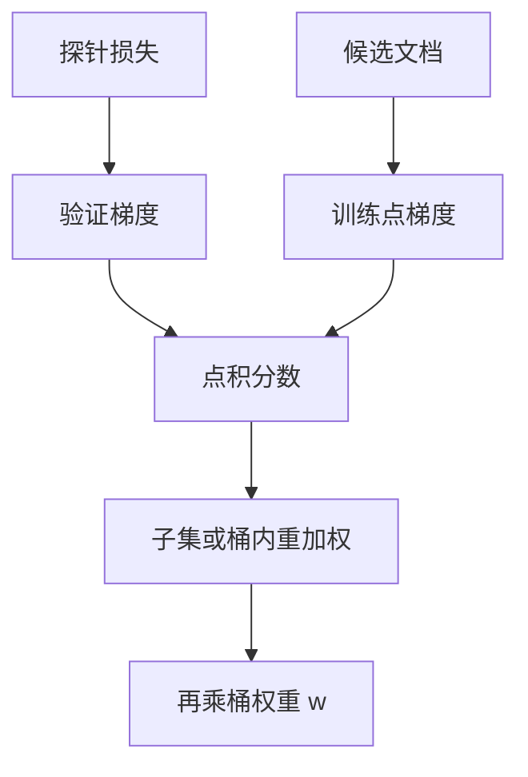

# 影响函数选数据

影响函数问的是：若训练时少看这一条样本，目标损失会升还是降；把升得最多的那些留下，就是一次面向探针的数据选择。

<footer>—— Koh & Liang，Understanding Black-box Predictions via Influence Functions，ICML 2017</footer>

[上一课](/llm/regmix)在桶的单纯形上拟合损失面。桶内文档仍然一视同仁：同样 10% 代码，许可证页与核心源文件权重相同。本课不重讲 $w$。缺口是文档（或段落）级的选择：哪些训练点对指定下游探针最有用。Koh 与 Liang 把经典影响函数接到黑箱模型；预训练规模下要改成梯度点积一类的可计算近似，而不是真去对海森求逆。

## 问题

DoReMi / RegMix 的操作单位是桶标签。标签错或桶内异构时，再精的 $w$ 也是糊的。文档级选择直接对 $p_{\mathrm{train}}$ 做再加权或子集选择。完整影响函数需要海森逆，大模型不可行。工程缺口是：用哪一种一阶近似（TracIn 的梯度累积点积、LESS 一类对指令微调的投影、数据模型的线性代理），才能在可承受的代理模型上给预训练混合物打分。

选择的目标必须说清。面向「降低 C4 验证损失」会挑流畅网页；面向「GSM8K」会挑数学；面向「不要背评测」还要与去污染课对接。没有目标探针的影响分数，只是又一种质量模型。

### 代理与目标的错位

在小模型上算影响，再在大模型上消费分数，假设是：样本对损失的相对贡献在尺度上缓慢变化。这比「最优 $w$ 可迁移」更强。应在目标模型上抽检高分与低分文档的真实贡献，而不是把代理排序当真理。

重复文档的影响会被放大。选择之前仍要走去重；否则影响函数成为「把镜像再加权」的昂贵方法。

## 方法

选定代理模型 $\theta$（常为小预训练或中途检查点）与探针集合。对探针算梯度 $g_{\mathrm{val}}$；对每个候选训练点算 $g_i$，分数 $s_i=\langle g_i,g_{\mathrm{val}}\rangle$（TracIn 还可沿训练轨迹对多个检查点求和）。保留 $s_i$ 最高的子集，或把 $s_i$ 转成采样权重接回加载器。Pruthi 等人的 TracIn 避免显式海森；Xia 等人的 LESS 面向指令微调选数据，预训练可借用其「先投影再打分」以省存储。

计算上必须二次抽样：不能对万亿 token 逐条反传。先用质量过滤缩小候选，再在候选上打分。分数要按桶归一，以免某一桶梯度范数天生更大而吞掉名额——否则又变回粗配比。

### 与配比的接口

影响选择输出的是桶内密度；桶间 $w$ 仍可由 DoReMi 或人工给定。两层相乘：先 $w$，再在桶内按 $s_i$ 抽样。不要用影响分数去「发现」一个新的网页桶比例，除非你把所有文档放进同一个池、让分数自己决定——那往往会被最大的桶主导。

负影响（去掉它探针更好）应视为污染或冲突信号，进入去污染与过滤，而不是静默丢弃后不加记录。

## 机制

一阶影响近似的是损失函数在参数空间沿 $g_i$ 方向对探针的局部变化。训练点与探针在梯度上对齐，则多看它会推动参数向降低探针损失的方向走。不对齐或反向，则是干扰。海森逆在理论上把「局部」修正为「沿损失曲率」，大模型上被丢掉后，分数更像相似度，对优化路径敏感：不同检查点排序会变，所以要多点平均或固定一个声明清楚的 $\theta$。

## 边界

影响函数不生成新数据，也不解决多语言 α 采样那种「低资源语言要过采样」的覆盖问题——覆盖是测度支撑，影响是测度密度。计算税高，只适合在过滤之后的精选层。下一课回到便宜、可规模化的语言层抽样：α-sampling，它不打梯度，只打语种频次的幂。

## 小结

- 本课不重讲桶级 $w$；只补文档级分数如何接到加载器。
- 大模型上用梯度点积等一阶近似，并对候选二次抽样。
- 分数按桶归一，与 DoReMi / 人工 $w$ 相乘，避免被大桶吞掉。
- 代理排序要在目标尺度抽检；负分当作污染信号。
- 出处：Koh & Liang, ICML 2017；Pruthi et al., *TracIn*, NeurIPS 2020；Xia et al., LESS。
