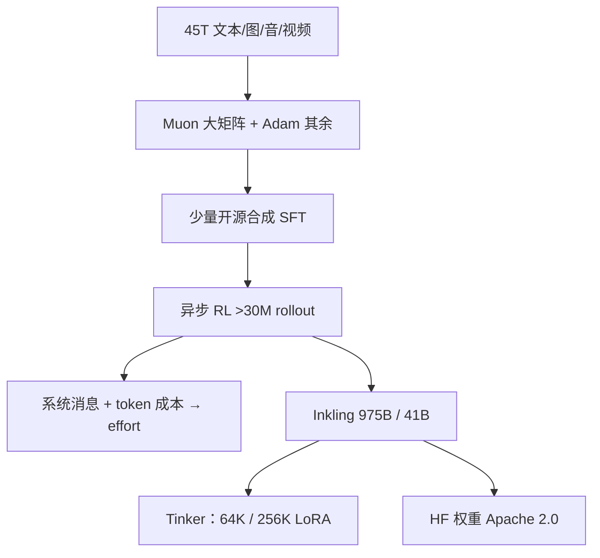

# Inkling（Thinking Machines）

    
Inkling 不是今天开源权重里最强的总榜模型；它被设计成可定制的宽基座：原生多模态、可控思考力度，并且当天就能在 Tinker 上微调。

    <footer>—— Thinking Machines Lab，Inkling: Our Open-Weights Model，2026-07-15</footer>

Thinking Machines Lab 的产品轴是「让人把模型改成自己的」。2026 年 7 月 15 日他们放出从零训成的 **Inkling**：稀疏 MoE Transformer，总参 **975B**、激活 **41B**，上下文至 **1M**，预训练 **45T** token（文本、图像、音频、视频）。输入文本 / 图像 / 音频，输出仅文本。许可 **Apache 2.0**。同期预告 **Inkling-Small**（276B / 12B 激活）。模型卡与发布博文给出层表级细节，是闭源实验室里少见的完整公开。本篇按这两份文本写，不把 Tinker 上 64K / 256K 的托管窗默认为权重的 1M 能力已经在微调栈里验过。

## 问题

开源旗舰往往在某一榜上极强、换域就要重找底座。定制（LoRA / 全参）需要的是：工具与编码够用、视觉音频能进同一残差流、思考力度可按延迟买卖、安全拒答不要在良性题上过触发。Inkling 把问题收成**泛化基座**，并承认总榜不是第一。第二条是交互模型：他们要把 Inkling 当实时语音–视觉协作系统的后台推理核，因此多模态必须从零训、无独立编码器巨塔更好。

Tinker 的约束是：用户微调时看见的上下文是产品档（64K，以及 PEFT 的 256K），与模型卡「至 1M」不是同一句。评测与训练都要钉实际档。

### 规格：66 层，256 专家选 6，加 2 共享

模型卡：66 层解码器，稀疏 MoE FFN，每 token 路由 **6 / 256** 专家，另有 **2** 个共享专家始终激活；注意力为局部 / 全局混合；图像经层次 patch 编码，音频经离散 token，投影进共享隐空间。发布博文补充：MoE 大体跟 DeepSeek-V3（sigmoid 路由、无辅助损失的负载偏置，选中专家与共享专家的分数**联合归一化**）；注意力按 **5:1** 交错滑窗与全局，**8** 个 KV 头；位置编码用相对位置（Shaw / Music Transformer 一系）而非 RoPE，并称外推更好；在键值投影后以及注意力 / MLP 残差汇入前加短卷积。数值：BF16、MXFP8、NVFP4。BF16 需合计约 2 TB 显存（8×B300 或 16×H200）；NVFP4 合计约 600 GB。

音频卡：WAV、16 kHz，最佳 20 分钟内；图像边长建议 40–4096 px。输出只有 UTF-8 文本。effort 扫到 0.99 是评测默认，不是聊天产品必须拉满。

## 方法

预训练 45T，混合优化：**大矩阵用 Muon，其余用 Adam**，权重衰减强度耦到学习率平方，以稳住长程训练的权重范数。后训练覆盖数学、智能体代码与工具、音频、图像、聊天与安全。启动用包括 Kimi K2.5 在内的开源模型合成数据做小比例 SFT，算力大头在合成与人工环境上的大规模 RL。训练硬件写 NVIDIA GB300 NVL72。RL 超过 **3000 万** 条 rollout，推理类持有集（AIME、HLE、GPQA 等）上奖励近似 log-linear；思考力度通过系统消息与**每 token 成本**指定，使不同 rollout 学会花不同长度的思维。

### 可控 effort、无编码器多模态、epistemics

Effort 从约 0.2 扫到 0.99，在 Terminal Bench 2.1、HLE、IFBench 上画出分数–生成 token 曲线。官方例：达到与 Nemotron 3 Ultra 相同的 Terminal Bench 分数大约只需三分之一 token。多模态：音频用 dMel 谱、图像 40×40 patch 经四层 hMLP，轻量嵌入后与文本共解码——**encoder-free**，与交互模型设计一致。推理期可用 Python 工具做缩放裁剪，把视觉推理接到代码。

Epistemics 三件：校准、指令遵循、抗审查。校准用已分晓的真实问题 + 正规评分规则做 RL；长文用 rubric 评分器（查全）与 claims 评分器（逐条核实，可联网），并加「会就答、不会就弃权」的短事实问答。安全：内外红队覆盖日常操纵与 CBRN / 网络 / 失控；结论是相对开源生态**没有实质性能力抬升**，残留风险是角色扮演与间接有害请求，部署应叠 Llama Guard 一类分类器。

发布日部分分数（effort=0.99）：HLE 纯文本 29.7%、带工具 46.0%；AIME 2026 97.1%；GPQA Diamond 87.2%；SWE-bench Verified 77.6%（bash-only harness）；Terminal Bench 2.1 63.8%（内部 harness，网络污染题记 0 分）。官方强调若干行取 Artificial Analysis 的外部数，编码行用自有 harness——**与厂商自评的闭源行不可无脚注混比**。

RL 过程中思维链自发变短、丢掉语法连接词，最终答案不变。这不是单独的长度惩罚目标，官方归因于效率压力，与 Cognition 在 SWE-1.7 上的观察同类。

## 机制

5:1 局部/全局注意力把大多数层的 KV 限制在窗口内，1M 理论窗才可能；相对位置编码被选来做长度外推，替代 RoPE 基数调节。短卷积提供局部时间滤波，补偿线性/滑窗层对精确 token 对齐的不足。联合归一化共享专家与路由专家，避免共享专家在 sigmoid 门下被系统性压掉。Muon 管大矩阵，是与 K2 / V4 同类的稳定与 token 效率选择。

Effort 的机制是**同一套权重上的条件计算**：系统消息改变「愿意花多少内部 token」，每 token 成本在 RL 里让省 token 的策略也能得分。因此低 effort 不是另一个蒸馏出来的小模型。校准 RL 把「说对的概率」接到 Brier 一类分数，模型才会在预测市场上有用——这是 Tinker 客户的目标域之一，不是聊天趣味。

### Inkling-Small

276B / 12B 激活，配方改进后在多数榜上接近或超过大号同胞，SimpleQA 等知识容量仍明显更小。角色是低延迟定制与合成数据生成。发布两周后权重跟进（博文更新句）；不要把预览表当成 7 月 15 日当天可下的检查点。

## 边界与工程取舍

Tinker 微调上下文不是 1M。LoRA 产出适配器，不是改写后的全量基座。主机 API（Together、Fireworks、Modal、Databricks、Baseten）与自托管 SGLang / vLLM 的默认 effort、工具模板可能不同。模型卡写明幻觉、长多轮退化、训练数据偏见与知识截止。FORTRESS 对抗分 78.0% 在开源对照里偏强，不等于可以去掉应用层过滤。不要把「从零训成」理解成数据全公开——来源含公网、第三方与合成，配比未给表。

出处：Thinking Machines Lab，*Inkling: Our Open-Weights Model*（2026-07-15）；*Inkling Model Card*。权重 `thinkingmachines/Inkling`。不编未给出的预训配比。

## 小结

- Inkling（2026-07-15）是 975B/41B 的开源多模态 MoE，Apache 2.0，45T 预训，上下文至 1M。
- 结构：256 专家 top-6 + 2 共享，5:1 滑窗/全局，相对位置编码，encoder-free 视听。
- 卖点是可定制、可控 effort、校准与安全，而不是总榜第一。
- Tinker 的 64K/256K 与模型卡 1M 必须分开写。
- 出处：官方博文与模型卡。
