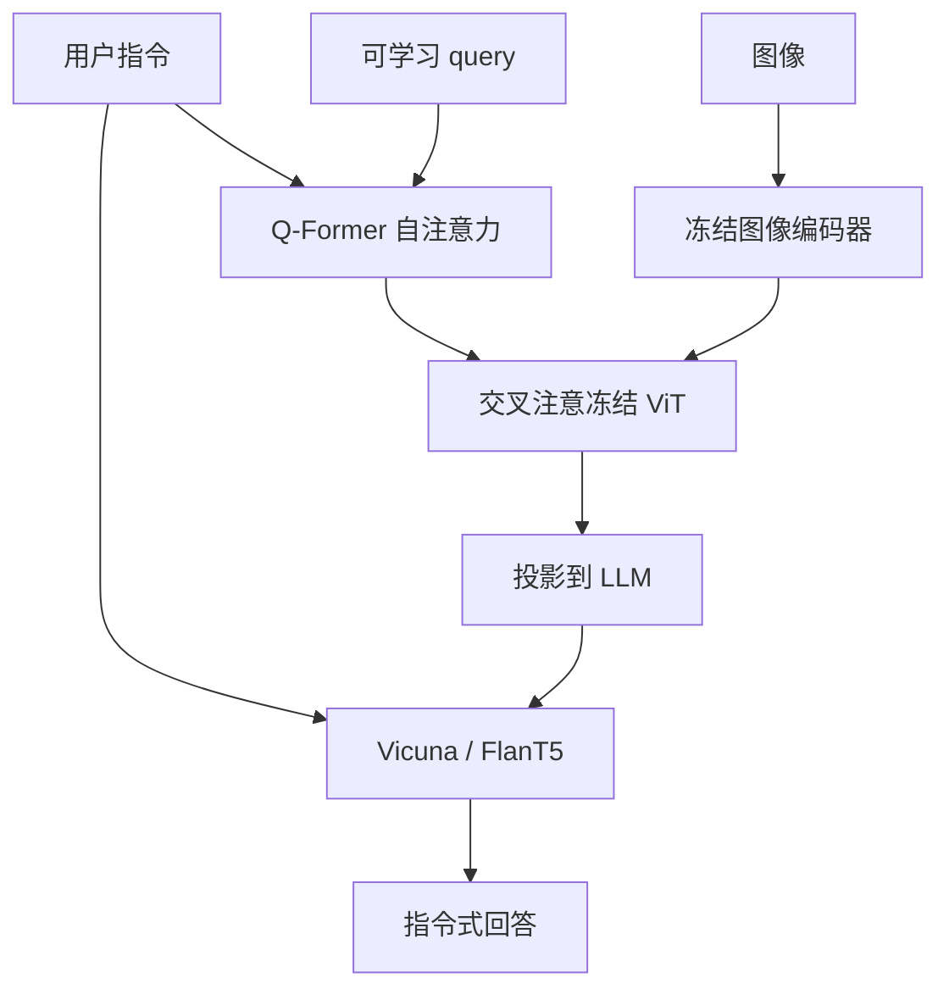

# InstructBLIP

同一张图、不同指令，Q-Former 的 query 应当抽出不同的视觉证据；否则接到 LLM 的 32 个槽位永远是「通用标题特征」，听不懂任务。

<footer>—— Dai 等，InstructBLIP: Towards General-purpose Vision-Language Models with Instruction Tuning，NeurIPS 2023</footer>

[BLIP-2](/llm/blip2) 证明冻结 ViT + 冻结 LLM + Q-Former 能做零样本图到文。Dai、Li 等人接着问：若下游是「数图里几只狗」「把表读成 Markdown」「按用户口吻闲聊」，32 个 query 在预训练里只见过标题与匹配，会不会总抽出同一套全局特征？**InstructBLIP** 的答案是给 Q-Former **看指令**：指令文本进入 Q-Former 的自注意力，query 在交叉注意 ViT 之前就已经被任务条件化，于是瓶颈里走的是「与当前指令相关的视觉」。他们把 11 类任务、26 个数据集改写成指令格式做视觉指令微调，并留出 held-out 任务测泛化。本篇按 arXiv:2305.06500 写这一改动；不把后来的 LLaVA 数据配方安进来。

## 问题

BLIP-2 的 Q-Former 在第一阶段用图文对训练，query 优化的是「对标题有用的视觉」。接到 LLM 之后，用户问题只出现在 LLM 侧。若问题是细粒度的，而前缀仍是标题型摘要，LLM 只能靠语言先验补全，表现为答非所问或幻觉物体。Flamingo 用交错示范告诉模型任务格式，但不改视觉抽取；纯 LLM 侧指令微调（只更 Q-Former 到 LLM 的映射、不让 Q-Former 看见指令）同样无法改变已经压缩掉的信息。

需要评测协议的第二问：在指令数据上微调很容易在同分布 VQA 上涨分，却在未见任务上掉回 BLIP-2。InstructBLIP 因此明确划分 held-in / held-out，主张的是**任务泛化**，不是刷 held-in 表。

### 指令必须进入视觉瓶颈，而不是只进入 LLM

结构仍是冻结图像编码器、Q-Former、全连接、冻结或轻训的 LLM（Vicuna-7B/13B、FlanT5-XL/XXL）。关键差分：指令 token 与 query 一起做自注意力，再让 query 交叉注意图像。公式上，query 的键值来自 ViT，但 query 的内容已经是 $q = f(q_0, \text{instruction})$。没有这一步，32 维瓶颈对所有问题都是同一张「图摘要」。

「指令感知」不是多一个提示词模板那么简单。模板只影响 LLM 看到的文字；Q-Former 看不见指令时，视觉前缀不变，换问题等于只换 LLM 的文本条件。消融应比较「指令是否输入 Q-Former」，而不是「有没有在 LLM 里写 Question:」。

## 方法

数据：把 VQA、描述、分类、计数、OCR、知识推理、对话等 26 个来源统一成自然语言指令–回答对，覆盖 11 个任务类别。训练时图像编码器保持冻结，Q-Former（含交叉注意力）与到 LLM 的投影更新；LLM 是否更新取决于具体检查点（Vicuna 线通常会让语言侧参与指令跟随）。采样按任务平衡，避免 VQAv2 这种大集把梯度独占。推理与 BLIP-2 相同：Q-Former 出固定长度视觉 token，LLM 自回归解码，只是 Q-Former 的输入多了当前指令。

### held-out 才是主张的位置

held-in 用来学格式与覆盖；held-out 任务在训练中完全没见过对应数据集，用来看指令感知特征能否迁移。论文展示：相对 BLIP-2 零样本，InstructBLIP 在未见视觉任务上平均提升明显，且同一套权重可切描述、VQA、推理，而不为每个数据集训头。这与当时「一个模型一个下游微调」的 VLP 习惯相对。FlanT5 骨干在纯文本指令上已经很强，视觉指令微调更多是把「看哪」对齐；Vicuna 骨干则同时要学对话口吻。

## 机制

瓶颈迫使选择。32 个槽装不下整图；若选择标准是「对标题互信息最大」，计数与读框会输给显著物体。指令进入 query 之后，选择标准变成「对当前问题互信息最大」：问颜色时 query 偏向物体区域，问文字时偏向字形激活。这与人类「先读题再看图」同构，发生在压缩之前，所以是机制而不是提示技巧。

LLM 侧仍然只看见压缩后的前缀加指令文本。若 Q-Former 已经丢掉了被问到的细节，Vicuna 再强也补不回像素。因此 InstructBLIP 改善的是**抽取策略**，不是分辨率。分辨率仍由冻结 ViT 的训练边长决定；文档级 OCR 的上限与 BLIP-2 同类，只是问「图里写了什么」时 query 更可能去抓字，而不是去抓物体名词。

26 个数据集改写指令时，回答格式（单词 / 句子 / 选项字母）必须与评测解析一致。BLIP-2 式短答案与 Vicuna 式聊天句若混在同一监督里不加格式提示，held-in 会涨、解析会乱。LLaVA-1.5 后来把「格式提示」写成一等公民，源头之一就是这类指令数据的异构。

### 和 LLaVA、和 Flamingo 少样本

[LLaVA](/llm/llava-paper) 不压缩 patch，指令只在 LLM 里，视觉侧始终是全图网格；它用 GPT-4 合成对话数据，而不是 26 个学术集的指令改写。Flamingo 用 in-context 示范换任务，视觉抽取（64 latent）不看当前问题。InstructBLIP 用**任务条件压缩**换任务，更接近「一个通用视觉编码器 + 按问题检索」。三者都可以叫 instruction / few-shot，注入点分别在 LLM 前缀网格、LM 层间交叉注意、Q-Former query。

## 边界与工程取舍

冻结 ViT 与 32 query 仍在。held-out 泛化不等于任意用户任务：分布仍靠近学术 VQA 与描述。Vicuna 权重受 LLaMA 许可约束；FlanT5 线更易商用，但对话风格不同。不要把 InstructBLIP 写成「BLIP-2 加了 SFT 数据」——少了指令感知 Q-Former，论文的核心消融不成立。

服务上，每条请求的指令都要跑 Q-Former，不能把视觉前缀在「未定问题」时缓存完事；多轮对话若每轮问题不同，应重新跑 Q-Former，或接受用第一轮特征。这与 LLaVA「视觉前缀与问题无关、可缓存」相反。多图、视频不是该文范围。评测若用 LLM 裁判，要与论文当时的官方脚本分开写。

InstructBLIP 可以初始化自 BLIP-2 的 Q-Former。从随机 Q-Former 直接做指令微调，会缺少第一阶段 ITC/ITM/ITG 已经学到的「如何从冻结 ViT 取证」。工程上应把两阶段预训练当前置，而不是用指令数据从零训 188M 桥。

## 小结

- InstructBLIP 在 BLIP-2 上做视觉指令微调，并使 Q-Former 的 query 条件于指令。
- 26 个数据集、11 类任务；主张看 held-out 泛化，而不是只看 held-in VQA。
- 机制是压缩前的任务条件选择；不提高分辨率，也不取消 32-token 瓶颈。
- 与 LLaVA 全 patch 前缀、Flamingo 少样本示范不是同一注入点。
- 出处：Dai 等，*InstructBLIP*，NeurIPS 2023，arXiv:2305.06500。
