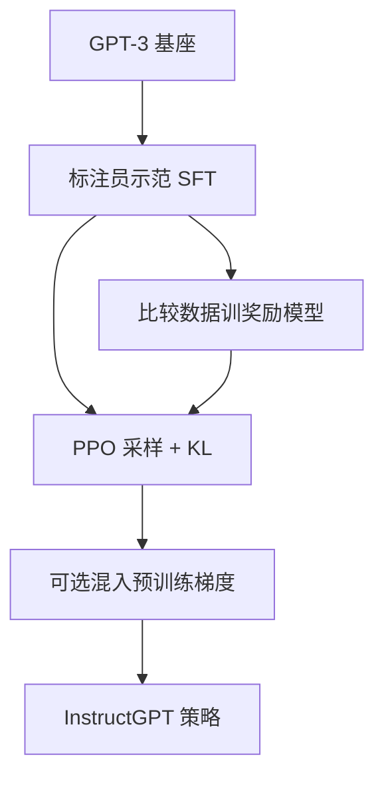

# InstructGPT

先用人类写的示范做监督微调，再在人类比较上训练奖励模型，最后用 PPO 在奖励上升的同时用 KL 把策略拴在微调模型附近。

<footer>—— Ouyang et al., Training language models to follow instructions with human feedback, NeurIPS 2022</footer>

Ouyang、Wu、Jiang 等人 2022 年的 InstructGPT 把 Christiano 式偏好强化学习接到 GPT-3 上，得到后来被称作 RLHF 的三阶段工序。预训练模型会续写互联网，不会自动按用户意图结束回合，也不会在有害请求上停住。作者雇佣标注员写示范、再对同一提示下的模型回答排序，依次训练 SFT、奖励模型、PPO 策略。最常被引用的结果不是某个学术基准创新高，而是：标注员更偏好 1.3B 的 InstructGPT，而不是 175B 的原始 GPT-3。本篇写这篇论文实际收了哪些数据、三个阶段各自优化什么、以及「对齐税」和 PPO-ptx 在原文里怎么处理。流程综述见 [RLHF](/llm/rlhf-pipeline)，PPO 实现见 [PPO](/llm/ppo-llm)。

## 问题

GPT-3 的训练目标是 $p(x_{t+1}\mid x_{\le t})$。用户在 API 里写的是请求（「总结下面这段」「用礼貌的语气写信」），不是网页前缀。零样本或少样本提示可以把部分请求改写成补全，但模型仍会跑题、编造、输出有害内容，并且对同一意图的不同措辞不稳定。微调一个专用头解决不了「所有 API 任务」，因为任务在提交时才出现。需要一种后训练：用人类反馈定义「怎样的完成算遵循指令」，再改策略分布。

人类无法为每个 token 写奖励，也无法穷尽所有提示。论文把反馈收成两类可操作的数据。示范：标注员按指南直接写一条合格回答，覆盖意图、格式、拒答。比较：同一提示下若干模型回答排序，只问相对好坏。前者适合把模型拉进可接受的语言区域，后者适合在已经会写的回答之间按偏好排序。缺少任一端，要么覆盖太窄，要么没有可优化的标量。

### 三个数据面不能共用一张表

示范供 SFT，比较供奖励模型，PPO 阶段的提示只有 $x$，回答由当前策略采样。把比较里的胜方再当 SFT，是拒绝采样，不是第三阶段。把示范直接标成奖励 1、其余 0，会毁掉成对信息。InstructGPT 原文把标注协议、来源和用途写清楚：示范与比较来自同一批受训标注员，但任务不同。API 真实提示被用于采样比较和 PPO，以保证后训练分布靠近产品，而不是靠近学术指令集。

论文里的人类数据不是产品 UI 上的五星。比较是相对的；绝对分数标定不是主损失。后来把「点赞点踩」直接当 RLHF，已经换了一套噪声模型。

## 方法

阶段一：在约一万三千条示范上做因果 LM，得到 $\pi_{\mathrm{SFT}}$。示范量远小于预训练，质量靠指南与标注员训练，不靠堆条数。阶段二：在成对（由排序拆出）数据上训奖励模型 $r_\phi$，采用 Bradley-Terry / Plackett-Luce：

$$
p(y_w\succ y_l\mid x)=\sigma\bigl(r_\phi(x,y_w)-r_\phi(x,y_l)\bigr).
$$

$r_\phi$ 通常在 SFT 初始化的模型上加标量头，对完整序列打分。论文中奖励模型可以小于策略：例如用 6B 的 RM 给 175B 的策略打分。阶段三：策略从 $\pi_{\mathrm{SFT}}$ 出发，对 RL 提示采样 $y$，用 $r_\phi$ 给序列打分，减去对参考策略的 KL，以 PPO 更新。参考 $\pi_{\mathrm{ref}}$ 冻结为 SFT。目标形如

$$
\max_\pi\;\mathbb{E}\bigl[r_\phi(x,y)\bigr]-\beta\,\mathrm{KL}\bigl(\pi(\cdot\mid x)\,\|\,\pi_{\mathrm{ref}}(\cdot\mid x)\bigr).
$$

PPO-ptx 是原文的配套技巧：在 PPO 梯度里混入预训练目标的梯度，减轻「对齐税」——指令模型在公开 NLP 基准上相对 GPT-3 的掉点。它承认偏好优化会挤占原分布的概率质量，要用显式的预训练项把一部分质量买回来。

### 1.3B 胜过 175B 测的是偏好，不是知识

标注员盲评：在 API 风格提示上，1.3B InstructGPT 的完成被更常选中，相对 175B GPT-3。这一结果被广泛转述成「对齐比规模更重要」。原文支持的更窄表述是：在「是否按指令作答、是否可读、是否少胡话」这一人类偏好上，后训练可以弥补两个数量级的参数差。它不支持「1.3B InstructGPT 的世界知识超过 175B GPT-3」。事实类、闭卷考试类基准上，规模仍然主导；论文也报告了公开 NLP 任务上的轻微回退，这正是对齐税。读这篇论文时要把偏好主指标和能力探针分开。

## 机制

SFT 把质量从「网页续写」挪到「提示后接助手完成」。它能教会格式、常用意图、以及指南里写过的拒答，但覆盖止于示范。奖励模型把成对选择收成标量 $r_\phi(x,y)$，PPO 再用该标量对策略做强化学习。KL 项防止策略为了抬奖励而离开 SFT 太远：奖励模型在分布外不可靠，过度优化会奖赏空洞套话、过度拒答或长度作弊。$\beta$ 与 PPO 裁剪共同限制步长。价值函数估优势，把稀疏的序列奖励分到 token 上；实现细节见 PPO 专文，InstructGPT 原文把这一套当成可运行的配方，而不是新的 RL 算法。

标注员指南是机制的一部分。什么叫有用、什么叫真实、什么叫无害，写进给标注员的说明，而不是写进可微损失。模型学到的是标注员在指南下的行为，包括他们的偏见和疲劳。论文报告了标注员与作者、标注员之间的一致性，用来标定奖励模型的天花板：RM 准确率不可能稳定超过人类一致性。安全与有害内容的改善是相对 GPT-3 的，不是绝对安全；真实性有提升，幻觉仍在。

InstructGPT 的 RM 吃的是模型回答之间的比较，不是人类示范对模型回答的比较为主。分布因此随策略迭代而变：新策略出新失败，比较集要跟上。原文已经是多轮收集，不是一次标注冻住。

### 奖励模型错指定会传进 PPO

BT 假设潜在分数差决定胜率。人类可能先看安全再看有用，可能被排版欺骗。残差被 $r_\phi$ 当成质量。PPO 优化的是这个错指定的标量，于是会出现奖励黑客：更长、更谄媚、更多免责声明。KL 与 ptx 是缓冲，不是诊断。论文用人类终评而不是 RM 分数来宣布成功，等于承认代理指标会偏。后来的 DPO 去掉显式 RM，并不自动去掉错指定——它只是把同一 BT 假设写到策略对数比上。

## 边界与工程取舍

InstructGPT 依赖受训标注员，成本高，且标注员不等于终端用户。API 提示偏编程与写作，迁移到其他产品域要重新采样。PPO 对语言模型又贵又脆：要同时驻留策略、参考、奖励、价值，要调采样温度、KL 系数、裁剪。原文能跑通，不表示这一套超参可直接抄到别的基座。1.3B 胜 175B 的偏好结果，在换了标注员群体或换了提示域之后不必成立。

论文没有解决监督的规模化。比较数据仍然要人看完整回答。Constitutional AI 与 RLAIF 后来用模型标注无害性，正是因为这条人标瓶颈，以及让标注员长期看有害文本的问题。InstructGPT 把有用、真实、无害缠在同一套人类反馈里，没有把无害性单独拆成可替换的宪法。它也不是指令数据合成方法：示范是人写的，Self-Instruct 与 Evol-Instruct 是另一条线。

把 InstructGPT 简化成「PPO 对齐了 GPT-3」会丢掉阶段一。没有 SFT，PPO 的参考分布不在助手区域，奖励模型见到的完成也更不像可排序的答案。原文的顺序是示范先、偏好后，强化学习最后。

## 小结

- InstructGPT 用示范 SFT、比较训 RM、PPO+KL 三阶段，把 GPT-3 改成指令模型。
- 主结果是人类偏好：1.3B 后训练模型可胜过 175B 基座的作答质量，不表示知识反超。
- 数据协议把示范、比较、RL 提示分开；API 提示用来贴近产品分布。
- PPO-ptx 混入预训练梯度，用来减轻公开基准上的对齐税。
- 奖励模型小于策略即可；KL 限制对 RM 的过度优化。
- 人标成本、PPO 脆性、有害性标注的负担，是后续 CAI / RLAIF / DPO 的入口。
- 出处：Ouyang et al., *Training language models to follow instructions with human feedback*, NeurIPS 2022。
