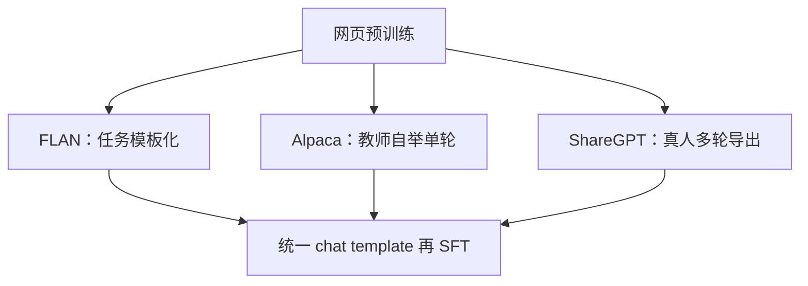

# FLAN / Alpaca / ShareGPT 谱系

指令微调的数据不是「更多网页」，而是把任务写成模型必须遵循的祈使句；谱系决定你在对齐格式、蒸馏教师，还是在模仿真实多轮。

<footer>—— 对照 Wei 等 FLAN（ICLR 2022）、Taori 等 Stanford Alpaca（2023）、Chiang 等 Vicuna 所用的 ShareGPT（2023）</footer>

[上一课](/llm/large-scale-failure-rate)把万卡训练的故障率收到工程账上：检查点、弹性、掉卡。本课打开新课程「微调、编辑与遗忘」：基座已经能稳定跑完，缺口变成**拿什么示范去改条件分布**。指令数据有三条至今仍在混用的谱系——把 NLP 任务模板化的 FLAN、用教师模型自举的 Alpaca、从真实 ChatGPT 导出多轮的 ShareGPT。它们不是同一张表的三个版本。后课默认已经分清这三条，再谈[仅回复损失](/llm/response-only-loss)与[chat template](/llm/chat-template)；不在这里重写 [LoRA](/llm/lora) 或[全参超参](/llm/full-sft-hparams)。

## 问题

预训练最大化网页上的 $p(x_{t+1}\mid x_{\le t})$，用户却把模型当「接到祈使句就应完成任务」的接口。缺口不是再堆 token，而是示范里**谁在下令、完成长什么样**。三种来源把这件事做成三种函数。

FLAN（Wei 等人，ICLR 2022）把已有监督任务写成统一指令，训练零样本迁移：见过「翻译成德语」就要会「翻译成罗马尼亚语」。Alpaca（Taori 等人，2023）走 [Self-Instruct](/llm/self-instruct)：用 text-davinci-003 从 175 条种子扩到 5.2 万，学生是 LLaMA 7B。ShareGPT 是用户把 ChatGPT 对话点分享后的导出，Vicuna（Chiang 等人，2023）用约 7 万轮多轮对话微调。混用而不标明谱系，等于把任务网格、教师蒸馏和真人多轮当成可互换的 epoch。

### 谱系决定你在优化哪一个条件

FLAN 的条件是「任务名 + 输入」；完成往往短、可自动评分。Alpaca 的条件是单轮 `Instruction` / `Input` / `Response`，完成口吻像教师模型。ShareGPT 的条件是带角色交替的长前缀，完成必须接得上上一轮助手。三者的最优[模板](/llm/chat-template)不同；用 FLAN 表训完却用 ChatML 推理，是谱系被格式抹平后的错位，不是学习率问题。

Chung 等人把 FLAN 扩到 FLAN-T5 / FLAN-PaLM（JMLR 2024）：主张是任务数目与模板多样性在扩，不是把 ShareGPT 式闲聊写进 T5。Alpaca 论文自己写明数据来自专有教师，许可与泄漏是后话，但方法定位是蒸馏，不是「开源指令的第一性原理」。

## 方法

选型先问产品接口，再问表。要零样本任务迁移、有标准答案：优先 FLAN 族与 Super-NaturalInstructions 一类网格，模板与评测一致。要廉价覆盖用户动词、接受教师腔：Self-Instruct / Alpaca，并记录教师型号与过滤阈值。要多轮、工具穿插、真人跑题：ShareGPT 及后续清洗版，但必须按[对话模板](/llm/chat-template)重渲染，不能把导出的 Markdown 直接当 token。

混合可以，但要当**配比**写进配方，而不是 concat 后假装同质。常见配比是：网格任务保技能、精选人或 [LIMA](/llm/lima) 式示范定口吻、少量多轮教指代。Ouyang 等人的 [InstructGPT](/llm/instructgpt) 用人写示范做 SFT，再进 RLHF；开源谱系常把这一段换成合成或导出，省标注、买偏差。

过滤按谱系分叉。FLAN 查标签与输入是否匹配。Alpaca 查与种子的近重复、空输出、指令–回答矛盾。ShareGPT 查角色字段是否完整、是否把系统提示或工具 JSON 糊进用户段、是否含评测泄漏。条数不是质量；未过滤的 10 万轮可以比 1 万清洗轮更毁格式。

## 机制

SFT 学的是渲染后前缀上的条件分布。FLAN 把「任务说明」变成高频前缀，模型学会把说明当程序；未见任务靠说明里的动词泛化，这是 Wei 等人零样本主张的机制。Alpaca 把教师的完成风格写入学生：短列表、客套结尾、拒绝模式都可能是教师的，不是用户的。ShareGPT 把长上下文里的指代与修正写进注意力：用户说「改成更短」，模型必须绑定上一轮答案。三种机制对[仅回复损失](/llm/response-only-loss)的敏感点不同——网格任务漏掩码会背题面；多轮漏掩码会模仿用户。

后课用到的约定：说到「Alpaca 格式」指单轮 Instruction 字段；说到「对话 SFT」指消息列表经 chat template 渲染。不要用「指令数据」一词同时覆盖三者。

## 边界与工程取舍

谱系不是时间线上的淘汰。2024 年以后的配方仍在混：数学用网格与合成解答，助手口吻用精选对话，工具用协议化轨迹。边界是：教师蒸馏继承教师的安全与谄媚；导出对话继承 UI 与隐私；任务网格几乎不教多轮。许可上，Alpaca 与早期 ShareGPT 都不能当「可商用金标准」。评测上，MMLU 偏 FLAN 族，人评开放生成偏 ShareGPT / LIMA 族；只报其中一个，会选出错误配比。

全参还是 [LoRA](/llm/lora) 不改变谱系选择；只改变你敢用多脏的数据——适配器过拟合脏多轮更快。超参见[全参学习率与批次](/llm/full-sft-hparams)，本课不扫 $\eta$。

## 小结

- 指令数据有三条谱系：FLAN 任务网格、Alpaca 式教师自举、ShareGPT 式真人多轮。
- 谱系决定条件前缀与最优模板；混用必须写成配比。
- FLAN 优化零样本任务迁移；Alpaca 蒸馏教师腔；ShareGPT 教多轮指代。
- 过滤、许可、评测轴都随谱系变，不能只比条数。
- 后课默认已分清谱系，再谈损失掩码与打包。
- 出处：Wei 等，FLAN，ICLR 2022；Chung 等，Scaling Instruction-Finetuned LMs，JMLR 2024；Taori 等，Stanford Alpaca，2023；Chiang 等，Vicuna / ShareGPT，2023。
