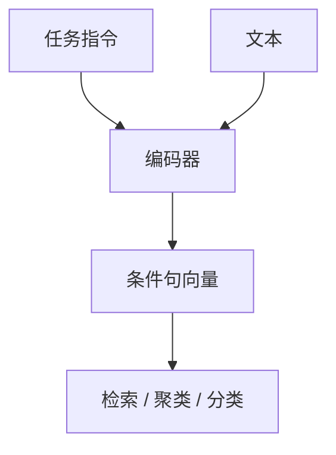
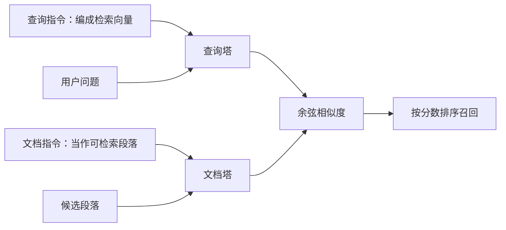

# 指令嵌入

同一句话，用作检索查询、用作要被检索的文档、用作聚类对象，需要的向量不同。把任务写成前缀指令，嵌入模型才知道该挤出哪一种语义。

<footer>—— Su 等 INSTRUCTOR；后续 E5-Mistral / 指令式检索模型同一接口</footer>

[上一课](/llm/matryoshka-embeddings)把维数当预算。还剩条件：双塔若永远用同一编码器无前缀，查询与文档、对称相似与非对称检索会互相伤害。本课写指令嵌入。缺口是任务条件化。后课多向量默认单向量已经按指令对齐，仍不够时再上晚交互。

## 问题

「苹果」在新闻检索、产品搜索、聚类里应靠近不同的邻居。无指令的句向量只能学一个折中空间。Su 等人的 INSTRUCTOR 把自然语言指令拼在文本前，训练时覆盖检索、分类、聚类等任务，推理时改指令即改几何。查询侧指令（「把这个问题编成检索向量」）与文档侧指令（「把这段当成可检索段落」）可以不对称，这正是非对称检索需要的。

术语翻译：「任务条件化」就是给编码器一句口头说明——这次要为什么目的算向量。同一句「苹果发布会」，配上「为产品检索编码」会靠近手机词条，配上「为新闻主题聚类编码」会靠近科技事件。模型没换，换的是被指令拉出来的那块几何。

与生成式指令微调同构，但损失仍是对比，不是下一词。不要把 LLM 聊天模板原样套到嵌入模型上而不做对比训练。

指令是条件，不是第二个要交叉注意的句子。池化发生在「指令+文本」的整段双向表示上，见池化课。

## 方法

训练数据要带任务指令，覆盖目标用例；指令多样性不足时，模型只学会几个模板。评测用 [MTEB](/llm/mteb) 时，必须用该任务官方指令，否则与别人的分数不可比。部署：查询实时加指令，文档侧指令在建索引时写入——改指令等于重建索引。

数字实例：文档指令随向量存进索引，1 亿条文档、每条重嵌入按 1 毫秒算，换一次文档指令就是约 27.8 小时的纯计算，外加一遍存储重写；查询指令则每条请求实时拼上，零存量成本。所以「指令版本化」省的不是分数，是重算索引的钱。

```mermaid
flowchart TD
  INST["任务指令"] --> ENC["编码器"]
  TXT["文本"] --> ENC
  ENC --> Z["条件句向量"]
  Z --> TASK["检索 / 聚类 / 分类"]
```

## 机制

指令 token 改变注意力下的汇聚：检索指令强调可匹配的关键约束，聚类指令强调主题，分类指令强调标签相关特征。对比损失把同一指令下的正对拉近。跨指令的几何不必连续——不要假设「改几个字指令」向量只小幅移动。因此指令要版本化，像聊天模板一样冻结。

```mermaid
flowchart LR
  QI["查询指令：编成检索向量"] --> QE["查询塔"]
  QT["用户问题"] --> QE
  DI["文档指令：当作可检索段落"] --> DE["文档塔"]
  DT["候选段落"] --> DE
  QE --> COS["余弦相似度"]
  DE --> COS
  COS --> RANK["按分数排序召回"]
```

常见误区：以为指令只是「多拼几个前缀 token」、向量八九不离十。实际上指令参与整段双向注意力与池化，会系统性搬动向量的位置；「检索」与「聚类」两条指令下同一句话的向量可以差很远，分数不在同一场比赛里。所以换了指令，就得重新校准阈值。

## 边界

指令不能替代相关性标注：再好的前缀也救不了假正例。超长指令会占掉文档有效长度。下一课多向量与晚交互：单向量条件化之后，仍需要 token 级交互的任务。

## 小结

- 指令前缀让同一编码器服务多种度量任务，查询/文档可非对称。
- 改文档指令必须重建索引；评测锁官方指令。
- 损失仍是对比，不是聊天 SFT。
- 出处：Su 等 INSTRUCTOR；E5-Mistral 等指令检索模型。
