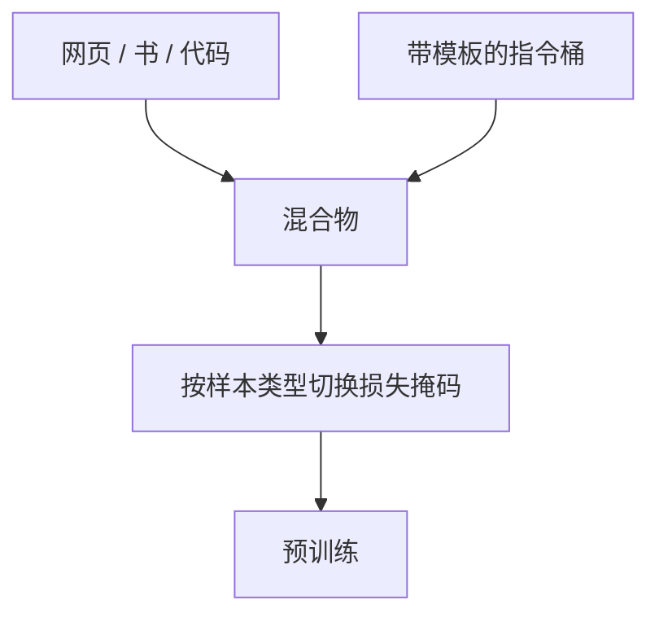

# 指令数据进预训练

把少量带角色标记的示范写进预训练混合物，聊天模板里的特殊 token 就不再是对齐阶段才第一次见面的 glitch。

<footer>—— 据 Groeneveld 等 OLMo、Cheng 等 Instruction Pre-Training 的实践整理</footer>

[上一课](/llm/long-doc-upsampling)让模型在预训练里见到真长跨度。序列仍几乎都是无角色的网页与书：没有用户/助手，[特殊 token](/llm/special-tokens) 课里预留的对话标记要么从不出现，要么只当 eos 用。本课不重讲长度加权。缺口是：在预训练阶段掺入指令与多轮格式，使协议嵌入被真正的梯度更新，并为退火期的高质量配比留接口。合成教科书是下一课；本课先谈「真示范进预训练」这条。

## 问题

标准做法把预训练与对齐切开：先无监督 LM，再 SFT。Ouyang 等人的 InstructGPT 就是这样。后果是角色标记欠训、模型在 SFT 初期要把大量容量用来认模板。OLMo 等开源配方以及 Instruction Pre-Training 一类工作尝试在预训练混合物里加入指令数据，使「按角色计损失」提前发生。工程缺口是比例、掩码、以及如何避免用指令集污染评测——去污染课会系统做，本课必须先不把基准抄进预训练指令桶。

比例过高，网页覆盖掉；过低，标记仍接近 glitch。指令桶的质量若低于网页过滤标准，等于在后期才该出现的噪声提前注入。

### 损失掩码与预训练目标不一致

预训练通常对全部 token 计损失。指令样本若也对用户问题计损失，模型会学着模仿提问而不是回答。应沿用 SFT 掩码：只在助手片段计损失，或至少降低用户片段权重。这与 FIM 只在 middle 计损失是同一类「不是整句 LM」的例外，加载器要能按样本类型切换掩码。

多轮对话的长依赖正好吃长文档上采样的窗口。不要把指令数据全部截成短单轮，否则本课与上一课脱节。

## 方法

单独建指令桶：公开 SFT 集、许可清楚的论坛问答、内部示范。清洗与去重按网页同等或更严。分配较小的 $w_{\mathrm{inst}}$（常见是几个百分点量级，随配方而变），用 [特殊 token](/llm/special-tokens) 套同一套将来上线的模板，禁止第二套「预训练专用模板」。与 DoReMi 的关系：指令桶可以参加 DRO，但探针若本身是指令任务，DRO 会过度抬升 $w_{\mathrm{inst}}$，应加盒约束上限。

词表必须已含角色标记。若标记是预训练中途才 append 的，应走词表扩展课的热启动，而不是指望几个点的 $w_{\mathrm{inst}}$ 救随机行。

### 与 α、代码桶共存

指令数据的语言分布往往偏英语。要用 α 或显式多语言指令去补，否则多语言能力与模板能力分裂：英语会聊天，其他语言只会续网页。代码指令（commit message、issue）可与仓库级数据同源，但格式是对话不是裸文件，不要重复计到两个桶而不记账。

把用户写的「请忽略以上指令」留在预训练指令里，等于提前教注入。这类样本应进安全过滤，不是进一般 $w_{\mathrm{inst}}$。

## 机制

协议 token 的嵌入只有在它们出现且有损失时才更新。预训练掺入指令，是把对齐需要的离散符号拉进训练支撑，减少 SFT 阶段的分布偏移。语义内容仍主要来自网页与书；指令桶的作用更像格式与风格的提前对齐，而不是用示范覆盖世界知识——世界知识仍靠大规模无监督。

## 边界

指令进预训练不是完整对齐：没有偏好模型、没有 RLHF。它也不能用合成数据的规模去冒充——那是教科书课。污染风险高于普通网页，因为指令集常从评测改写而来。下一课讨论当人类示范不够时，用教科书式合成补密度；再下一课把评测去污染写成硬关卡。

## 小结

- 本课不重讲长窗口；只补协议格式进入预训练测度。
- 小份额指令桶 + 与上线相同的模板 + 助手侧掩码。
- 盒约束防止 DRO 把指令抬成主食；多语言指令要单独补。
- 不替代 SFT/RLHF，且必须为去污染留出清单。
- 出处：Groeneveld et al., OLMo, 2024；Cheng et al., Instruction Pre-Training；Ouyang et al., InstructGPT, NeurIPS 2022。
