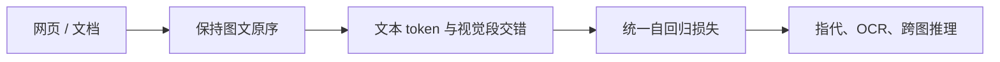

# 多模态交错训练

网页本来就是图文交错的；把它们拆成「一张图一段说明」再训练，是在丢弃文档自己的阅读顺序。

<footer>—— 归纳自 Flamingo、Chameleon 与 Qwen2.5-VL 的数据叙述</footer>

多模态训练最常见的样本是图文对：一张图，一段对齐描述。这对字幕和检索有效，却不像人读书、看帖、看论文：图像嵌在句子中间，后文引用前文的图，图与图之间隔着论证。交错训练（interleaved multimodal training）把样本写成模态符号的序列——文本 token 与视觉（或音频）块按原文档顺序排成一条，用同一个语言模型目标预测文本，有时也预测离散图像 token。Flamingo 用交错数据加门控交叉注意力读图。Chameleon 把图像也离散化，早期融合进统一 Transformer。Qwen2.5-VL 的预训练语料明确包含 interleaved image-text，而不是只有成对字幕。本篇讲交错作为数据与注意力的归纳偏置，不把任意多模态产品都称为交错模型。

## 问题

成对数据的条件是 $p(y_{\mathrm{cap}}\mid I)$，图在前、文在后，或文在前当检索。交错文档写成一条混合序列 $z_{1:n}$，文本与视觉块按原序排列，自回归目标是

$$
p(y_t\mid y_{<t}, I_{\le t}),
$$

即生成到某一句时，可见的图是「到目前为止出现过的图」，而不是永远看见全部图或永远只看见一张封面。若训练从不出现这种条件，推理时用户说「上面那张表的第三列」会找不到指代对象——模型没有学过「上面」在交错序列里的绑定。

成对训练还有统计偏差：字幕短、物体中心、少OCR。网页交错数据含表格、meme、教程截图和长论证，OCR 与指代更密集。Qwen2.5-VL 把预训练从约 1.2T 扩到约 4T token，并列举 image captions、interleaved image-text、OCR 等来源，交错是体量的一部分，不是装饰。

### 拆开网页等于改写监督

从 HTML 抽「主图 + 标题」会丢掉图序和附近的句子。剩余的标题像字幕，模型以为世界总是一图一文。交错保存 $\ldots$ 文本、图、文本、图 $\ldots$ 的顺序，监督信号变成：在这些已出现的视觉块条件下写下一句。这与语言模型在纯文本里学指代是同一机制，只是先行词有时是图像 token 段。

交错不是把所有图拼成一张拼贴画。拼贴破坏阅读顺序和相对位置；交错保留「第几张图出现在第几个词之后」。位置编码必须允许视觉段插入后，后续文本的下标继续递增，而不能每张图都从零编号。

## 方法

Flamingo 冻结大语言模型与视觉编码器，用 perceiver 压缩视觉，再以门控交叉注意力插入 LLM 层，数据含交错图文。交叉注意力让文本查询读图像记忆，门控在训练初期保护语言能力。Chameleon 走早期融合：图像 VQ token 与文本 token 进入同一自注意力，没有单独的交叉注意力槽；交错是序列的自然形态，模型甚至可以在图文混合词表上生成图像码。代价是要训练离散视觉码本，且生成图像与理解图像共享同一套量化误差。

Qwen2.5-VL 类模型通常仍是「视觉编码器 + 投影 + LLM 自注意力」：图像被编码成一段视觉 token，插入到聊天模板里对应占位符的位置。交错文档则在一条样本里插入多段视觉 token，中间夹文本。自注意力同时看见多图与文字，不必为每张图单独开交叉注意力层。这与 Flamingo 的架构不同，但数据假设相同：多图共现、有序、可指代。

### 损失落在哪里

多数理解模型只对文本 token 计损失，视觉 token 当条件不预测。交错因此主要教「在图后写字」，不教「在字后画图」。Chameleon 对图像码也计损失，才能图文混生。Qwen 的 Omni 生成语音走 Talker，不走视觉码预测。讨论交错训练时要问损失掩码：只掩文本，则交错强化的是条件语言，不是任何模态的生成。

视觉段长度远大于句子时，交错样本会变成「偶尔夹几个字的图墙」，文本梯度稀疏。需要截断、降分辨率、或限制每样本图数。Qwen 视觉侧的动态分辨率与 patch merge，部分是为让交错样本在上下文窗口里塞得下第二张图。

## 机制

交错把跨图指代变成注意力距离问题。「见图 2」对应的视觉段可能在数百 token 之前，需要足够的全局注意力或周期性全注意力，否则指代落到最近一张图——典型的 recency bias。Flamingo 的交叉注意力每次读全部视觉记忆，指代路径更短，但图多时记忆长度 $m$ 变大。纯自注意力拼串则 $n$ 变大。两种实现都在为交错付平方代价，只是平方的轴不同。

训练初期若交错比例过高，语言建模被视觉噪声打乱，出现所谓模态退化。Qwen3-Omni 强调从预训练早期就混合单模态与跨模态数据，并追求相对同尺寸单模态模型不退化。交错是跨模态数据的一种排版，不是全部。纯文本、成对字幕、交错网页、音视频要按比例调度，否则「会指代」以「不会写代码」为代价。

Chameleon 论文展示早期融合的统一离散空间；Flamingo 展示冻结 LLM 加轻量交叉注意即可读交错数据。Qwen2.5-VL 走动态分辨率编码器插入 LLM。三条线都吃交错数据，但不可把论文结构画成同一张图。

### 与 OCR、视频的关系

文档 OCR 的多页输入是交错的特例：页图与「第 n 页」文本交替。若只做单页成对，跨页表格学不会。视频在某种意义上是时间维交错：帧段与字幕、ASR 文本交错。Qwen2.5-VL 预训练列举 OCR 与 interleaved 为不同来源，说明版式文档和网页图文要分开采集，尽管序列格式相似。网页 meme 的图文关系和扫描 PDF 的阅读顺序，统计结构不同，不能指望一种交错数据覆盖两种任务。

## 边界与工程取舍

版权与噪声：交错网页含乱码图、装饰图、广告。没有过滤的交错会教模型引用无关图。过滤过狠又退回成对字幕。需要图文相关性启发式，而不是「凡 HTML 皆样本」。

推理接口若只允许单图，训练时的交错能力用不上。产品要在消息列表里支持多图穿插，且位置编码与训练一致。用户把三张图全堆在消息开头再写一段话，与「图、字、图、字」的训练分布仍有隙，但比永远单图近。音频、视频再插入时，交错变成多模态真正的时间线，位置编码必须切换到 MRoPE/TM-RoPE，否则「上面那张图」和「刚才那句话」抢同一套 1D 下标。

交错训练不自动提供引用可靠性。模型可以在正确的图段上生成错误的数字。文档 AI 仍要结构化任务模板与校验；交错只提供指代与上下文，不提供事实保证。

## 小结

- 交错训练按原文档顺序排列文本与视觉块，使条件变成「已出现的图 + 已写的字」，从而学习跨图指代与版式阅读。
- 成对字幕覆盖短描述；交错网页与文档覆盖 OCR、表格和论证中的插图。
- Flamingo 用门控交叉注意力读交错视觉记忆；Chameleon 用早期融合离散码；Qwen2.5-VL 用多段视觉 token 插入自注意力。
- 损失通常只落在文本；是否预测图像码决定模型能不能混生。
- 模态比例、上下文里的图墙、以及推理接口是否允许多图穿插，决定交错能力能否落地。
- 出处：Alayrac 等，Flamingo，NeurIPS 2022；Chameleon Team，Chameleon；Qwen2.5-VL 技术报告（arXiv:2502.13923）预训练数据中的 interleaved image-text。全模态混合见 Qwen3-Omni（arXiv:2509.17765）。
