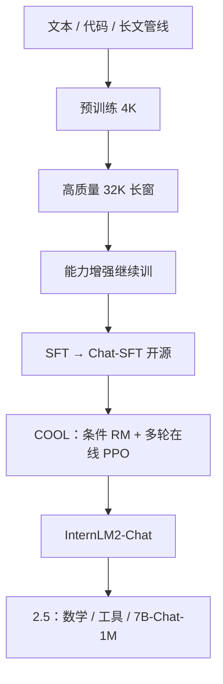

# InternLM2 / InternLM2.5

    
预训练把 4K 拉到 32K，对齐用带条件的在线 RLHF 调和冲突偏好；2.5 再把推理加厚、把对话窗口推到 1M，并加强工具使用。

    <footer>—— Cai 等，InternLM2 Technical Report，arXiv:2403.17297；InternLM2.5 以上海 AI Lab 模型卡与开源说明为准（2024-07 起）</footer>

InternLM2 是上海人工智能实验室联合团队 2024 年 3 月的开源一代：**1.8B / 7B / 20B**，并放出 SFT 后、RLHF 后两个聊天检查点，便于看对齐差分。结构跟 Llama 系兼容（RMSNorm、SwiGLU），全系列 [GQA](/llm/gqa) 以降低长推理 KV；预训练详述文本 / 代码 / 长文如何准备；对齐提出 **COOL RLHF**（Conditional Online RLHF）。长上下文：先 4K 再 32K，配合位置外推，NIAH 做到 **200K**。InternLM2.5（2024 年 7–8 月开源 1.8B/7B/20B）**没有**与 2403.17297 对等的综合 arXiv，官方模型卡主张：推理尤其是数学大幅提升、**7B-Chat-1M**、更强工具调用（可检索上百网页，MindSearch / Lagent）。本篇写 2 的报告贡献，并单独标明 2.5 只引用模型卡，不为 2.5 伪造总报告编号。

## 问题

开源模型要同时交出客观六维约 30 个基准、长上下文、以及开放对话的主观体验。只堆预训练 token，聊天仍可能不跟指令、不跟人类价值；只用 SFT，冲突偏好（有用 vs 无害、简短 vs 详尽）会让单一奖励模型左右摇。长窗口若只在推理外推、预训练从未见过 32K 高质量长文，200K 针测会先于真实长文档 QA 崩掉。

工程上，千卡训练的通信与长序列显存是另一条问题：报告因此先写 InternEvo（数据/张量/序列/流水并行、ZeRO、FlashAttention、自适应切分与故障恢复），再写模型。QKV 融合能加速，但朴素把 Wq/Wk/Wv 沿第一维叠起来，改 tensor parallel 度时切分复杂。需要一种交错布局，使 TP 变成沿最后一维切或拼。

2.5 面对的产品缺口更具体：2 的数学仍不够、200K 对「整本书 + 多步智能体」仍紧、工具调用的选工具与反思弱。这些是模型卡叙事，不是 2 的论文章节。

### 放出 SFT 与 Chat 两份权重

COOL 的效果若只给最终 Chat，社区无法把「条件奖励」和「多轮在线 PPO」从普通 RLHF 里拆开。InternLM2 明确发布 `InternLM2-Chat-{size}-SFT` 与 RL 后版本，让主观分差可以对照。

InternLM2 的 200K 是针测外推能力，不是默认训练长度 200K。训练主长度是 4K 再 32K。2.5 的 1M 只保证在 Chat-1M 检查点上，且官方推荐 LMDeploy 推理。

## 方法

预训练数据按来源分成中英网页、书籍、论文专利等，网页占字节的大头，书籍与科技文献平均更长、质量更高。管线：格式化 → 规则清洗 → MinHash 去重 → 安全（域名/词/毒性/色情等）→ 分源质量过滤（广告、流畅度分类器等）。代码与长文另有专节：长文用于第二阶段 32K。分词与超参见报告；预训练阶段包括 4K、长上下文 32K、以及能力增强继续训。

结构：合并 Wqkv 使预训练加速超过 5%；矩阵按头交错 Q/K/V，改 TP 时沿最后维切即可。全系列 GQA，服务 32K 以上更省 KV。

### COOL RLHF

监督微调之后，奖励模型是**条件的**：输入不仅是对话，还有偏好条件（例如更强调无害或更强调有用），用来调和互相冲突的人类标注，而不是训两个互打的 RM。在线 RLHF 多轮做 PPO：每一阶段出现的奖励黑客（钻 RM 空子的句式）在下一轮用新数据压下去，而不是一次 PPO 到底。报告称这显著抬高中英主观对话与指令遵循；并做了条件 RM 的消融。长上下文在 SFT/RL 阶段也构造 32K 数据，与预训练长窗衔接。工具增强是 2 报告里已有的一章，2.5 模型卡把它写成可搜 100+ 页面的产品能力。

InternLM2.5 方法层公开信息较薄：在 2 的基座上用通用域 + 领域增强继续预训练；Chat 再 SFT + 在线 RLHF。数学分数相对 2 大幅上升（官方称部分设定约一倍量级，须看具体表）。7B-Chat-1M 用合成长数据减轻域偏移，针测 1M，LongBench 同尺寸对比领先（模型卡口径）。工具侧强调遵从、选工具、反思，配套 MindSearch。

## 机制

GQA 让 decode 的 KV 按 KV 头数增长，200K 外推在内存上才谈得上；位置外推（报告引用开源实践）把 32K 训练撑到 200K 针测，机制与 [位置外推](/llm/position-extrapolation) 同类，InternLM2 的贡献是**全阶段都准备长数据**（预训练、SFT、RL），而不是只改推理公式。交错 Wqkv 不改变数学，改变的是切 TP 时要不要做复杂 gather——这是千卡训练的实现贡献。

### 条件奖励只在训练图里

条件 RM 把「偏好哪一轴」从隐藏的标注噪声里提出来：同一对回复在「无害」条件下排序可以反转。多轮在线 PPO 承认 RM 会过时：策略一旦开始重复安全套话骗分，就需要新的人类或模型标注更新 RM。这与后来纯结果奖励的推理 RL 不同，COOL 仍是人类反馈闭环。开源 Chat 模板若没有条件字段，用户不能在推理时切换轴，条件只存在于训练。

### 2.5 增量以模型卡为界

2.5 的 1M 在模型卡里强调合成长数据防域偏移，与 Qwen2.5-1M 报告里「自然长文远距弱、要合成」是同一类观察，但 InternLM **未**公开对等的 DCA/MInference 配方，推理侧指向 LMDeploy。数学提升来自领域增强语料与对齐，细节以模型卡评测表为准，不要把 InternLM-Math 或 StepProver（arXiv:2410.15700）的 Lean 搜索写进通用 2.5 Chat。工具「可搜一百页」是智能体系统（MindSearch）与模型遵从的组合，不是 2 论文里的新注意力。

InternEvo 在 1024 卡、全局 batch 不变时仍报 53% MFU，长序列 256K 训练 7B 报约 88% MFU。这些是框架数字，不能当成 Chat 模型的推理吞吐。

## 边界与工程取舍

InternLM2 报告很长，但 MoE、MLA 不是该代内容。200K 针测满分不等于 LongBench 任务满分；2.5-1M 同理。COOL 的条件标签若在开源 Chat 模板里未暴露，用户无法在推理时切换「无害/有用」条件——条件可能只存在于训练。2.5 无综合技术报告，1M 的位置编码、稀疏注意力、是否 YaRN 均不可臆造。StepProver 是定理证明专线，另文。

许可与下载以 Hugging Face / ModelScope / OpenXLab 当时页面为准。评测用 OpenCompass 是实验室自己的体系，与第三方表对比要声明协议。

1.8B 与 20B 不要共用 7B-Chat-1M 的窗口故事。1M 权重是 7B Chat 的一条支线。

## 小结

- InternLM2：1.8B/7B/20B，GQA、融合交错 QKV、4K→32K 预训练，针测 200K；对齐为 SFT + COOL RLHF，并开源 SFT/Chat 两阶段。
- 预训练贡献是公开的文本/代码/长文制备与 InternEvo 训练栈。
- InternLM2.5：模型卡主张数学推理、工具与 7B-Chat-1M；无与 2403.17297 对等的综合 arXiv。
- 不要把 Lean StepProver 或未公开的 1M 核写成 2.5 通用论文贡献。
- 出处：Cai 等，*InternLM2 Technical Report*，arXiv:2403.17297，2024；InternLM 模型卡 *InternLM2.5*（2024-07-03 起）。StepProver 见 Wu 等，arXiv:2410.15700。
