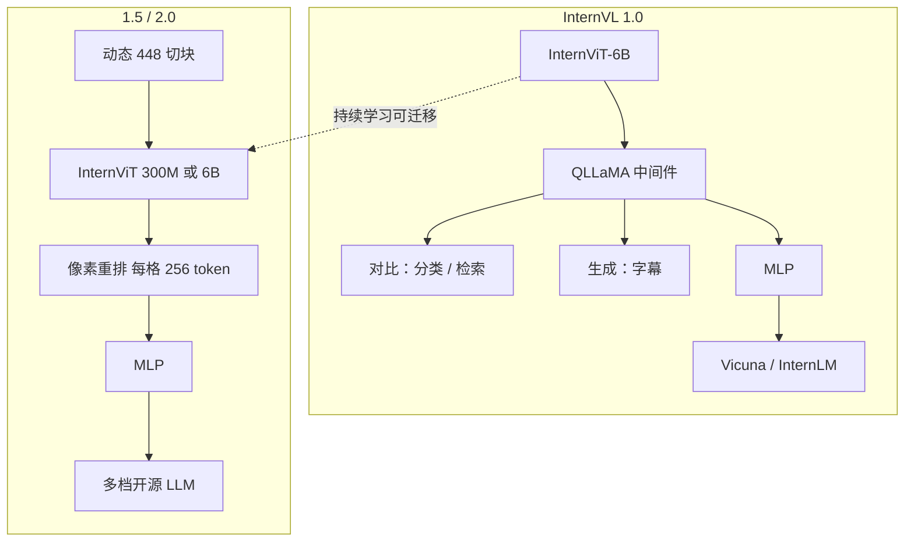

# InternVL / InternVL2

先把视觉基础模型做到 6B 并可迁移，再按长宽比切 448 格把分辨率变成上下文；2.0 把同一套管线接到从端侧到 70B 的多种 LLM。

<footer>—— Chen 等，InternVL，CVPR 2024；OpenGVLab InternVL 2.0</footer>

上海人工智能实验室 OpenGVLab 的 InternVL 线要回答的，不是又一个聊天投影器，而是：**视觉塔能否做成像 LLM 那样可复用的基础模型**。2023 年末的 InternVL 1.0（Chen 等，arXiv:2312.14238，CVPR 2024）把 InternViT-6B 与语言中间件 QLLaMA 对齐到网页级图文，覆盖分类、检索、对话等 32 项通用视觉–语言基准，并主张可替代当时的 ViT-22B 级视觉塔。2024 年 4 月的 InternVL 1.5（*How Far Are We to GPT-4V?*，arXiv:2404.16821）加上持续学习、动态高分辨率与中英双语数据。2024 年 7 月的 **InternVL2** 没有单独长篇 arXiv，而是把 1.5 的切块配方接到 1B–76B 多档 LLM。2.0 规格见 [InternVL2](/llm/internvl2)；本篇写 1.0 / 1.5 原文与 2.0 如何坐在它们上面，不把 2.5 / 3 的编码器升级倒填。

## 问题

2023 年 LLM 已经到 10B–70B，开源视觉编码器仍停在百兆到 1B 量级的 CLIP 变体。多模态 AGI 缺的是能跟上语言容量的视觉基础模型：要能做像素级感知，也要能接到现成 LLM 上对话。轻量 Q-Former 或线性层当胶水，参数太少，冻住 LLM 时对话上不去；完全端到端重训又浪费已有语言权重。InternVL 1.0 的问题是：能否把 ViT 做到 6B，再用一个**足够大**的语言中间件做对齐，使视觉特征空间与现成 LLM 一致，从而分类、检索、生成共用一座视觉塔。

1.5 面对的产品缺口更具体：开源模型文档 OCR 掉字、中文弱、分辨率锁在 224/336。需要在不重做 6B 塔的前提下，把输入抬到 4K 量级，并用双语问答把 OCR 与中文拉上来。2.0 的缺口则是部署谱：同一套切块能否覆盖端侧 1B 与云端 70B。

### 6B 视觉塔加 8B 中间件，而不是一层 MLP

InternViT-6B 是为性能–效率折中定制的 ViT。QLLaMA 约 8B，从多语增强 LLaMA（Cui 等）初始化，新加 96 个可学习 query 与交叉注意力（约 1B 随机初始化）。相对 Q-Former，中间件大四十倍量级，且自带多语文本表示：既能做图文对比学习（InternVL-C / InternVL-G 两种推理），也能当生成式前缀做字幕，还能冻住 Vicuna / InternLM 只训 MLP 就做对话。这是 1.0 相对「CLIP + 线性层」的结构差。

QLLaMA 不是用户推理时必须跑的 8B 聊天模型。对话形态里它是胶水：视觉 token 经它对齐后再进 Vicuna。1.5 / 2.0 文档主路径改成 InternViT + 像素重排 + 两层 MLP + LLM，中间件配方被更轻的投影取代，但 6B 塔的可迁移性是 1.0 训出来的。

## 方法

1.0 分阶段。对比学习阶段用约 49.8 亿级图文把 InternViT 拉成视觉基础模型。生成阶段把 InternViT 与 QLLaMA 冻住，只训新 query 与交叉注意力，数据滤到约 10.3 亿高质量字幕，损失为 ITC + ITM + ITG（BLIP-2 同类）。对话阶段经 MLP 接 Vicuna-7B/13B 等，约 400 万指令；因特征空间已接近 LLM，可冻解码器只训 MLP，或解冻 QLLaMA。对比推理：InternVL-C 用 ViT 侧全局特征，InternVL-G 用 QLLaMA query 特征，文本取 QLLaMA 的 [EOS]。

### 1.5 的三条改进与 2.0 的多底座复制

1.5 三条：(1) 对 InternViT-6B 持续学习，使同一塔可接到不同 LLM；(2) **动态高分辨率**：按长宽比把图切成 1 到 40 个 $448\times 448$ 格，训练最多约 12 格，测试可到 40 格（文档称 4K）；(3) 高质量中英双语数据，覆盖自然图与文档，显著抬 OCR 与中文。像素重排把每格 1024 patch 收到 256 token。2.0 把这一配方复制到多语言骨干：小档 InternViT-300M + Qwen2 / InternLM / Phi-3；26B 及以上接 InternViT-6B-V1-5 + InternLM-20B / Yi-34B / Llama-3-70B 系。各档表见 InternVL2 专文。2.0 没有新的视觉定律，也没有 2024 年 7 月的独立 arXiv。

测试期 40 格是延迟旋钮，不是训练见过 40 格的保证。服务必须按最坏格数预留 KV。BNB 4-bit 量化在 InternViT-6B 上官方不建议：视觉侧误差会让模型「看不见」。博客里的 InternVL2-108B 与文档主表 1B–76B 不要混成同一天下载集合。

## 机制

1.0 的机制是**表示对齐先于对话**。6B ViT 先在对比目标上学会可检索的视觉空间；QLLaMA 用 LLM 初始化的语言空间去读这些视觉 token，所以后续接 Vicuna 时特征已经在附近，冻 LLM 仍能对话。这与 LLaVA 式「随机投影 + 全参 SFT」相反：InternVL 把贵的对齐算力花在中间件和视觉塔上，聊天只是最后一跳。1.5 的切块机制与 AnyRes 同类：编码器权重与 448 边长不变，细字靠更多原生窗口；像素重排是格内压缩，信息仍在，LLM 看到的是下采样网格。持续学习让 6B 塔在换 LLM 时不必从 CLIP 再训一遍。

2.0 换语言骨干不等于换视觉能力。300M 与 6B 编码器的表示密度不同：小档能跑在端侧，文档上限仍受视觉塔约束；76B 档的增益大量来自 70B 级世界知识。OpenCompass 一类综合分把两者混在一起，不能单独证明「切块算法赢了」。中英双语是 1.5 的数据主张，2.0 继承；小语种 OCR 没有同等保证。

### 和 Qwen-VL、PaliGemma 的分辨率合同不同

Qwen2-VL 的原生动态分辨率按原图像素切 patch，不一定先缩进 448 格。[PaliGemma](/llm/paligemma) 把图缩到固定 224/448/896 方图，token 数固定。InternVL 对「已经有固定 448 的 InternViT」最友好。三者都叫动态或高分辨率，掩码、位置编码和账单不能互换。1.0 的 QLLaMA 对比学习能力（零样本分类 / 多语检索）在 2.0 聊天模型卡片上不再是主指标，不要用 2.0 对话分回溯 1.0 的 CLIP 式 SOTA。

引用只使用真实出处：1.0 为 Chen 等 arXiv:2312.14238；1.5 为 Chen 等 arXiv:2404.16821；2.0 以 OpenGVLab 2024-07-02 博客与 internvl2.0 文档为准。2.5 报告 arXiv:2412.05271 可用来核对 2.0 回溯表，但其编码器 V2.5 不属于 2.0。

## 边界与工程取舍

1.0 主分辨率 224/336，不能承担 1.5 的文档主张。1.5 / 2.0 的 40 格会先吃光 7B 档的 4K–8K 上下文。多图、视频不是 2.0 的主叙事。语言底座许可各异：Qwen2、InternLM、Phi、Llama 3、Yi 衍生叠加，再分发前要逐档读模型卡。聊天模板必须用对应底座的特殊符号。

不要给 InternVL2 编造独立的 2024 年 7 月 arXiv。不要把 2.5-Pro 或 InternVL3 的测试时缩放写进这一代。评测应分自然图、文档、图表三张表。1.0 的 32 项基准含感知与检索，与 2.0 的综合对话榜不是同一张图。

## 小结

- InternVL 1.0 用 InternViT-6B + QLLaMA 做可迁移视觉基础模型，对比 / 生成 / 对话共用一塔。
- InternVL 1.5 用持续学习、448 动态切块与双语数据追商业多模态；2.0 把该配方接到 1B–76B 多 LLM。
- 2.0 以博客与文档为出处；切块账单与量化限制见 InternVL2 专文。
- 出处：Chen 等，*InternVL*，arXiv:2312.14238；Chen 等，*How Far Are We to GPT-4V?*，arXiv:2404.16821；OpenGVLab InternVL 2.0，2024-07。
