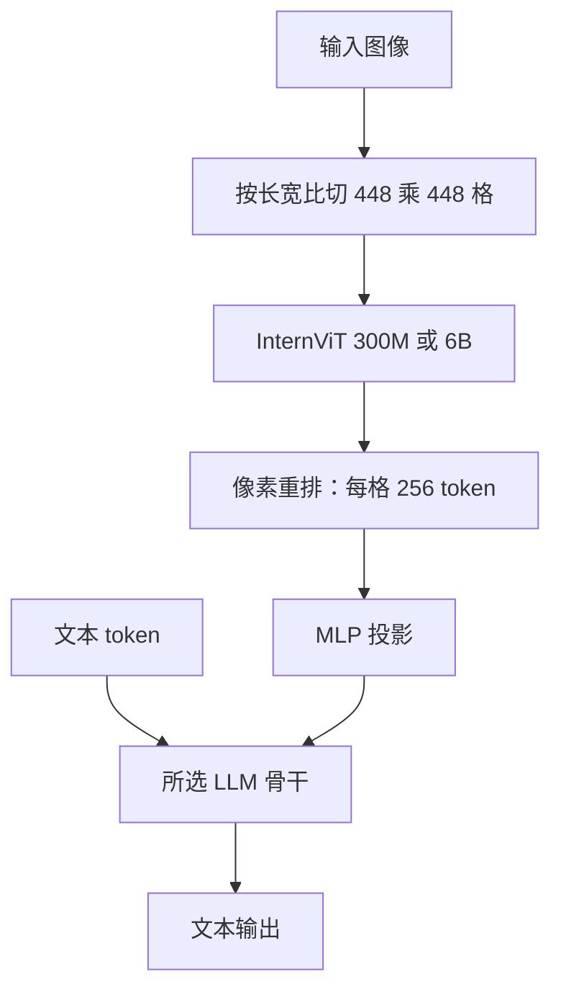

# InternVL2

InternVL2 把视觉基础模型与不同体量的开源语言模型接到同一套动态分辨率管线上，从端侧 1B 拉到 70B 级骨干，用来缩小与商业多模态模型的差距。

<footer>—— OpenGVLab，InternVL 2.0 发布说明，2024 年 7 月</footer>

上海人工智能实验室 OpenGVLab 的 InternVL 线，先把视觉编码器做到可迁移的 6B 级 InternViT，再在 InternVL 1.5 里把动态高分辨率切块写成可复用配方。2024 年 7 月放出的 **InternVL2** 不是换一套注意力公式，而是把同一套 ViT–MLP–LLM 接到从 0.5B 到 70B 的多种语言骨干上，形成 1B 到 76B（博客还提到 108B 档）的指令微调家族。本篇按 2.0 文档与随后在 InternVL 2.5 报告里核对过的规格写，不把 2.5 / 3 的编码器升级倒填进 2.0，也不给 2.0 单独立项一篇当时并不存在的 arXiv。

## 问题

开源多模态在 2024 年上半年的缺口很具体：要么视觉编码器太弱、文档 OCR 掉字，要么只接得动 7B 级聊天模型、无法把「接近 GPT-4V」的叙事做到 70B 级语言容量。InternVL 1.0（Chen 等，CVPR 2024）证明 InternViT-6B 可以当可复用视觉基础模型；1.5 进一步用动态切块把输入抬到 4K 量级。剩下的产品问题是：**同一套切块与像素重排，能否覆盖端侧 1B 与云端 70B，而不为每一档重训视觉塔。**

第二个问题是分辨率账单。448×448、patch 14 的 ViT 一张图就是 1024 个视觉 token；多格一乘，语言模型窗口先被图像吃光。InternVL 必须在「看清细字」和「LLM 还留得下指令」之间给出可部署的压缩，而不是把 AnyRes 的格数无上限堆上去。

### 2.0 是配方扩展，不是新的视觉定律

InternVL2 文档把系列写成指令微调模型：视觉侧是 InternViT-300M-448px 或 InternViT-6B-448px-V1-5，语言侧换骨干，中间是随机初始化的 MLP 投影。小档用 300M 编码器省端侧显存；26B 及以上接 6B 编码器，把 1.5 已经训好的高分辨率视觉表示接到更大的 LLM。动态分辨率规则与 1.5 同类：按长宽比把图切成 448×448 的 tile。训练最多 12 格，测试可零样本加到 40 格（文档称为 4K 分辨率）。这是测试期放大格数，不是训练见过 40 格的保证。

博客表里的 InternVL2-108B 与文档主表的 1B–76B 不要混写成同一天的可下载集合。写部署以 Hugging Face 上实际检查点为准：1B / 2B / 4B / 8B / 26B / 40B / Llama3-76B 是 2.0 文档列全的指令档。

## 方法

公开配置是 ViT 编码 → 像素重排（pixel shuffle / unshuffle）→ 两层 MLP → 语言模型。448×448 的 tile 经 patch 14 得到 $32\times 32=1024$ 个 patch；2×2 像素重排把 token 收到四分之一，故**每格 256 个视觉 token**。再加一张全局缩略图时，总视觉长度大约按格数线性涨，但比「每格 1024」便宜四倍。这与 [AnyRes](/llm/anyres) 一样把分辨率转成上下文，只是 InternVL 用像素重排做格内压缩，而不是只靠切格。

### 各档骨干对照（2.0 文档）

| 名称 | 视觉 | 语言骨干 |
| --- | --- | --- |
| InternVL2-1B | InternViT-300M | Qwen2-0.5B-Instruct |
| InternVL2-2B | InternViT-300M | internlm2-chat-1.8b |
| InternVL2-4B | InternViT-300M | Phi-3-mini-128k-instruct |
| InternVL2-8B | InternViT-300M | internlm2_5-7b-chat |
| InternVL2-26B | InternViT-6B-V1-5 | internlm2-chat-20b |
| InternVL2-40B | InternViT-6B-V1-5 | Nous-Hermes-2-Yi-34B |
| InternVL2-Llama3-76B | InternViT-6B-V1-5 | Hermes-2-Theta-Llama-3-70B |

参数量以文档为准：例如 8B 档合计约 8.1B，76B 档约 76.3B。语言骨干的词表、聊天模板、上下文上限随底座走——4B 的 Phi-3-mini 带 128K 文本窗口，不等于视觉侧已经按 128K 图文交错训过。训练叙述与 1.5 一致：先对齐 ViT 与 MLP，再指令微调；2.0 把这一配方复制到多底座，而不是公布一套全新的预训练语料表。

## 机制

动态切块的机制与 LLaVA-NeXT AnyRes 同类：格数随面积与长宽比变，编码器权重与 448 边长不变，细字靠「更多原生窗口」而不是把 ViT 拉到 1024 边长。像素重排把空间相邻的 2×2 patch 收成更短序列，信息仍在，只是 LLM 看到的是下采样后的网格。全局视图（若实现包含）提供版面；缺全局时，跨格表格要靠语言模型在拼接序列上「猜邻接」。

换语言骨干不等于换视觉能力。300M 与 6B 编码器的表示密度不同：小档能跑在手机级显存，文档理解的上限仍受视觉塔约束；76B 档的增益大量来自 Hermes/Llama-3 70B 的世界知识与指令跟随，视觉侧仍是同一套 6B-V1-5。因此评测应分任务看：自然图 VQA 可能随 LLM 涨，OCR 与图表更吃编码器与切块预算。OpenCompass 一类综合分把两者混在一起，不能单独证明「切块算法赢了」。

测试期 40 格是延迟与显存旋钮。服务必须按最坏格数预留 KV，而不能按平均图尺寸配卡。BNB 4-bit 量化在 InternViT-6B 上官方明确不建议：视觉侧误差会让模型「看不见」。不要把文本 LLM 能量化，误推到 6B ViT 也能 4-bit。

### 和 MiniCPM-V、原生动态分辨率的差别

[MiniCPM-V](/llm/minicpm) 用 SigLIP + perceiver 把高分辨率压到更短的视觉前缀，目标是端侧；InternVL2 更愿意为云端档保留每格 256 token，用更大 LLM 换推理。Qwen2-VL 的 [naive dynamic resolution](/llm/qwen-vl-naive-dynamic-res) 按原图像素切 patch，不一定先缩进 448 格。三者都叫「动态分辨率」，掩码、位置编码和 token 账单不能互换。InternVL2 对「已经有固定 448 的 InternViT」最友好。

## 边界与工程取舍

2.0 没有单独长篇技术报告；架构与切块数字以官方文档为准，综合分数可与 InternVL 2.5 报告（arXiv:2412.05271）里回溯的 InternVL2 表交叉核对，但 2.5 的编码器 V2.5、Qwen2.5 骨干不属于 2.0。不要把 2.5-Pro 或后续 InternVL3 的测试时缩放写进这一代。

多图、视频不是 2.0 的主叙事。语言底座许可各异：Qwen2、InternLM、Phi、Llama 3、Yi 衍生权重叠加，再分发前要逐档读模型卡，不能以为「InternVL」四个字统一了许可证。聊天模板必须用对应底座的特殊符号；混用 Qwen 与 Llama 的角色分隔符，表现为胡言，而不是切块超了。

切块预算与语言模型窗口要一起算：12 格 × 256 token 已是三千量级视觉前缀，再加多轮历史，7B 档的 4K–8K 上下文会先被图像占满。服务上应设硬上限（例如最多 8 格）并在超限时先缩图，而不是静默切到 40 格把延迟打爆。中英双语文档是 1.5 以来的数据主张，2.0 继承；小语种 OCR 没有同等保证。评测应分自然图、文档、图表三张表，综合分只适合排座次，不适合当上线门禁。

引用只使用真实出处：InternVL 1.0 为 Chen 等，arXiv:2312.14238；动态高分辨率与 1.5 配方见 Chen 等 *How Far Are We to GPT-4V?*，arXiv:2404.16821；2.0 以 OpenGVLab 2024-07-02 博客与 internvl2.0 文档为准。不要给 InternVL2 编造独立的 2024 年 7 月 arXiv 号。

## 小结

- InternVL2 是 OpenGVLab 2024 年 7 月的多模态指令家族：InternViT + MLP + 多档 LLM，动态 448 切块。
- 训练最多 12 格、测试可到 40 格；像素重排使每格 256 个视觉 token。
- 小档 InternViT-300M，大档 InternViT-6B-V1-5；76B 档接 Llama-3 70B 系聊天模型。
- 分辨率问题转化成 LLM 上下文账单；4-bit 不要随便打在 6B ViT 上。
- 2.0 本身以博客与文档为出处，1.0 / 1.5 / 2.5 报告是可核对的前后论文，不是 2.0 的替身。
- 出处：OpenGVLab InternVL 2.0 文档与 2024-07-02 博客；Chen 等，arXiv:2312.14238、arXiv:2404.16821；系列规格亦见 InternVL 2.5 报告 arXiv:2412.05271。
