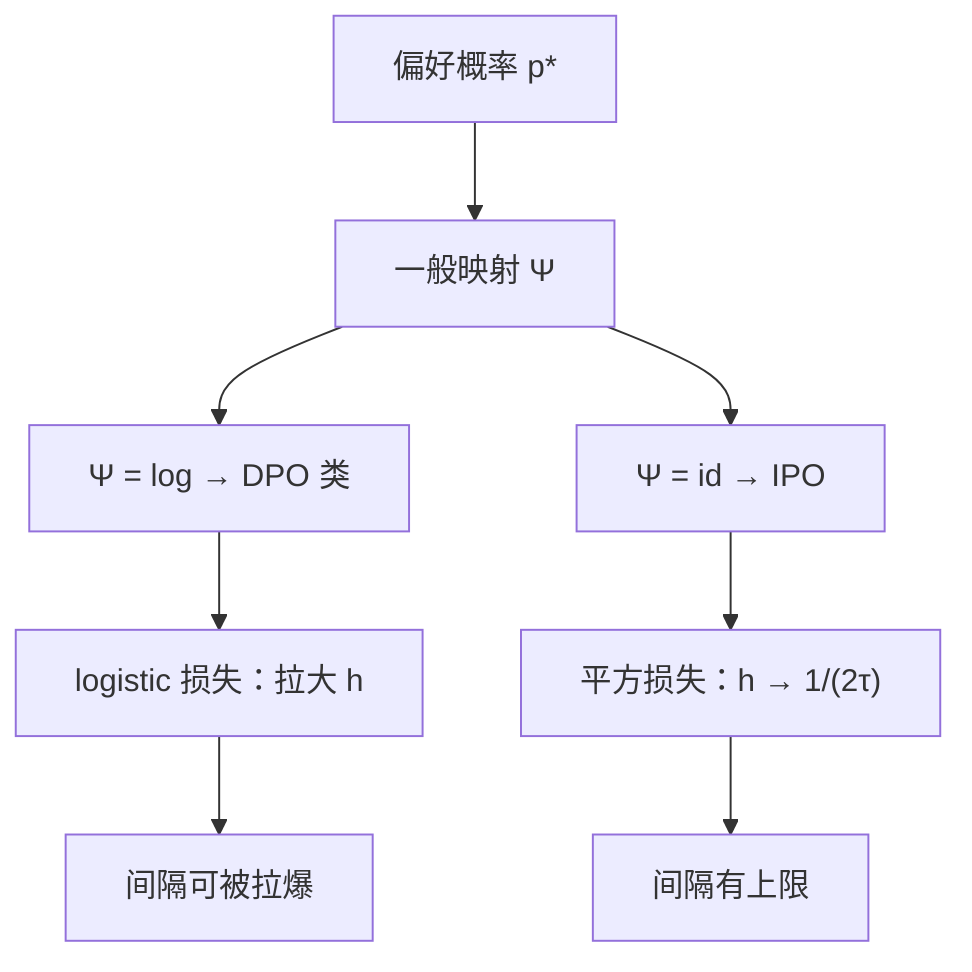

# IPO

若偏好概率不必经过对数才能接到策略，间隔就不必被logistic推到无穷；平方损失对着一个有限目标打，而不是对着永不饱和的 sigmoid 打。

<footer>—— Azar et al., A General Theoretical Paradigm to Understand Learning from Human Preferences（其中的 Identity Preference Optimisation, IPO）</footer>

DPO 把 Bradley-Terry 的 logistic 接到 $\log(\pi/\pi_{\mathrm{ref}})$ 上，训练损失在间隔被拉得再大时仍然给出同号梯度。数据一旦有噪声或捷径，模型会用极端对数比去拟合本应是「略好一点」的对。Azar 等人提出一个更一般的偏好学习范式：先定义从偏好概率到策略目标的单调映射 $\Psi$，再在 KL 正则下优化。DPO 对应 $\Psi$ 取对数（与 BT 一致）；他们称为 Identity Preference Optimisation（IPO）的实例取恒等映射，并用平方损失把策略的对数比差推向一个**有限目标** $1/(2\tau)$。本篇写 IPO 补的是 DPO 哪一块，而不是宣称替代 InstructGPT 的整条 RLHF 流水线。比较数据从哪来，仍是 Ouyang 等人已经用过的人类成对选择。

## 问题

设 $p^*(y\succ y'\mid x)$ 是真实偏好概率。BT+DPO 假定 $p^*=\sigma(r(y)-r(y'))$，且 $r$ 恰好等于 $\beta\log(\pi/\pi_{\mathrm{ref}})$。两条假设都可以错：人的比较可以不是 logistic 于某奖励差；即使是，最优策略的正则目标也不一定该用对数 $\Psi$ 把接近 1 的胜率翻译成无穷奖励间隔。错指定时，最大似然会牺牲 $\pi_{\mathrm{ref}}$ 附近的行为，去换训练对上的极大间隔。表现是：训练损失很好，持有比较一般，原能力掉，长度或拒答崩——与 [DPO](/llm/dpo) 篇里 logistic 不饱和的机制相同，这里把它提升为「$\Psi$ 选错」。

Azar 等人要的是一张能把多种算法放进去的地图，而不是又一个以新名字出现的采样环。一般目标在期望 $\Psi(p^*)$ 与到参照的 KL 之间权衡。选择不同的 $\Psi$，得到不同的「偏好有多确定应换来多大的策略移动」。恒等映射是最保守的线性翻译之一：胜率从 0.5 到 1，目标间隔线性增加并封顶，而不是像 $\mathrm{logit}$ 那样在两端发散。

### Ψ-偏好与恒等映射

对数 $\Psi$ 把 $p^*\to 1$ 映到 $+\infty$，于是「几乎总是赢」的对要求无限的 $\log\pi$ 差。恒等 $\Psi$ 把 $p^*$ 保持在 $[0,1]$ 尺度上进入目标，对应的最优间隔有限。实践里往往没有 $p^*$ 的软标签，只有谁赢谁输（近似 $p^*\in\{0,1\}$ 或 0.5 的平局）。IPO 并不需要估计 $p^*$ 的数值，而是在赢/输编码下，把对数比差回归到常数间隔。这与「先估胜率再回归」不同，实现上仍只用成对胜负。

IPO 不是把 DPO 的 sigmoid 换成 MSE 那么随意的技巧。它来自选定 $\Psi=\mathrm{id}$ 之后的正则目标。随便把 DPO 损失改成平方、却仍用 logistic 最优条件，并不自动等于论文中的 IPO。

## 方法

令

$$
h_\theta(x,y_w,y_l)=\log\frac{\pi_\theta(y_w\mid x)}{\pi_{\mathrm{ref}}(y_w\mid x)}-\log\frac{\pi_\theta(y_l\mid x)}{\pi_{\mathrm{ref}}(y_l\mid x)}.
$$

IPO 损失为

$$
\mathcal{L}_{\mathrm{IPO}}=\mathbb{E}\Bigl[\Bigl(h_\theta(x,y_w,y_l)-\frac{1}{2\tau}\Bigr)^2\Bigr].
$$

$\tau$ 是温度，作用类似 DPO 的 $\beta$，但出现在**目标间隔**里而不是 sigmoid 的斜率里。实现与 DPO 几乎共用同一套 log-prob 计算：冻结 $\pi_{\mathrm{ref}}$（SFT）、掩码提示、对两条回答求和或平均。差别只在标量损失：DPO 是 $-\log\sigma(\beta h)$，IPO 是 $(h-1/(2\tau))^2$。当 $h$ 已经超过目标，梯度会把间隔拉回来，而不是继续加码。这是抑制过拟合间隔的直接机制。

超参：$\tau$ 过小则目标间隔过大，行为接近「仍想拉得很开」；$\tau$ 过大则目标接近 0，策略几乎不动。应在持有比较与原能力上扫，与 DPO 扫 $\beta$ 对称。优化器、学习率、参照选择的工程约束与 DPO 相同：参照必须是 SFT 助手，比较分布应靠近参照。InstructGPT 式的比较集、Llama 2 式的分头偏好，都可以作为 $p^*$ 的数据来源；IPO 不自带新的标注协议。

平局：若数据含平局，目标间隔应为 0 附近，而不是 $1/(2\tau)$。需要单独编码，不能把平局当赢。这与 BT 必须处理平局是同一数据问题，换损失不会消失。多目标时，Azar 的一般范式仍是一个 $p^*$；产品上的有用/安全冲突，要么分头做成两个 IPO，要么在标注时合成一个比较，和 RM 分头是同一层决策。

### 平方损失的目标间隔

目标 $1/(2\tau)$ 来自恒等映射下最优解的推导，不是随便选的边距。它的单位是两条回答的对数密度差。长回答的求和 log-prob 尺度更大，同样 $\tau$ 下长短对的有效间隔不同，长度偏置不会因为改成 IPO 就消失。仍应对长度做归一（平均到 token）或在数据里控制赢家不一定更长。IPO 抑制的是**无限拉大 $h$**，不是抑制长度捷径。捷径对在平方损失下会被拟合到有限间隔，伤害通常小于 DPO 拉爆，但捷径仍然进了 $\pi$。

## 机制

DPO 的梯度在 $\sigma(\beta h)$ 远离 1 时始终要把 $h$ 变大。IPO 的梯度正比于 $(h-1/(2\tau))$，过了目标就反向。噪声标签下，DPO 会为错误的赢方持续加间隔；IPO 会停在目标，错误对的损害有上限（在这一项上）。这不能消灭系统捷径：若 80% 的对都是「更长的赢」，目标间隔会一致地要求更长的一方 log-prob 更高，策略仍变长，只是不会为剩下 20% 的矛盾对把概率打到数值崩坏。

与一般 $\Psi$ 的关系：$\Psi$ 越在 $p^*\to 1$ 时陡，算法越「相信极端比较、要求极端策略移动」。对数很陡；恒等平坦。还可以想象中间的映射，但 Azar 等人落地的可运行实例是 IPO。经验选择是：比较很干净、接近 BT、想要强分离时 DPO 可能更够用；比较吵、公开汇编、已经看到 DPO 训练损失与评测脱节时，IPO 更对症。不是年份上的替代关系。

不要把 IPO 的 $\tau$ 与 DPO 的 $\beta$ 用同一数字互抄。它们进损失的位置不同，尺度不可比。迁移时只迁移「需要扫温度」这一事实，重新扫。

### DPO 过拟合时 IPO 补什么

过拟合间隔：训练对上 $h$ 极大、持有对上 $h$ 乱。IPO 通过有限目标直接打。过拟合捷径：两边都会，IPO 只降剂量。过拟合参照外的低概率区：两者都是离线，都不会采样新 $y$；要补覆盖只能迭代采样本再标，那是 InstructGPT 的在线环，不是 $\Psi$ 能给的。原能力损伤：DPO 过抑制 $y_l$ 时更明显；IPO 在目标不大时抑制较弱。若目标间隔仍设得很大（$\tau$ 很小），IPO 会表现得像「有上限的 DPO」，保护有限。

## 边界与工程取舍

IPO 仍然需要 SFT 参照与成对数据，仍然不注入知识，仍然会长度偏置。它不是安全对齐的完整方案：安全冲突该在标注与分头，不在平方损失。Azar 等人的贡献首先是理论地图，IPO 是地图上可实现的一点；把所有偏好方法都改名为 IPO 没有意义。

没有 $p^*$ 软标签时，赢/输被当成确定事件，恒等映射的「线性于真概率」优点打了折扣——数据端已经把概率量化成 0/1。此时 IPO 的主要实务价值就是有限间隔，而不是对 $p^*$ 的无偏估计。若有重复标注，可以把经验胜率当软目标，更贴近理论；多数开源集没有。

TRL 一类实现里 DPO 与 IPO 只差损失几行，容易让人以为二者超参通用。参照模型、掩码、是否对 token 平均，任一不同都比损失名字更能决定结果。写配方应写损失、$\tau$ 或 $\beta$、是否平均 log-prob、参照检查点，而不是只写「用了 IPO」。

和 RM+PPO 相比，IPO 与 DPO 同属离线直接偏好优化，没有显式 $r$ 可拿去拒绝采样。若产品需要打分器，仍要训 RM，或用隐含 $h$ 临时排序（同样依赖当前 $\pi_\theta$）。InstructGPT 的三阶段在需要在线探索时仍更完整；IPO 替换的是其中「RM+PPO」在离线成对数据上的那一段，不是替换示范 SFT。

## 小结

- IPO 来自 Azar 等人一般 $\Psi$-偏好框架里 $\Psi$ 取恒等的实例，用平方损失把对数比差 $h$ 推向 $1/(2\tau)$。
- 相对 DPO 的 logistic，间隔有限，噪声对上不易把 $\log\pi$ 拉爆；不自动消除长度捷径。
- $\tau$ 与 DPO 的 $\beta$ 位置不同，必须分开扫；参照仍是 SFT，数据仍是成对比较。
- 一般范式说明 DPO 对应 $\Psi=\log$，在 $p^*\to 1$ 时要求无穷间隔，这是过拟合机制而不是实现 bug。
- 离线直接法都不采样新失败模式；覆盖仍靠比较数据或 InstructGPT 式迭代标注。
- 配方要写损失形式与是否 token 平均，不能只写算法名。
- 出处：Azar 等，*A General Theoretical Paradigm to Understand Learning from Human Preferences*（IPO）；对照 Rafailov 等 DPO（NeurIPS 2023）、Ouyang 等 InstructGPT、Bradley-Terry 比较模型。
