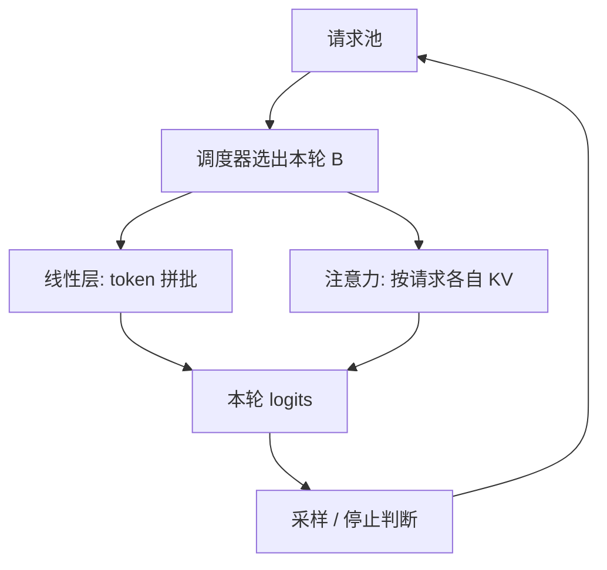

# iteration-level 调度

调度执行的粒度是一次迭代而不是一条请求：引擎每次只跑模型的一步，批次成员在步与步之间可以改变。

<footer>—— Yu et al., Orca: A Distributed Serving System for Transformer-Based Generative Models, OSDI 2022</footer>

生成式 Transformer 的一条请求是一个循环：直到 EOS 之前，每次调用模型只前进一个 token。若调度器仍按「请求」为单位——选出一批，调用引擎，直到这批人全部离开循环才返回——引擎内部再快，系统仍在请求级的同步屏障上等待。Yu 等人把这个循环从引擎里拆出来，让调度器每次只授权**一轮迭代**，从而同时得到 [连续批处理](/llm/continuous-batching) 的成员变更，以及后面要叠的抢占、优先级。本篇写 Orca 的两块技术：iteration-level 调度本身，以及让变长请求仍能批起来的选择性批处理。

## 问题

已有服务栈（当时以 NVIDIA FasterTransformer 一类引擎加请求级批调度为代表）假设：一次「运行」对应一批输入张量，运行结束时每条请求的输出都已完备。这个假设对单次前向的分类成立，对自回归不成立。生成请求的「完备」要 $T$ 次运行，$T$ 未知且高度不齐。请求级调度只能在最外层循环上改批，于是出现：早结束者不能返回、新到达者不能加入、引擎在 padding 或空槽上工作。

要把调度推进到循环内部，必须回答两个工程问题。第一，谁负责停止条件、采样、KV 追加——若仍封在引擎里，调度器看不见迭代边界。第二，一次迭代里各请求的序列长度不同，注意力的 $S$ 维对不齐，朴素 `batch` 维会强制 pad 到最大 $S$。只解决第一问得到「能每步换人但每步仍在为最长序列买单」；两问一起解决，迭代级调度才变成吞吐。

### 调度器与引擎的职责切分

Orca 的模型是：调度器拥有请求池、KV 的逻辑归属和批次组成；引擎是无状态的一步执行器，输入是「这些请求的这一迭代要算哪些算子」，输出是新的 logits 或隐藏态。停止符、最大长度、取消、[优先级](/llm/priority-sla) 全在调度器。引擎可以做算子融合和分布式切分，但不做「跑到整条请求结束」。这个切分是后来几乎所有 LLM 服务框架的原型。

iteration 在这里指定向解码的一步（或等价地，模型的一次前向），不是训练的 optimizer step，也不是流水线的 microbatch。读 Orca 时看到 iteration-level，应把它翻译成「token 步级」，以免和训练日志里的 iteration 混掉。

## 方法

主循环极短：从池中选出本轮集合 $\mathcal{B}$ → 引擎执行一步 → 根据 logits 采样或取 argmax → 追加 token 与 KV → 把结束者移出池并返回客户端 → 重复。选择 $\mathcal{B}$ 的策略可以先是简单的「能放下的都进」，再演进到抢占与配额；**机制不依赖某一条政策**，依赖的是这一循环存在。

### 选择性批处理

Transformer 层里，GEMM 类算子（QKV 投影、输出投影、FFN）的工作量按 token 计，不按序列长度计：把各请求当前要算的 token 拼成一条长 batch，线性层完全规整。注意力不同：第 $i$ 条请求的查询要和**自己的** $K_{1:s_i}$ 做点积，不能和邻居的键混。Orca 因此对算子分类：非注意力走 token 级批，注意力按请求分别做（或带各自掩码的分组）。这就是选择性批处理——不是只批一部分请求，而是只批一部分算子。

分布式情形下，同一迭代仍要在模型并行组上同步：所有卡对同一 $\mathcal{B}$ 的同一迭代达成一致，否则流水线或张量并行的通信对不上。调度决策因此是集群级的，而不是每张卡各选各的请求。Orca 针对千亿参数给出了相应的扩展设计；对单卡服务，选择性批处理已经足够让变长 decode 叠在一起。

### 与连续批、动态批的关系

iteration-level 是机制：引擎接口以步为单位。连续批、动态批是这个接口上的成员策略：步与步之间 $\mathcal{B}$ 可以变。可以想象一种退化：每步调度，但 $\mathcal{B}$ 仍冻结到全结束——那是用迭代接口去实现静态批，没有收益。也可以在迭代接口上做静态大包离线作业。所以写系统时先保证迭代接口，再声明在线策略是连续的。vLLM 一类后续工作用分页注意力把「按请求分别做注意力」升级成「按块批处理注意力」，但调度粒度仍是 Orca 这条 iteration 边界。

## 机制

请求级调度的同步屏障长度是 $\max_i T_i$ 次前向；迭代级把它拆成 $T_i$ 个可独立退出的点。早结束者的返回延迟从「等最慢同伴」变成「等当前这一步结束」，通常差一个输出长度量级。新到达者的准入延迟从「等当前批解散」变成「等当前一步」，通常是一次前向的墙钟。Orca 在 GPT-3 175B 上相对请求级批的 FasterTransformer 路径，报告了同等延迟水平下约 $36.9\times$ 的吞吐——该数字钉在论文的具体负载与基线上，不能当成任意集群的常数，但解释很稳定：气泡越大，拆屏障的收益越大。

选择性批处理的收益来自线性层重新获得高算术强度。若每条请求单独跑完整层，GEMM 太瘦；把 token 拼起来，FFN 重新变宽。注意力仍可能瘦（decode 时每请求一两个查询），这正是后来分页、CUDA Graph、投机解码要继续填的洞。Orca 没有声称注意力也完全批成一块规整张量；它声称的是**不必为了批处理而把调度退回请求级**。

$36.9\times$ 是论文在特定延迟点上对特定基线的比，不是「迭代级调度的理论加速比」。复述时应带上：GPT-3 175B、与 FasterTransformer 加请求级批的对照、以及吞吐–延迟曲线而不是单点。

## 边界与工程取舍

迭代级调度把调度器放进每步热路径。决策过重（复杂公平、跨节点协商）会在 decode 的毫秒级预算里露馅。实践上比较器必须 $O(\lvert\mathrm{pool}\rvert)$ 可接受，或先分片再选。CUDA Graph 与定长核假设形状稳定，迭代级天然形状不稳，需要对 $B$ 分桶捕获，或接受 launch 开销。

选择性批处理要求引擎能把一层拆成可批与不可批的算子图，而不是一个不可分割的 `forward(batch)`。对只暴露整模型前向的框架，要先切开。流水线并行时，「一步」还要定义成整条流水的一次前向，微批与请求调度不要抢同一个词。MoE 的 All-to-All 发生在迭代内部，调度器不能在专家通信中途改 $\mathcal{B}$。

不要把 iteration-level 理解成「训练那种每 step 换数据」。训练换的是样本，梯度要对齐；推理换的是未完成请求，没有优化器。实现上两者都叫 scheduler，对象完全不同。

## 小结

- iteration-level 调度让引擎每次只跑自回归的一步，停止与组批在步边界完成。
- 它是连续批、抢占、优先级的公共钩子；没有这个钩子，那些政策只能作用在整请求上。
- 选择性批处理：线性层按 token 拼批，注意力按请求（或按块）用各自 KV。
- 收益来自拆掉 $\max T$ 屏障，以及让 GEMM 重新变宽；注意力侧的批处理由后续系统补。
- 调度器进入热路径，形状变化与分布式同步是主要工程税。
- 论文中的数十倍吞吐是特定对照点，不是普适常数。
- 出处：Yu et al., *Orca: A Distributed Serving System for Transformer-Based Generative Models*, OSDI 2022。
